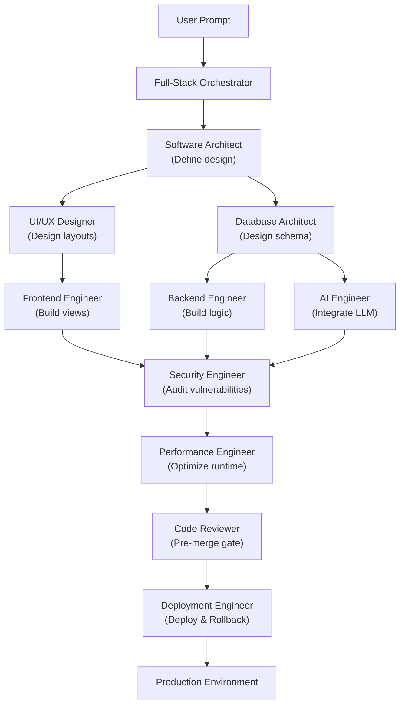

# Nexulyt-AI-OS

> A production-grade AI engineering operating system that transforms standard AI assistants into specialized, principal-level software engineering agents.

---

## Project Vision

Nexulyt-AI-OS is a centralized repository of cognitive architectures, system designs, validation checklists, and execution workflows. It is built to bridge the gap between simple LLM code suggestions and professional, production-grade software engineering.

By defining precise role specifications, structured decision frameworks, and strict validation loops, Nexulyt-AI-OS enables developers to pair-program with AI assistants as if they were collaborating with a team of Principal Architects, Senior Engineers, and Specialized Lead Reviewers.

---

## Why Nexulyt-AI-OS Exists

Standard LLMs are generalists. When asked to write code, they often build simple, happy-path solutions that fail to address:
*   **Scale and Performance:** Ignoring caching, indexing, connection pooling, and payload size.
*   **Security Vulnerabilities:** Overlooking SQL injection, cross-site scripting (XSS), insecure cross-origin requests, and hardcoded credentials.
*   **Production Readiness:** Omitting structured logging, health checks, metrics instrumentation, and automated rollback paths.
*   **Architectural Boundary Integrity:** Allowing frontend state to dictate API design, database schemas to bleed into client code, and systems to lack encapsulation.

Nexulyt-AI-OS solves this by structuring AI capabilities into **specialized engineering skills**. Each skill contains a defined brain (`SKILL.md`), a gatekeeper (`CHECKLIST.md`), and a reasoning engine (`EXAMPLES.md`).

---

## Core Features

*   **Centralized Orchestration:** The Full-Stack Orchestrator maps project scopes, determines required specialists, and resolves inter-agent design conflicts.
*   **Scientific Debugging Framework:** Enforces evidence-first diagnostics (Observe → Hypothesize → Experiment → Confirm) instead of speculative trial-and-error changes.
*   **Dual-Phase Security Gateways:** Integrates security reviews both pre-design and post-implementation to ensure compliance is a constraint, not an afterthought.
*   **Metric-Driven Optimization:** Enforces P95/P99 latency constraints, N+1 query elimination, and profiling validation.
*   **Zero-Downtime Releases:** Standardizes rolling, blue-green, and canary deployments with automated rollback triggers.

---

## AI Skills Overview

The core of Nexulyt-AI-OS is its collection of specialized engineering skills located in the `skills/` directory.

| Skill | Role in Orchestration | Primary Artifacts |
| :--- | :--- | :--- |
| **[Full-Stack Orchestrator](file:///d:/projects/Nexulyt-AI-OS/skills/full-stack-orchestrator)** | Coordinates specialists, resolves conflicts, and manages workflow | [SKILL.md](file:///d:/projects/Nexulyt-AI-OS/skills/full-stack-orchestrator/SKILL.md), [README.md](file:///d:/projects/Nexulyt-AI-OS/skills/full-stack-orchestrator/README.md), [CHECKLIST.md](file:///d:/projects/Nexulyt-AI-OS/skills/full-stack-orchestrator/CHECKLIST.md) |
| **[Software Architect](file:///d:/projects/Nexulyt-AI-OS/skills/software-architect)** | Defines system topologies, technology stacks, and ADRs | [SKILL.md](file:///d:/projects/Nexulyt-AI-OS/skills/software-architect/SKILL.md) |
| **[UI/UX Designer](file:///d:/projects/Nexulyt-AI-OS/skills/ui-ux-designer)** | Designs visual hierarchies, layouts, and accessibility flows | [SKILL.md](file:///d:/projects/Nexulyt-AI-OS/skills/ui-ux-designer/SKILL.md) |
| **[Frontend Engineer](file:///d:/projects/Nexulyt-AI-OS/skills/frontend-engineer)** | Implements responsive UI layouts, client state, and accessibility | [SKILL.md](file:///d:/projects/Nexulyt-AI-OS/skills/frontend-engineer/SKILL.md) |
| **[Backend Engineer](file:///d:/projects/Nexulyt-AI-OS/skills/backend-engineer)** | Implements API layers, business logic, queues, and integrations | [SKILL.md](file:///d:/projects/Nexulyt-AI-OS/skills/backend-engineer/SKILL.md) |
| **[Database Architect](file:///d:/projects/Nexulyt-AI-OS/skills/database-architec)** | Designs schemas, indexing strategies, and migration scripts | [SKILL.md](file:///d:/projects/Nexulyt-AI-OS/skills/database-architec/SKILL.md) |
| **[AI Engineer](file:///d:/projects/Nexulyt-AI-OS/skills/ai-engineer)** | Builds RAG pipelines, agent configurations, and prompt systems | [SKILL.md](file:///d:/projects/Nexulyt-AI-OS/skills/ai-engineer/SKILL.md) |
| **[DevOps Engineer](file:///d:/projects/Nexulyt-AI-OS/skills/devops-engineer)** | Provisions environment infrastructure, networks, and secrets | [SKILL.md](file:///d:/projects/Nexulyt-AI-OS/skills/devops-engineer/SKILL.md), [CHECKLIST.md](file:///d:/projects/Nexulyt-AI-OS/skills/devops-engineer/CHECKLIST.md) |
| **[Security Engineer](file:///d:/projects/Nexulyt-AI-OS/skills/security-engineer)** | Classifies threat models, audits data isolation, and enforces rules | [SKILL.md](file:///d:/projects/Nexulyt-AI-OS/skills/security-engineer/SKILL.md), [CHECKLIST.md](file:///d:/projects/Nexulyt-AI-OS/skills/security-engineer/CHECKLIST.md) |
| **[Performance Engineer](file:///d:/projects/Nexulyt-AI-OS/skills/performance-engineer)** | Profiles runtimes, optimizes queries, and measures latency | [SKILL.md](file:///d:/projects/Nexulyt-AI-OS/skills/performance-engineer/SKILL.md), [CHECKLIST.md](file:///d:/projects/Nexulyt-AI-OS/skills/performance-engineer/CHECKLIST.md) |
| **[Code Reviewer](file:///d:/projects/Nexulyt-AI-OS/skills/code-reviewer)** | Audits code before merge via the Self Review Engine | [SKILL.md](file:///d:/projects/Nexulyt-AI-OS/skills/code-reviewer/SKILL.md), [CHECKLIST.md](file:///d:/projects/Nexulyt-AI-OS/skills/code-reviewer/CHECKLIST.md) |
| **[Debugging Expert](file:///d:/projects/Nexulyt-AI-OS/skills/debugging-expert)** | Investigates production outages and anomalies with evidence | [SKILL.md](file:///d:/projects/Nexulyt-AI-OS/skills/debugging-expert/SKILL.md), [CHECKLIST.md](file:///d:/projects/Nexulyt-AI-OS/skills/debugging-expert/CHECKLIST.md) |
| **[Deployment Engineer](file:///d:/projects/Nexulyt-AI-OS/skills/deployment-engineer)** | Re-releases services with canary gates and automated rollbacks | [SKILL.md](file:///d:/projects/Nexulyt-AI-OS/skills/deployment-engineer/SKILL.md), [CHECKLIST.md](file:///d:/projects/Nexulyt-AI-OS/skills/deployment-engineer/CHECKLIST.md) |

---

## Workflow Overview

Nexulyt-AI-OS operates using a structured multi-agent lifecycle managed by the Full-Stack Orchestrator. The workflow separates concerns strictly:



---

## Folder Structure

The repository is organized to separate system capabilities, configuration assets, and reference implementations:

```text
Nexulyt-AI-OS/
├── skills/              # The "brains" — cognitive definitions and domain logic for each agent
├── prompts/             # System prompts for bootstrapping LLMs into specialized roles
├── templates/           # Starter files, Dockerfiles, and boilerplate configurations
├── workflows/           # Declarative multi-agent execution pipeline configurations
├── checklists/          # Domain-agnostic production readiness validation sheets
├── standards/           # Engineering guidelines for code, styling, security, and performance
├── docs/                # Comprehensive technical guides and architectural concepts
├── examples/            # Reference implementation files showing correct structures
├── assets/              # Architecture diagrams, visual elements, and graphics
├── LICENSE              # Repository license configuration
└── README.md            # Repository landing page and onboarding documentation
```

---

## Quick Start

### Prerequisites
To use Nexulyt-AI-OS, you need:
1. An IDE configured for agentic AI workflows (e.g., Cursor, Windsurf, Claude Code, or VS Code with custom extensions).
2. API access to advanced language models (e.g., Claude 3.5 Sonnet, GPT-4o, Gemini 1.5 Pro).

### Installation
Clone the repository to your local workspace or config directory where your AI assistant can access the skills:

```bash
git clone https://github.com/ShivangKesarwani/Nexulyt-AI-OS.git
```

### Loading Skills
For assistants like Claude Code, Cursor, or Gemini Agent settings:
1. Point your assistant’s system prompts or documentation paths to the appropriate skill folder in `skills/`.
2. For global loading, add the path of the cloned repository to your agent system config.

---

## How to Use

When interacting with an AI assistant in your project workspace:
1. **Initialize the Orchestrator:** Prompt the assistant with your product goal and direct it to use the `full-stack-orchestrator` skill.
2. **Execute Sequentially:** Allow the orchestrator to call individual skills in order. Each skill will write its technical output, run its validation checklist (`CHECKLIST.md`), and document its decisions in your codebase repository.
3. **Verify Gates:** Ensure the assistant confirms it has passed the defined Quality Gates for each phase before promoting code.

### Example Workflow: "Build an AI Assistant SaaS"

```text
User: 
"I need to build an AI SaaS for document search. Use Nexulyt-AI-OS skills."

Assistant (Orchestrator):
1. Runs 'Requirement Analysis' and classifies the project as Tier 4 (Advanced).
2. Activates 'Software Architect' to design the workspace tenant model and choose the stack (Next.js, FastAPI, pgvector).
3. Activates 'Database Architect' and 'UI/UX Designer' in parallel to define the schema and dashboard mockups.
4. Activates 'Frontend Engineer', 'Backend Engineer', and 'AI Engineer' to implement the RAG retrieval code.
5. Runs 'Security Engineer' to audit user queries for injection attacks.
6. Runs 'Performance Engineer' to profile response times.
7. Calls 'Code Reviewer' to validate coding standards.
8. Triggers 'Deployment Engineer' to write the Kubernetes configurations and deploy to staging.
```

---

## Roadmap

### Current Focus (v1.0.0 Release)
*   [x] Core 13 specialized engineering skills implemented.
*   [x] Production-grade `CHECKLIST.md` and `EXAMPLES.md` validation chains created.
*   [x] Flowcharts and systems architecture mapped via Mermaid.

### Next Milestone (v1.1.0)
*   [ ] Automated CLI tool to initialize skills in local development workspaces.
*   [ ] CI/CD pipeline actions to auto-run agent checklists during pull request reviews.
*   [ ] Dynamic orchestration connectors for LangGraph and CrewAI frameworks.

---

## Contributing

We welcome contributions to improve the cognitive models, templates, and checklists in Nexulyt-AI-OS.
1. Review the guidelines in [standards/](file:///d:/projects/Nexulyt-AI-OS/standards).
2. Fork the repository and create a feature branch.
3. Verify your prompt structure and validation formats using local tests.
4. Submit a pull request detailing the changes and which specific skills are affected.

---

## Future Plans

*   **Dynamic Skill Registry:** A runtime server enabling agents to look up and load custom skills dynamically from remote servers.
*   **Visual Debugger Interface:** A GUI to monitor multi-agent execution graphs, decision trees, and validation gates in real time.
*   **Self-Healing Pipelines:** Autonomous agents linked directly to site reliability monitoring (Datadog/Sentry) to deploy fixes automatically when alerts trigger.

---

## License

Distributed under the [MIT License](file:///d:/projects/Nexulyt-AI-OS/LICENSE).

Copyright © 2026 Shivang Kesarwani. All rights reserved.