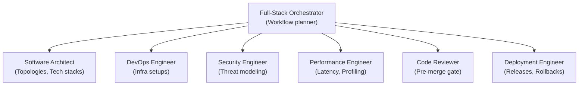

# Repository Architecture

This document describes the multi-agent orchestration architecture of the **Nexulyt-AI-OS** repository.

---

## 1. Multi-Agent Design Pattern

Nexulyt-AI-OS is designed as a modular **multi-agent operating system**. Each AI skill represents a specialized agent with limited, domain-specific capabilities, cognitive paradigms, and validation checklists.

---

## 2. Structural Isolation

To keep agents focused and prevent cognitive drift:
- **Zero-Overlap Domains:** Implementation agents (Frontend/Backend) never make database structural choices or infrastructure topology decisions; they build within constraints set by Architect and DevOps agents.
- **Strict Quality Gates:** An agent's output must pass its own `CHECKLIST.md` and the `Code Reviewer` gate before it is handed off to the next agent.
- **Handoff Contracts:** Handoffs are structured as payload dictionaries containing (1) upstream design context, (2) operational constraints, and (3) defined output criteria.
