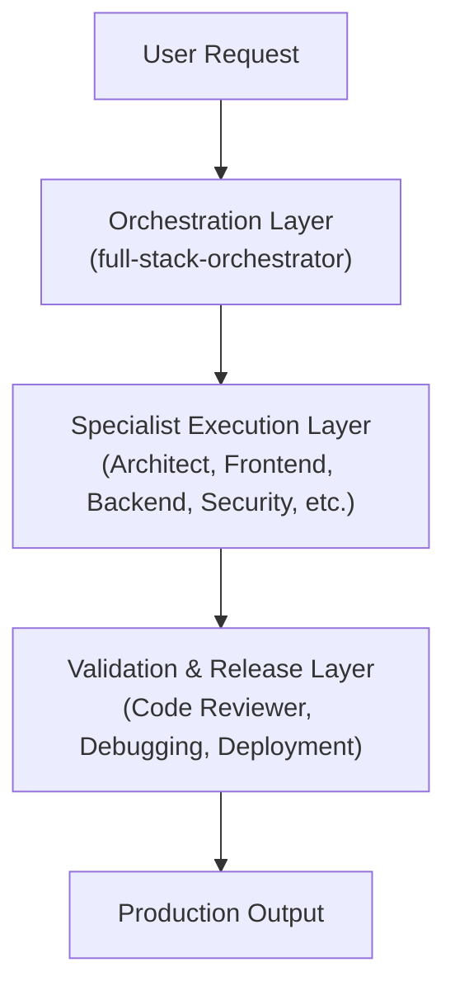

# Repository Architecture

This document describes the design patterns, system topologies, and orchestration mechanisms of the **Nexulyt-AI-OS** repository.

---

## 1. System Topology

Nexulyt-AI-OS is structured as a **multi-agent cognitive operating system**. It does not execute code autonomously on remote networks; rather, it structures the thinking, decisions, and validations of AI assistants.

The architecture is divided into three core functional layers:

---

## 2. Why Skills Exist

A general-purpose AI assistant is prone to "hallucinations" and "happy-path bias" — writing code that works in a sandbox but fails under production scale.

Skills exist to enforce **bounded domain expertise**:
*   **Encapsulation of Concerns:** A Database Architect focuses only on migration locking, normalization levels, indexing profiles, and transactional isolation. It is not distracted by button states or API endpoints.
*   **Rigid Rulesets:** Each skill contains a `SKILL.md` file that acts as the agent's "core code." It contains non-negotiable rules (e.g., "Never concatenate strings on SQL queries," "Always run containers rootless").
*   **Gatekeeping:** By packaging every skill with a `CHECKLIST.md`, the repository prevents code from progressing if it violates specialized requirements.

---

## 3. Why Workflows Exist

Workflows define the **coordination protocol** between skills. Without workflows, independent agents will produce conflicting solutions:
- A Frontend Engineer might design a login dashboard that does not match the authentication scheme chosen by the Software Architect.
- A Backend Engineer might implement a query pattern that causes a deadlock in the database model.

Workflows resolve this by mapping dependencies. No specialist can begin its task until the prerequisite specialists have signed off on their outputs. The workflow defines how data is packaged and passed down the agent chain.

---

## 4. Documentation Strategy

Nexulyt-AI-OS uses a standardized, uniform documentation strategy to maintain clarity across the codebase:
- **`README.md` (Public Face):** Located in every folder, defining the skill, its inputs, outputs, and compatibility.
- **`SKILL.md` (Agent Brain):** System configurations that bootstrap the LLM's system prompt into the specialized role.
- **`CHECKLIST.md` (Gatekeeper):** Actionable QA checkboxes that must be run before promoting modifications.
- **`EXAMPLES.md` (Reasoning Engine):** Step-by-step design case studies (without implementation code) to train the agent in problem analysis.

---

## 5. Future Scalability

The repository is built to be extended:
1.  **Dynamic Skill Loading:** By structuring skills in standard folders, custom agents can dynamically import new capabilities as directory path parameters.
2.  **Telemetry Integration:** Future plans involve connecting the Debugging Expert and Performance Engineer skills directly to SRE APM frameworks (such as Datadog or Sentry) to create self-healing deployment loops.
3.  **CI/CD Pipeline Gates:** Integrating checklist execution into GitHub Action workflows to automatically block pull requests if a check is failed.
