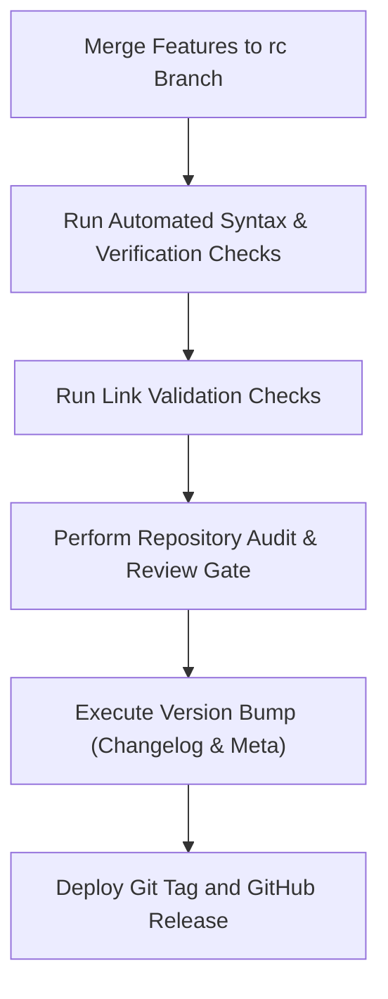

# Release Process

This document defines the step-by-step procedure for preparing, validating, and publishing a new release of **Nexulyt-AI-OS**.

---

## 1. Preparing the Release

A release cycle begins after all feature milestones for a version target are completed.



---

## 2. Release Steps

### Step 1: Repository Review & Testing
Before a release:
- Verify that no empty (0-byte) files exist in the workspace.
- Run the repository link checker to verify that all `file:///` links resolve correctly.
- Verify that the test suite runs and passes on the release candidate branch.

### Step 2: Documentation Review
- Ensure [docs/changelog.md](file:///d:/projects/Nexulyt-AI-OS/docs/changelog.md) is updated with all features, fixes, and modifications included in the release.
- Update the version metadata in the root [README.md](file:///d:/projects/Nexulyt-AI-OS/README.md).

### Step 3: Version Bump
- Update version strings in all metadata files (e.g. `SKILL.md` frontmatter targets).
- Commit the version bump with a conventional commit message:
  ```bash
  git commit -m "chore: bump version to v1.0.0"
  ```

### Step 4: Tag & Publish
1.  Tag the commit on the `main` branch:
    ```bash
    git tag -a v1.0.0 -m "Release v1.0.0"
    ```
2.  Push the tag to GitHub:
    ```bash
    git push origin v1.0.0
    ```
3.  Publish a new release on the GitHub project dashboard, copy-pasting release notes from `docs/changelog.md`.
