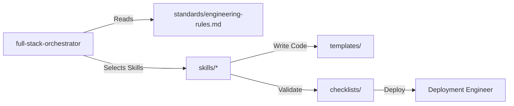

# Repository Integration Guide

This guide describes how Nexulyt-AI-OS operates as a system, how skills and folders interact, and how developer teams should integrate the repository.

---

## 1. How the Repository Works

Nexulyt-AI-OS is a **declarative engineering knowledge base**. It does not run containerized clusters directly, nor does it write source code automatically.

Instead, it defines:
1.  **AI Behavioral Models (`SKILL.md`):** Instructions that shape the cognitive standards of AI assistants.
2.  **Standard Rules (`standards/`):** Strict constraints regarding code style, directory layouts, and security.
3.  **Validation Checklists (`checklists/` & `skills/*/CHECKLIST.md`):** Criteria that must be satisfied before completing any engineering phase.

---

## 2. Interaction Model

The skills and folders interact dynamically during a project run:



1.  **Orchestrator Selection:** The `full-stack-orchestrator` reviews the prompt against the `skills/` folder to determine the required specialists.
2.  **Standards Enforcement:** Every specialist skill references `standards/` to format its deliverables.
3.  **Template Injection:** Runtimes and setups are pulled from `templates/` to avoid custom boilerplate creation.
4.  **Verification:** Implementations run the local `CHECKLIST.md` before prompting the `Code Reviewer` gate.

---

## 3. Team Integration Guidelines

To integrate Nexulyt-AI-OS into your development team:

*   **Setup Workspace Context:** Add the cloned Nexulyt-AI-OS folder as a read-only directory reference in your IDE (Cursor/VS Code).
*   **Prompt with Role Context:** When asking your assistant to perform a task, bootstrap it using the corresponding prompt:
    ```text
    Context: Refer to skills/security-engineer/SKILL.md.
    Task: Audit our authentication logic.
    ```
*   **Pipeline Checks:** Add script steps in your CI pipeline to run formatting and link verification on Markdown files.
