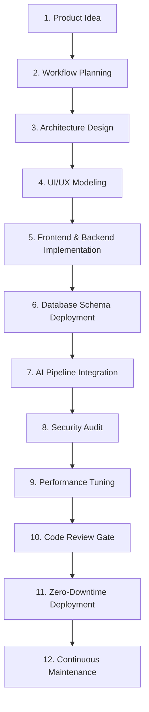

# Workflows Engine

This document outlines the complete multi-agent development lifecycle managed by the **Nexulyt-AI-OS** workflows engine.

---

## 1. Development Lifecycle Stages

The lifecycle tracks the progression of an idea into a stable, monitored production application.

---

## 2. Phase Explanations

### Phase 1: Product Idea & Requirements
- **Goal:** Decompose the initial prompt into functional scope, scalability expectations, and compliance needs.
- **Skills:** `Full-Stack Orchestrator` analyzes the request and produces the Project Brief.

### Phase 2: Workflow Planning
- **Goal:** Derive the activation list and execution graph.
- **Skills:** `Full-Stack Orchestrator` maps dependencies and sets Quality Gate criteria.

### Phase 3: System Architecture
- **Goal:** Lock technology choices and design component boundaries.
- **Skills:** `Software Architect` creates system designs, selects the stack, and writes ADRs.

### Phase 4: UI/UX Modeling
- **Goal:** Create visual layouts and interface mockups.
- **Skills:** `UI/UX Designer` defines design systems, wireframes, and accessibility flows.

### Phase 5: Implementation (Frontend & Backend)
- **Goal:** Build the codebase.
- **Skills:** `Frontend Engineer` builds views and client state; `Backend Engineer` builds routing and business logic.

### Phase 6: Database Schema & Migrations
- **Goal:** Structure relational or NoSQL datastores safely.
- **Skills:** `Database Architect` designs schema diagrams and writes transaction migrations.

### Phase 7: AI Integration
- **Goal:** Build LLM, RAG, or agent systems.
- **Skills:** `AI Engineer` configures prompts, RAG databases, context maps, and custom tools.

### Phase 8: Security Audit
- **Goal:** Remediate vulnerabilities and verify data isolation.
- **Skills:** `Security Engineer` performs STRIDE threat modeling and checks input validation layers.

### Phase 9: Performance Optimization
- **Goal:** Profile execution latency and query speeds.
- **Skills:** `Performance Engineer` measures P95/P99 latency, removes N+1 queries, and sets caching.

### Phase 10: Pre-Merge Review
- **Goal:** Verify coding styles, test suites, and security controls.
- **Skills:** `Code Reviewer` audits implementation files and issues merge approvals.

### Phase 11: Deployment
- **Goal:** Release code using secure pipelines.
- **Skills:** `Deployment Engineer` sets up container variables, Ingress configs, and rollback schedules.

### Phase 12: Continuous Maintenance & Incident Response
- **Goal:** Monitor telemetry and debug live errors.
- **Skills:** `Debugging Expert` analyzes traces, logs, and stack frames to isolate and resolve anomalies.
