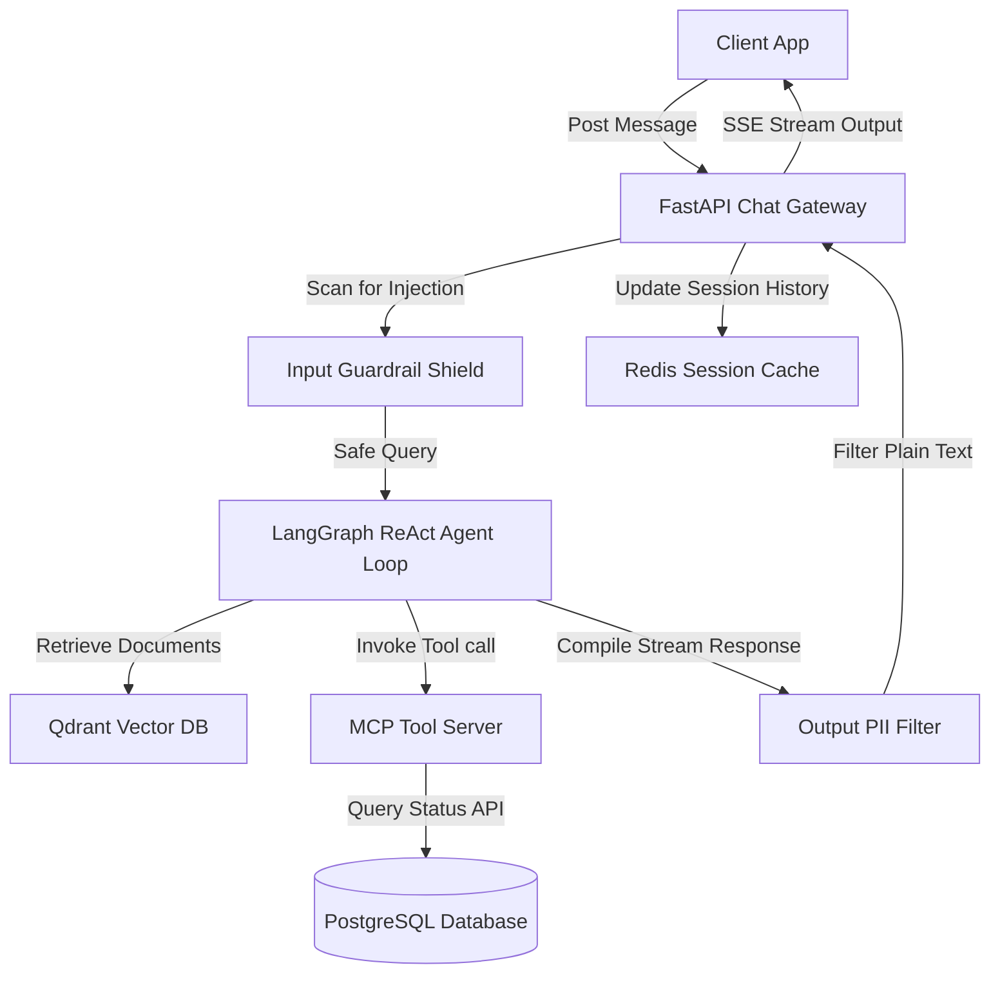

# AI Chatbot Architecture Specification

This document provides the architectural blueprint, design parameters, and engineering decisions for building a stateful, interactive **AI Chatbot Platform** featuring session buffer persistence, Model Context Protocol (MCP) tool loops, vector memory (RAG) retrieval, and input/output guardrails.

---

## 1. Overview & Strategy

### Business Problem
Customer service chatbots require stateful conversation history, deep context indexing, and external system connectivity (e.g. checking order status, modifying bookings) to resolve queries. Unstructured agent loops risk prompt injection exploits, context window exhaustion, and hallucinations, leading to degraded customer satisfaction.

### Goals
* **Stateful Session Memory**: Persist conversation histories across client reconnects, maintaining window context.
* **Secure Tool Execution**: Enable the LLM to invoke backend APIs (via the Model Context Protocol, MCP) safely under restricted scopes.
* **Vector-Driven Memory (RAG)**: Retrieve company knowledge base docs using semantic embeddings search.
* **Strict Guardrail Pipelines**: Scan incoming messages and outgoing responses to prevent prompt injection and PII leakage.

### Target Users
* **End Customers**: Conversing with the chatbot to resolve account, order, or product queries.
* **Support Administrators**: Managing agent system instructions, reviewing conversation logs, and defining tool access parameters.

---

## 2. Requirements

### Functional Requirements
* **Chat Session Manager**: Stores chronological messages, maintaining sliding context window offsets.
* **Knowledge Retrieval Engine (RAG)**: Connects to a vector database to search and inject relevant FAQ/policy docs into the chat context.
* **MCP Tool Router**: Standardized server interface exposing actions (e.g. `get_order_status`, `reschedule_appointment`) to the agent client.
* **Guardrail Pipeline**: Input classifier scanning for injection attacks, and output scanner blocking PII/secret leaks.

### Non-functional Requirements
* **Response Stream Latency (TTFT)**: Stream the initial chat character in under 500ms.
* **Semantic Search Execution**: Execute vector similarity lookups in under 40ms.
* **Tool Loop Timeout**: Enforce a hard 8-second execution limit on agent tool calls.
* **Compliance Checks**: Encrypt all conversation histories at rest, stripping credit cards/PII before DB storage.

---

## 3. Technology Stack Selection

| Layer | Technology | Rationale & Trade-offs |
|---|---|---|
| **Frontend** | React / Next.js / Tailwind CSS | React Client components. Visual chat bubbles parse streaming Markdown and code blocks dynamically. |
| **Backend** | Python (FastAPI) | Extensive library ecosystem for AI processing (LangChain, LlamaIndex), asynchronous loops support, and native integrations. |
| **Database** | PostgreSQL | Stores account credentials, configurations, prompt audit logs, and persistent chat sessions history. |
| **Vector DB** | Qdrant / pgvector | Stores knowledge base document chunks and vector embeddings. |
| **Session Cache** | Redis | Caches active session message buffers to minimize PostgreSQL read loads. |
| **Agent Loops** | LangGraph / Autogen | Manages stateful ReAct (Reasoning and Acting) execution loops and tool routing configurations. |

---

## 4. Architecture & Engineering Plans

### Repository Skills Used
* **[ai-engineer](file:///d:/projects/Nexulyt-AI-OS/skills/ai-engineer/SKILL.md)**: RAG vector searches, prompt configuration versioning, agent tool loop setups.
* **[security-engineer](file:///d:/projects/Nexulyt-AI-OS/skills/security-engineer/SKILL.md)**: Prompt injection shields, output PII filters.
* **[backend-engineer](file:///d:/projects/Nexulyt-AI-OS/skills/backend-engineer/SKILL.md)**: Asynchronous chat streams, Redis session cache updates, API schemas.

### Architecture Overview
The system isolates the agent loop behind an HTTP gateway. User queries pass through an input guardrail before entering the ReAct loop. The agent retrieves knowledge from Qdrant, calls local tools via the Model Context Protocol (MCP) server, and streams output through a final PII filter back to the client:

### Database Strategy
This architecture balances SQL session tables, vector knowledge collections, and Redis message buffers:
* **Relational Schema (PostgreSQL)**:
  * Tables: `sessions` (contains status, user metadata, creation date), `messages` (permanent message store containing ID, session ID, role, content, token count, audit flags).
* **Vector Schema (Qdrant)**:
  * Collection: `knowledge_base` containing embedding vectors representing document chunks alongside metadata attributes (source url, title, document section).
* **Session Cache (Redis)**:
  * Active sessions store messages in a Redis List: `session:history:session_id` containing stringified JSON message items (representing the sliding context window).
  * Inactive sessions are periodically archived from Redis to the PostgreSQL `messages` table.

### API Strategy
* **HTTP Server-Sent Events (SSE)**: Streamed completions exposed on `/api/v1/chat/stream`.
* **Model Context Protocol (MCP) Server**:
  * Implements the MCP JSON-RPC protocol over HTTP/SSE.
  * Exposes tools matching the client schema: `{ "name": "check_order", "description": "Fetch order details", "inputSchema": { ... } }`.
* **JSON Web Token Authentication**: Bearer tokens carry user credentials and organization scopes, ensuring tool calls validate user permissions.

### Frontend Strategy
* **Streaming Chat Interface**: Renders message bubbles dynamically as chunks land.
* **Adaptive Markdown Render**: Parses text deltas in real-time, converting inline links to buttons and syntax code blocks to copyable layouts.
* **Connection Re-sync Manager**: If WebSocket/SSE connections drop, the client requests a session sync from `/api/v1/chat/history/{session_id}` to reconcile missing messages.

### Backend Strategy
* **Agent Loop (LangGraph)**:
  1. Receive user query.
  2. Query Qdrant for semantic documents similar to user query.
  3. Format prompt: `System Instructions + Context + Chat History + User Query`.
  4. Invoke LLM: If the model returns a tool call request, check the MCP tool registry, run the tool, append results, and call the LLM again.
  5. Stream output chunks through output validation guards (PII scrubbing).
  6. Append both user query and final model completion to the Redis session history list.

---

## 5. Security & Performance

### Security Considerations
* **Prompt Injection Defenses**: Implement strict XML tag boundaries (`<user_query>`) and validate incoming strings using regex checks for known jailbreak strings.
* **Tool Authorization Boundary**: Never permit the LLM to access credentials or databases directly. All actions must run via the MCP server API, validating OAuth scopes matching the user token.
* **Output Sanitization**: Scan outgoing chunks using named entity recognition (NER) classifiers to scrub accidentally exposed emails, phone numbers, or credentials.

### Performance Considerations
* **Sliding Window Management**: Limit active history context injected into LLM calls (e.g. limit to last 10 messages). Summarize older messages into a single system variable to keep token counts compact.
* **Prompt Caching Organization**: Structure system instructions and static knowledge templates first in the prompt, placing dynamic user inputs last, to maximize prompt caching efficiency.
* **Asynchronous Tool Execution**: Run tool calls concurrently using Python asyncio execution loops.

### Deployment Strategy
* **Containerization**: Package FastAPI application and MCP server in Docker containers.
* **Kubernetes Orchestration**: Route traffic using ingress controllers configured to maintain long-lived SSE connections.
* **Vector Sync Worker**: Background tasks automatically crawl company document folders, chunk updates, and sync vectors in Qdrant.

---

## 6. Risks, Best Practices, and Future Scope

### Risks
* **Infinite Tool Loops**: If error exceptions occur during tool execution, the agent might repeatedly query the same tool, wasting tokens and racking up API costs.
* **Hallucinated Tool Inputs**: The model might output malformed parameters (e.g. string formats instead of integer IDs) when calling MCP tools.

### Best Practices
* Set strict loop iteration limits (e.g., maximum 5 tool invocations per prompt turn) to prevent runaway execution costs.
* Validate all incoming parameters at the MCP tool API boundary using schemas (e.g. Pydantic) before executing actions.
* Decouple the prompt classifier shield from the primary LLM, running it on smaller, cheaper models (e.g. Llama-3-8B).

### Common Mistakes
* Injecting the entire conversation history database directly into the LLM context, causing massive token costs and latency slowdowns.
* Giving the LLM write permissions on databases without implementing manual validation checks.

### Future Improvements
* **Multi-Agent Collaboration**: Split chat tasks among specialized agents (e.g. Billing Agent, Technical Agent) coordinated by a main Supervisor agent.
* **Continuous Self-Evaluation**: Implement automated evaluation frameworks that randomly test chat logs against grading rubrics to track accuracy changes over prompt updates.
