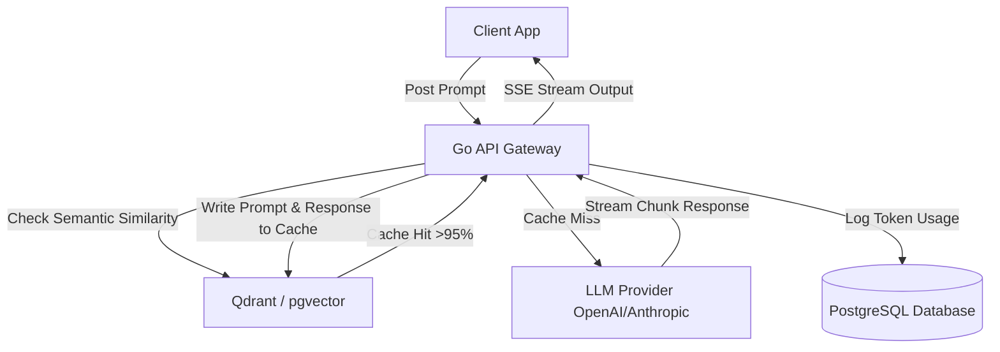

# AI SaaS Architecture Specification

This document provides the architectural blueprint, design parameters, and engineering decisions for building an **AI-powered Software-as-a-Service (SaaS)** platform featuring prompt lifecycle management, token utilization controls, streaming APIs, and model billing models.

---

## 1. Overview & Strategy

### Business Problem
Building and scaling LLM-powered utilities incurs high infrastructure API costs, response latency, and prompt configuration drift. SaaS providers require a unified platform that caches semantic responses, manages variable prompt templates, streams outputs in real-time, limits tokens usage, and attributes costs directly to specific customer tiers.

### Goals
* **Optimize API Costs**: Implement semantic caching (Redis + Vector DB) to bypass LLM generation for duplicate user requests.
* **Stream Real-time Outputs**: Stream LLM responses chunk-by-chunk to frontends, lowering perceived latency.
* **Manage Prompts Lifecycle**: Centralize and version system prompts in database configurations, decoupling prompts from application code.
* **Granular Token Budgeting**: Automatically track token usage per tenant, enforcing usage caps based on subscription plans.

### Target Users
* **Subscribing Developers / Users**: Invoking the utility to generate structured copy, translate code, or analyze text datasets.
* **System Administrators / Finance**: Monitoring LLM costs, provider latency budgets, and token usage limits.

---

## 2. Requirements

### Functional Requirements
* **Semantic Response Cache**: Check semantic similarity of user queries against previous prompts, returning cached text if match score exceeds 95%.
* **Streaming API Router**: Expose HTTP Server-Sent Events (SSE) streaming paths that pipe chunked LLM responses directly to clients.
* **Prompt Versioning Panel**: Admin interface to edit, test, and release system prompt variables with roll-back history logs.
* **Billing & Token Limits**: Track input and output tokens consumed per API key, automatically declining requests exceeding plan limits.

### Non-functional Requirements
* **Perceived Time-to-First-Token (TTFT)**: Stream the initial text token in under 400ms from request receipt.
* **Semantic Match Latency**: Run vector similarity search in under 30ms to prevent cache check delays.
* **Tenant Isolation**: Row-level tenant partitioning on billing tables, keeping token metrics separate.
* **LLM Provider Redundancy**: Automatic failover routing to secondary providers (e.g., Anthropic to OpenAI) if primary API error rates exceed 5%.

---

## 3. Technology Stack Selection

| Layer | Technology | Rationale & Trade-offs |
|---|---|---|
| **Frontend** | React / Next.js / Tailwind CSS | Next.js with React Server Components. Interactive chat/output panel built using client-side hooks to process streamed inputs. |
| **Backend** | Go (Golang) | High concurrency throughput and minimal memory overhead are perfect for handling thousands of concurrent HTTP streams. |
| **Database** | PostgreSQL | Handles account management, billing logs, and prompt history tables. |
| **Vector DB** | Qdrant / pgvector | Stores prompt vector embeddings to perform rapid cosine similarity matches for semantic caching. |
| **Cache Layer** | Redis | Handles user session states and stores exact string cache inputs. |

---

## 4. Architecture & Engineering Plans

### Repository Skills Used
* **[ai-engineer](file:///d:/projects/Nexulyt-AI-OS/skills/ai-engineer/SKILL.md)**: Prompt configurations, semantic chunking boundaries, and vector database query layouts.
* **[performance-engineer](file:///d:/projects/Nexulyt-AI-OS/skills/performance-engineer/SKILL.md)**: Semantic cache hits optimization, prompt token reductions, and compression.
* **[backend-engineer](file:///d:/projects/Nexulyt-AI-OS/skills/backend-engineer/SKILL.md)**: SSE streams, Go API routing, and token bucket rate limiters.

### Architecture Overview
The system acts as a smart gateway between client applications and external LLM providers (e.g. Anthropic, OpenAI). It checks a hybrid SQL/Vector cache before routing queries downstream, streaming results back to the client:

### Database Strategy
This architecture utilizes a dual-database approach to decouple transactional user metrics from semantic cache profiles:
* **Relational PostgreSQL**:
  * Tables: `users`, `tenants`, `api_keys`, `prompts_templates`, `token_ledgers`.
  * Every write record carries a `tenant_id` context.
* **Vector Engine (Qdrant)**:
  * Index: `semantic_query_cache` containing vectors (384-dimension or 1536-dimension depending on embedding model) alongside payload metadata (original query, cached response, tenant restrictions).

### API Strategy
* **HTTP Streaming (Server-Sent Events)**: Enforced via `text/event-stream` response headers on `/api/v1/generate`.
* **API Key Auth**: Bearer token authorization checks (`Authorization: Bearer <token>`). Tokens map to specific scopes, tenant identifiers, and budget states.
* **Structured Payload Schema**:
  * Input: `{ "prompt": string, "prompt_id": string, "variables": map[string]string }`
  * Stream response: Array of JSON chunks containing completion text delta, index positions, and intermediate token summaries.

### Frontend Strategy
* **Stream Parser UI**: React state engine using `ReadableStream` reader interfaces to continuously update the layout text area as chunks land.
* **Visual Markdown Parsing**: Streamed text rendered in markdown format dynamically using streaming markdown component trees.
* **Prompt Variable Form Builder**: Auto-generated forms in the admin dashboard matching inputs declared in selected prompt schemas.

### Backend Strategy
* **Token Budget Middleware**: Compares the tenant's current monthly token consumption totals against their plan ceiling before executing the query.
* **Token Counting**: Runs tiktoken encoders locally in Go to calculate exact token consumption prior to sending data to providers.
* **Failover Engine**: Monitors downstream API responses. If HTTP 429 (rate limits) or HTTP 503 (service unavailable) occur, requests are transparently redirected to the alternative provider using equivalent prompt structures.

---

## 5. Security & Performance

### Security Considerations
* **Prompt Injection Defense**: Run input prompts through validation checks (Regex filters and lightweight classifier models) to prevent system-instructions override attempts.
* **Cache Leakage Boundaries**: Ensure semantic cache queries filter results using metadata keys matching `tenant_id` to prevent one tenant from receiving cached outputs from another.
* **API Key Rotation**: Support multiple keys per tenant, auto-deactivating keys that deviate from baseline usage patterns.

### Performance Considerations
* **Embedding Model Latency**: Use local lightweight embedding models (e.g. BGE-micro) run in edge containers to generate similarity vectors fast.
* **Prompt Caching Headers**: Leverage provider-specific caching headers (like Claude's Prompt Caching) by keeping system prompts static and ordering dynamic variables at the end.
* **Concurrence Pools**: In Go, use connection worker pools to manage outgoing HTTP streams without consuming thread resources.

### Deployment Strategy
* **Containerization**: Pack Go API server and Qdrant database in lightweight Docker containers.
* **Kubernetes Routing**: Route incoming traffic using NGINX ingress controllers configured with high read/write buffers to prevent stream connection interruptions.
* **Edge Hosting**: Host the Go gateway geographically close to downstream LLM provider API regions to minimize network latency.

---

## 6. Risks, Best Practices, and Future Scope

### Risks
* **Stale Semantic Caches**: Cached responses might contain stale information if application rules or data change behind the scenes.
* **Provider Downtime**: Total outage of target LLM APIs during peak times.

### Best Practices
* Set strict TTL limits (e.g. 7 days) on semantic cache vectors to ensure response freshness.
* Implement a manual "Clear Cache" button inside user dashboards.
* Version all prompt configurations in Git using JSON template files alongside database entries.

### Common Mistakes
* Sending large system instruction headers with every single chat message instead of using dynamic prompt caching strategies.
* Not filtering vector database similarity checks on the user's tenant identifier, risking security leaks.

### Future Improvements
* **Automated A/B Prompt Testing**: Implement split routing of user queries across multiple prompt versions, comparing user satisfaction ratings automatically.
* **Hybrid LLM Routing**: Introduce regression classifiers that route requests to smaller, cheaper models (e.g. Llama-3-8B) for simple queries and larger models only for complex tasks.
