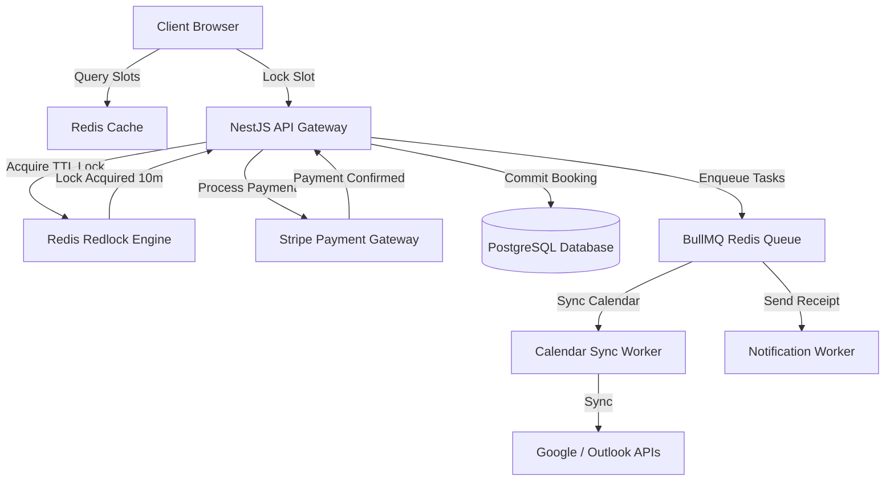

# Booking Platform Architecture Specification

This document provides the architectural blueprint, design parameters, and engineering decisions for building a high-concurrency **Reservation Booking Platform** featuring temporary inventory locks, calendar synchronization, and transaction notifications.

---

## 1. Overview & Strategy

### Business Problem
Booking platforms (e.g. ticketing, appointment schedulers, seat booking) face high race conditions when multiple users attempt to reserve the same finite slots concurrently. Failure to manage atomic lock allocations results in double-bookings, degraded customer trust, and broken calendar availability logs.

### Goals
* **Prevent Double-Bookings**: Enforce strict atomic reservation steps to guarantee that a slot is assigned to only one user.
* **Temporary Slot Locking**: Implement lightweight, automated TTL locks that hold tickets during payment checkout phases.
* **Bi-directional Calendar Sync**: Synchronize booking states with external platforms (Google Calendar, Outlook) within minutes.
* **Decoupled Ticket Notification**: Offload customer verification emails and SMS dispatches to background worker channels.

### Target Users
* **Customers**: Browsing available sessions, booking slots, and paying.
* **Hosts / Providers**: Setting up calendars, adjusting ticket boundaries, and reviewing bookings.

---

## 2. Requirements

### Functional Requirements
* **Session Inventory & Grid**: Interactive visual layouts mapping seats/slots and showing availability.
* **Temporary Lock Manager**: Reserve slots for 10 minutes, automatically releasing them if checkout is abandoned.
* **Payments Checkout Integration**: Process payments using external payment gateways, converting temporary reservations to confirmed status.
* **External Calendar Sync**: Push confirmation events to provider Google/Outlook calendars using ICS/OAuth APIs.

### Non-functional Requirements
* **Booking Transaction Isolation**: Use Serializable transaction boundaries to guarantee slot validation.
* **Lock Allocation Speed**: Allocate temporary Redis locks in under 10ms.
* **Notification Queue Delay**: Offload notification jobs to background tasks, executing emails in under 5 seconds from payment confirmation.
* **Availability Query Response**: Return session grids in under 40ms.

---

## 3. Technology Stack Selection

| Layer | Technology | Rationale & Trade-offs |
|---|---|---|
| **Frontend** | React / Next.js / Tailwind CSS | Next.js with React Client components. Visual seat layouts parse grids dynamically, updating states via polling or WebSockets. |
| **Backend** | Node.js (NestJS framework) | Enterprise-grade TypeScript server offering rich modules, decorator-based validations, and cron scheduling capabilities. |
| **Database** | PostgreSQL | Relational schema integrity guarantees ACID compliance, ensuring foreign keys hold slot rules. |
| **Distributed Lock** | Redis (Redlock algorithm) | Fast, in-memory keys with TTL expirations are perfect for temporary reservation locks. |
| **Queue Engine** | BullMQ | Decouples notification tasks and Google Calendar synchronization queues. |

---

## 4. Architecture & Engineering Plans

### Repository Skills Used
* **[software-architect](file:///d:/projects/Nexulyt-AI-OS/skills/software-architect/SKILL.md)**: Database locking paradigms, concurrency conflict patterns.
* **[database-architect](file:///d:/projects/Nexulyt-AI-OS/skills/database-architect/SKILL.md)**: PostgreSQL transactional safety, index layouts.
* **[backend-engineer](file:///d:/projects/Nexulyt-AI-OS/skills/backend-engineer/SKILL.md)**: Redis Redlock handlers, BullMQ workers, third-party Calendar sync.

### Architecture Overview
The platform decouples availability reads from booking writes. Users view cached slots. Initiating a checkout sets a temporary TTL lock in Redis. Successful payments trigger PostgreSQL updates and dispatch tasks to BullMQ workers for calendar sync and emails:



### Database Strategy
This system balances relational transactional tables with fast Redis keys:
* **Relational Schema (PostgreSQL)**:
  * Tables: `slots`, `bookings`, `users`, `providers`, `calendars_sync_tokens`.
  * Status parameters: `slots` table contains a state enum (`available`, `reserved`, `booked`).
* **Redis Lock Storage**:
  * Temporary locks use keys: `lock:slot:slot_id` containing value `user_id` with a strict Time-to-Live (TTL) of 600 seconds.
  * If the user pays, the backend updates the SQL slot state to `booked`. If the TTL expires, the key deletes automatically, and the slot is treated as `available`.

### API Strategy
* **REST APIs**: Paths structured as `/api/v1/slots`, `/api/v1/bookings/lock`, `/api/v1/bookings/confirm`.
* **Lock Allocation Endpoint**: POST request returns a temporary booking identifier:
  * Input: `{ "slot_id": string }`
  * Output: `{ "booking_id": string, "expires_at": timestamp }`
* **Google Calendar Push**: Webhook notification updates leverage standard channel channels.

### Frontend Strategy
* **Dynamic Grid Map**: Visual SVG canvas showing seat layout. Color coding maps states (Green: Available, Yellow: Locked in your cart, Red: Booked).
* **Expiration Countdown Timer**: Renders dynamic countdowns on checkout pages using local client states. If the timer reaches zero, the checkout UI closes and prompts the user to re-select.
* **Debounced Seat Clicks**: Prevents double-clicking inputs, avoiding multiple simultaneous locking API calls.

### Backend Strategy
* **Atomic Locking Pattern (Redlock)**:
  1. Receive request to reserve `slot_id` for `user_id`.
  2. Set Redis key: `SET lock:slot:slot_id user_id NX PX 600000` (NX: only if key doesn't exist; PX: 10 minutes).
  3. If set fails: Return `409 Conflict` (slot already reserved).
  4. If set succeeds: Return success. Start payment timer.
* **Confirmation Transaction block**:
  1. Stripe payment webhook captures confirmation.
  2. Start SQL transaction: `BEGIN;`
  3. Verify slot status: `SELECT status FROM slots WHERE id = ? FOR UPDATE;`
  4. If status is `booked` then rollback (should never occur if Redlock held).
  5. Update slot: `UPDATE slots SET status = 'booked' WHERE id = ?;`
  6. Create booking row: `INSERT INTO bookings (user_id, slot_id, status) VALUES (?, ?, 'confirmed');`
  7. Commit transaction: `COMMIT;`
  8. Delete Redis key: `DEL lock:slot:slot_id`.

---

## 5. Security & Performance

### Security Considerations
* **Race Condition Mitigation**: Ensure the database uses `SERIALIZABLE` or `REPEATABLE READ` transaction isolation levels to prevent phantom reads during lock verification.
* **API Spam Protection**: Rate-limit slot locking requests per IP to prevent scraper bots from locking all slots.
* **Token Expiration Checks**: Secure webhooks utilizing cryptographic verification signatures.

### Performance Considerations
* **Pessimistic Locking Mitigation**: Use Redis Redlock to handle temporary locks, preventing PostgreSQL connection pools from blocking on long-running payment wait operations.
* **Index Configurations**: Index columns used in schedules: `slots (provider_id, start_time, status)`.
* **Database Connection Pooling**: Configure low database statement timeouts (e.g. 3s) to prevent lock contention.

### Deployment Strategy
* **Clustered Redis**: Deploy Redis in HA Sentinel or Cluster setups to prevent single-point-of-failure lock drops.
* **Containerization**: Deploy NestJS containers on AWS ECS with auto-scaling metrics.
* **Database Mirroring**: Use database replicas to process read queries (viewing available grids) and direct write queries (bookings) to the primary database.

---

## 6. Risks, Best Practices, and Future Scope

### Risks
* **Redis Instance Failure**: A Redis reboot clears active temporary locks, potentially allowing double bookings during recovery.
* **Google API Rate Limits**: Syncing too many calendars concurrently could trigger external API blocks.

### Best Practices
* Always clean up temporary Redis locks programmatically once SQL transactions commit.
* Use Redis Persistence (AOF) with fsync configured every second.
* Implement circuit breakers on calendar sync workers to pause calls if Google/Outlook APIs throw 503 errors.

### Common Mistakes
* Implementing temporary locks directly in SQL tables using `updated_at` timestamps, creating heavy write and index update workloads.
* Querying slot status without locking rows during the payment confirmation phase.

### Future Improvements
* **AI Smart Scheduling**: Analyze historical booking histories to recommend optimal pricing variations and slot configurations to hosts.
* **Distributed Multi-Region Locks**: Implement global locking mechanisms across regional clusters to support global ticket releases.
```
