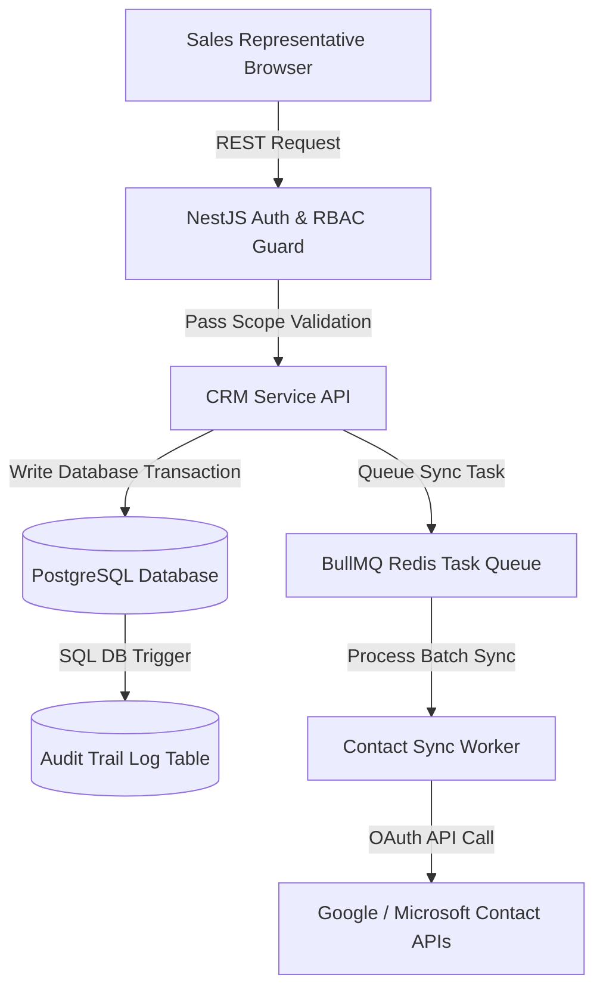

# CRM System Architecture Specification

This document provides the architectural blueprint, design parameters, and engineering decisions for building a multi-user **Customer Relationship Management (CRM) System** featuring granular Role-Based Access Control (RBAC), database auditing history logs, and external contact synchronization pipelines.

---

## 1. Overview & Strategy

### Business Problem
Enterprises require systems to manage leads, contacts, and deal histories across sales teams. Uncontrolled data access can result in internal client list leakage, while changes to deal values or contact assignments require complete audit histories to resolve internal disputes and verify compliance.

### Goals
* **Granular Role-Based Access Control (RBAC)**: Secure data boundaries so agents can only view assigned records, while managers retain global access.
* **Immutable Change Auditing**: Log every write operation (INSERT, UPDATE, DELETE) to a tamper-proof audit table.
* **Robust Contact Syncing**: Synchronize contact information with third-party providers (e.g. Google Contacts, Microsoft Outlook) without creating duplicate records.
* **Low-Latency Search**: Allow real-time search across thousands of customer records and notes fields.

### Target Users
* **Sales Representatives**: Updating leads and logging customer interactions.
* **Sales Managers**: Allocating territories, reviewing forecasts, and auditing representative activities.
* **Administrators**: Configures RBAC scopes and manages custom attributes.

---

## 2. Requirements

### Functional Requirements
* **Contact & Lead Management**: CRUD capabilities on contacts, organizations, and deal flows.
* **Granular RBAC Policy**: Restrict lead views, edit capability, and deal approvals based on user roles and assigned groups.
* **Record Audit Trails**: Track previous and current states for all modified records, noting who modified the data and when.
* **Contact Sync Engine**: Bi-directional integration mapping fields (emails, phones) to Microsoft/Google contact catalogs.

### Non-functional Requirements
* **Access Control Check Latency**: Enforce RBAC validation middleware in under 5ms per API request.
* **Auditing Consistency**: Audit logs must write synchronously within the primary database transaction block.
* **Search Execution Time**: Full-text name/note search queries must run in under 30ms across 1 million contacts.
* **Integrations Synchronization Interval**: Batch sync integration scripts run in background queues every 15 minutes.

---

## 3. Technology Stack Selection

| Layer | Technology | Rationale & Trade-offs |
|---|---|---|
| **Frontend** | React / Next.js / Tailwind CSS | Next.js App Router. SPA architecture inside authenticated boundaries utilizing React Query for automatic caching. |
| **Backend** | Node.js (NestJS framework) | Direct support for interceptor patterns, middleware, and decorators simplifies implementing RBAC schemas. |
| **Database** | PostgreSQL | Supports advanced JSONB data types (useful for custom contact attributes), transactions, and trigger functions for database audits. |
| **Search Engine** | pg_trgm / Elasticsearch | PostgreSQL trigram index indices for medium catalogs, or Elasticsearch for enterprise-scale contacts searches. |
| **Task Queue** | BullMQ (Redis-backed) | Manages background contact syncing routines and webhook dispatch events. |

---

## 4. Architecture & Engineering Plans

### Repository Skills Used
* **[software-architect](file:///d:/projects/Nexulyt-AI-OS/skills/software-architect/SKILL.md)**: RBAC policy designs, relational schemas patterns.
* **[backend-engineer](file:///d:/projects/Nexulyt-AI-OS/skills/backend-engineer/SKILL.md)**: NestJS guard logic, BullMQ task consumers, third-party API sync.
* **[code-reviewer](file:///d:/projects/Nexulyt-AI-OS/skills/code-reviewer/SKILL.md)**: Auditing security scopes and SQL trigger structures.

### Architecture Overview
The CRM uses NestJS Guards to validate roles before routing to API endpoints. SQL write queries run database triggers that instantly copy changes to audit tables, while external sync jobs run inside BullMQ background queues:



### Database Strategy
* **Relational PostgreSQL Entity Schema**:
  * Tables: `users`, `roles`, `permissions`, `contacts`, `organizations`, `deals`, `audit_logs`.
  * RBAC Schema: Many-to-Many mappings between `roles` and `permissions`. `users` carry a `role_id` and belong to target `sales_groups`.
* **Database Trigger-Based Auditing**:
  * Write events on `contacts` or `deals` trigger a database function copying the transaction payload into the `audit_logs` table:
  ```sql
  CREATE OR REPLACE FUNCTION log_record_change() RETURNS TRIGGER AS $$
  BEGIN
    INSERT INTO audit_logs (table_name, record_id, action, old_data, new_data, modified_by)
    VALUES (TG_TABLE_NAME, OLD.id, TG_OP, to_jsonb(OLD), to_jsonb(NEW), current_setting('app.current_user_id'));
    RETURN NEW;
  END;
  $$ LANGUAGE plpgsql;
  ```

### API Strategy
* **REST API Endpoints**: Formulated under `/api/v1/contacts`, `/api/v1/organizations`, `/api/v1/deals`.
* **RBAC Route Decorators**: NestJS controllers secure paths using permissions tags:
  * `@UseGuards(JwtAuthGuard, RolesGuard)`
  * `@CheckPermissions('contacts:read')`
* **OAuth 2.0 Client Tokens**: Tokens for external providers (Google, Microsoft) are stored encrypted in the database `integrations` table.

### Frontend Strategy
* **Dynamic Sidebar Navigation**: Sidebar menu elements show/hide dynamically based on user token scope permissions.
* **Audit Timeline Component**: Renders a vertical layout timeline detailing changes made to contacts, comparing `old_data` and `new_data` fields.
* **React Query Cache Control**: Uses optimistic list updates and automatic cache invalidations on mutations to ensure data consistency across multiple windows.

### Backend Strategy
* **RBAC Engine Middleware**:
  1. Intercepts the REST request.
  2. Queries the user's permissions mapped to their active role.
  3. Validates if the user's sales group matches the target lead owner's sales group.
* **Bi-directional Sync Pipeline**: BullMQ jobs request external changes using Delta Sync flags, compare record modification dates, resolve conflicts using "last-write-wins" policy, and commit updates to database tables.

---

## 5. Security & Performance

### Security Considerations
* **SQL Injection & ORM Escaping**: Ensure all dynamic searches bypass string construction; use parameter-bound filters.
* **Data Encryption at Rest**: Encrypt OAuth integration access/refresh tokens using AES-256 GCM prior to database commits.
* **Direct Object Reference (IDOR) Protection**: Ensure that queries request records matching sales group boundaries, preventing users from altering IDs belonging to separate groups.

### Performance Considerations
* **Trigram Index Search**: Index text columns using PostgreSQL trigram extension:
  ```sql
  CREATE INDEX idx_contacts_name_trgm ON contacts USING gin (name gin_trgm_ops);
  ```
* **Audit Logs Indexing**: Partition `audit_logs` by calendar months and create indexes on `(table_name, record_id)` to keep history reads snappy.
* **Transactional Auditing**: Keep audit writes fast; avoid executing complex external notifications inside the trigger functions.

### Deployment Strategy
* **Application Node**: NestJS web servers packaged in Docker containers deployed to server configurations with load balancers.
* **BullMQ Queue Processing**: BullMQ workers run in independent cluster containers to prevent heavy contact syncing processes from starving HTTP server resources.
* **Managed Postgres**: Hosted database configurations featuring auto-scale storage allocations and point-in-time recovery configurations.

---

## 6. Risks, Best Practices, and Future Scope

### Risks
* **Rate Limits Exhaustion**: Heavy contact syncing operations might exhaust Google or Microsoft API limit caps.
* **Audit Table Growth**: Large enterprises creating thousands of contact changes will bloat audit tables, degrading database disk capacities.

### Best Practices
* Always index foreign keys and columns utilized inside filtering where criteria.
* Store large contact text notes in a separate `contact_notes` table to prevent table-scan performance degradation on primary contact columns.
* Encrypt API credentials securely at the DB level, storing encryption keys outside the database configuration files.

### Common Mistakes
* Implementing RBAC security solely on the frontend UI, leaving public API routes exposed to IDOR attacks.
* Writing database triggers that call external network APIs, locking database transactions during network lag times.

### Future Improvements
* **AI Sentiment Analysis**: Introduce automated sentiment extraction on logged sales call transcripts to classify lead engagement levels.
* **Automatic Lead Scoring**: Train regression algorithms to score incoming leads based on contact profiles, engagement metrics, and firmographic data.
