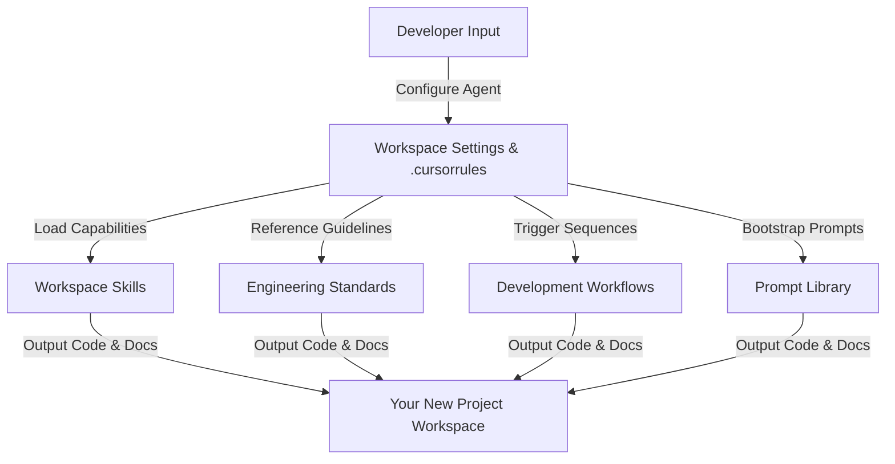

# Custom Project Creation Guide

This guide explains how developers and engineering teams can use **Nexulyt-AI-OS** as an engineering bootstrap framework to create completely new software projects from concept to production. By combining different modular skills, prompt libraries, workflows, and standards, you can establish consistent, production-grade system designs and development processes.

---

## 1. The Nexulyt-AI-OS Philosophy

Nexulyt-AI-OS is structured as a modular, agent-ready repository. Instead of copy-pasting code, the framework enforces a **separation of capabilities, standards, prompts, and workflows**:

To build a project, you do not build code manually. You configure your AI coding assistants with these modules, using the system to guide the agent through sequential development phases.

---

## 2. Step-by-Step Custom Project Pipeline

Follow this 5-stage pipeline to construct any new software project using Nexulyt-AI-OS:

### Stage 1: Discovery & Requirements
1. **Define the Domain**: Write a 1-page summary describing the business goal and target users.
2. **Draft Requirements**: Copy templates from **[project-planning.md](file:///d:/projects/Nexulyt-AI-OS/prompts/project-planning.md)** to generate User Stories and Gherkin-style Acceptance Criteria.
3. **Establish Milestones**: Use planning templates to generate a Work Breakdown Structure (WBS) and map dependencies.

### Stage 2: System & Database Design
1. **Verify Architecture Standards**: Read the **[Architecture Standards](file:///d:/projects/Nexulyt-AI-OS/standards/architecture-standards.md)** and **[Folder Structure Standards](file:///d:/projects/Nexulyt-AI-OS/standards/folder-structure.md)** to choose your deployment style (e.g. monolithic vs decoupled).
2. **Design the System Topology**: Query your AI assistant using the System Design prompts in **[software-architecture.md](file:///d:/projects/Nexulyt-AI-OS/prompts/software-architecture.md)** to generate a C4 Container model.
3. **Design the Database Schema**: Use templates from **[database-design.md](file:///d:/projects/Nexulyt-AI-OS/prompts/database-design.md)** to generate SQL DDL code or NoSQL document schemas, producing a Mermaid.js ER diagram.
4. **Define API Contracts**: Generate OpenAPI/tRPC YAML specifications using the API Design templates.

### Stage 3: Front- & Backend Scaffolding
1. **Initialize Directory structures**: Use the Directory Scaffolding prompts in **[template-generation.md](file:///d:/projects/Nexulyt-AI-OS/prompts/template-generation.md)** to construct directories.
2. **Configure compiler & style settings**: Generate tsconfig, ESLint, and Tailwind configuration files using starter kit templates.
3. **Scaffold Boilerplates**: Output typed controller skeletons and component prop structures.
4. **Trigger Engineering Workflows**: Use **[frontend-development.md](file:///d:/projects/Nexulyt-AI-OS/prompts/frontend-development.md)** and **[backend-development.md](file:///d:/projects/Nexulyt-AI-OS/prompts/backend-development.md)** prompts to instruct your AI assistant to generate component files and API route handlers.

### Stage 4: Testing, Security & Auditing
1. **Write Automated Tests**: Instruct your assistant using testing prompts to write unit and integration test blocks.
2. **Audit Security Parameters**: Perform a STRIDE threat modeling analysis and OWASP Top 10 check using templates in **[security.md](file:///d:/projects/Nexulyt-AI-OS/prompts/security.md)**.
3. **Audit Code Quality**: Run a pre-merge code review audit using prompts in **[code-review.md](file:///d:/projects/Nexulyt-AI-OS/prompts/code-review.md)** to classify issues by severity.
4. **Audit Workspace Consistency**: Run repository consistency checks using **[repository-review.md](file:///d:/projects/Nexulyt-AI-OS/prompts/repository-review.md)**.

### Stage 5: Containerization & Telemetry
1. **Write Docker configurations**: Generate secure, multi-stage Dockerfiles using templates in **[deployment.md](file:///d:/projects/Nexulyt-AI-OS/prompts/deployment.md)**.
2. **Create Orchestration manifests**: Generate Kubernetes Deployment and Service YAML configurations.
3. **Configure CI/CD pipelines**: Create GitHub Actions / GitLab pipeline YAML files to automate tests and deployments.
4. **Establish Monitoring limits**: Define Prometheus alert rules and dashboard graphs.

---

## 3. Mixing and Matching Modules (Examples)

Nexulyt-AI-OS modules are designed as lego blocks. Depending on your project requirements, combine these combinations:

### Scenario A: High-Performance Public Catalog
* *Goal*: Build a search-engine-optimized marketing catalog.
* *Standards Used*: [Coding Standards](file:///d:/projects/Nexulyt-AI-OS/standards/coding-standards.md), [Performance Standards](file:///d:/projects/Nexulyt-AI-OS/standards/performance-standards.md).
* *Skills Used*: [frontend-engineer](file:///d:/projects/Nexulyt-AI-OS/skills/frontend-engineer/SKILL.md), [ui-ux-designer](file:///d:/projects/Nexulyt-AI-OS/skills/ui-ux-designer/SKILL.md).
* *Prompts Used*: [frontend-development.md](file:///d:/projects/Nexulyt-AI-OS/prompts/frontend-development.md) (SEO, Tailwind, React, Animations), [performance.md](file:///d:/projects/Nexulyt-AI-OS/prompts/performance.md) (Core Web Vitals).

### Scenario B: HIPAA Compliant Patient Portal
* *Goal*: Build a secure medical database access application.
* *Standards Used*: [Security Standards](file:///d:/projects/Nexulyt-AI-OS/standards/security-standards.md), [Architecture Standards](file:///d:/projects/Nexulyt-AI-OS/standards/architecture-standards.md).
* *Skills Used*: [security-engineer](file:///d:/projects/Nexulyt-AI-OS/skills/security-engineer/SKILL.md), [database-architect](file:///d:/projects/Nexulyt-AI-OS/skills/database-architect/SKILL.md).
* *Prompts Used*: [security.md](file:///d:/projects/Nexulyt-AI-OS/prompts/security.md) (Threat Modeling, Secure Coding), [database-design.md](file:///d:/projects/Nexulyt-AI-OS/prompts/database-design.md) (Relational Schema, Indexing).

### Scenario C: Conversational AI Support Agent
* *Goal*: Build an AI chatbot that calls business APIs.
* *Standards Used*: [AI Engineering Standards](file:///d:/projects/Nexulyt-AI-OS/standards/ai-engineering-standards.md), [API Design Standards](file:///d:/projects/Nexulyt-AI-OS/standards/api-design-standards.md).
* *Skills Used*: [ai-engineer](file:///d:/projects/Nexulyt-AI-OS/skills/ai-engineer/SKILL.md), [backend-engineer](file:///d:/projects/Nexulyt-AI-OS/skills/backend-engineer/SKILL.md).
* *Prompts Used*: [ai-engineering.md](file:///d:/projects/Nexulyt-AI-OS/prompts/ai-engineering.md) (Meta-prompts, MCP, Agent loops), [backend-development.md](file:///d:/projects/Nexulyt-AI-OS/prompts/backend-development.md) (Validation, Error Handling).

---

## 4. Best Practices for New Projects

1. **Keep Your Prompts Dynamic**: Use variables (`{{VARIABLE_NAME}}`) in system prompts to keep them adaptable to changing schemas.
2. **Continuous Linting**: Integrate folder structure checks and naming convention rules in your CI pipelines from Day 1 to prevent project drift.
3. **Maintain ADRs**: Document significant architectural modifications using ADR markdown templates to help onboard new developers.
