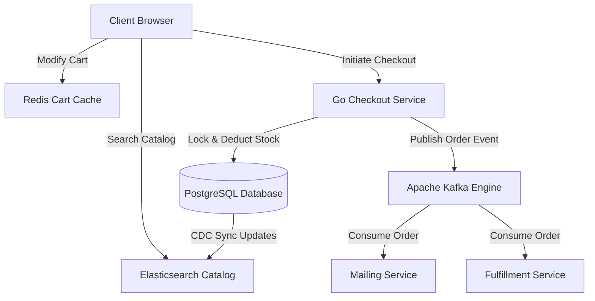

# E-Commerce Platform Architecture Specification

This document provides the architectural blueprint, design parameters, and engineering decisions for building a high-scale, transactional **E-Commerce Platform** featuring catalog search synchronization, shopping cart state persistence, checkout pipelines, and inventory transaction locks.

---

## 1. Overview & Strategy

### Business Problem
E-commerce websites face high traffic spikes (e.g., Black Friday), complex catalog search requirements, and race conditions during stock checkouts. Failure to handle inventory checks concurrently can lead to oversold products, while slow search queries and checkout dropouts directly degrade sales conversion rates.

### Goals
* **Inventory Integrity**: Enforce strict ACID guarantees during checkout transactions to prevent stock overselling.
* **Low-Latency Search**: Synchronize product updates to full-text search indexes in under 2 seconds.
* **Persistent Cart State**: Manage fast, distributed shopping cart states that remain consistent across sessions and devices.
* **Peak Load Resilience**: Decouple order processing streams from direct checkout operations using message queues.

### Target Users
* **Shoppers**: Searching catalogs, adding items to carts, and completing checkouts.
* **Store Operators**: Managing products inventory, pricing, and fulfilling orders.

---

## 2. Requirements

### Functional Requirements
* **Synchronized Product Catalog**: Full-text catalog search featuring autocomplete, dynamic category filters, and inventory tags.
* **Distributed Shopping Cart**: High-availability cart state manager surviving page reloads and browser closures.
* **Transactional Checkout Pipeline**: Multistep checkout validation flow (auth -> check stock -> reserve inventory -> process payment -> create order -> publish order event).
* **Inventory Reservation Lock**: Lock catalog stock counts temporarily during checkout payment phases.

### Non-functional Requirements
* **Catalog Search Latency**: Return search results and filter queries in under 50ms.
* **Cart Read/Write Times**: Cart modifications must execute in under 15ms.
* **Database Isolation Conformance**: Serializable database transactions for inventory deduct commands.
* **Throughput Capacity**: Handle up to 10,000 concurrent shopping sessions and 200 orders per second.

---

## 3. Technology Stack Selection

| Layer | Technology | Rationale & Trade-offs |
|---|---|---|
| **Frontend** | React / Next.js / Tailwind CSS | Next.js with Static Site Generation (SSG) for static product detail pages, and dynamic React components for carts and checkout pages. |
| **Backend** | Go (Golang) | High concurrency throughput, fast startup, and native performance are optimal for checkout routing APIs. |
| **Database** | PostgreSQL | Relational constraints and transactional (ACID) safety are required for orders and payment ledger tables. |
| **Search Engine** | Elasticsearch | Delivers advanced full-text query matching, scoring, and aggregation metrics for large product catalogs. |
| **In-Memory Cache** | Redis | Serves as the distributed shopping cart manager and caches popular product payloads. |
| **Message Broker** | Apache Kafka | Logs and streams order events to downstream fulfillment, mailing, and analytical services. |

---

## 4. Architecture & Engineering Plans

### Repository Skills Used
* **[software-architect](file:///d:/projects/Nexulyt-AI-OS/skills/software-architect/SKILL.md)**: C4 Container boundaries, distributed data synchronization plans.
* **[database-architect](file:///d:/projects/Nexulyt-AI-OS/skills/database-architect/SKILL.md)**: PostgreSQL indexing structures, database transaction isolation modes.
* **[performance-engineer](file:///d:/projects/Nexulyt-AI-OS/skills/performance-engineer/SKILL.md)**: Redis caching models, Elasticsearch aggregation tuning, asset optimization.

### Architecture Overview
The architecture decouples catalog reads from order writes. Product searches hit Elasticsearch, while cart modifications hit Redis. The checkout service updates the primary SQL database and writes orders to Kafka, shielding the backend from database bottleneck locks during high-traffic intervals:

### Database Strategy
This system employs a **polyglot persistence model** to balance write consistency with read performance:
* **PostgreSQL (System of Record)**:
  * Contains `products`, `inventory`, `orders`, `order_items`, `payments`.
  * Write transactions use explicit SQL pessimistic locks (`SELECT FOR UPDATE`) inside database transactions to lock stock during purchase validation.
* **Elasticsearch (Read Replica)**:
  * Replicates product details (title, description, price, tags, stock status).
  * Synchronization is managed using Change Data Capture (CDC) triggers (e.g. Debezium) listening to PostgreSQL replication logs, updating Elasticsearch indexes asynchronously.
* **Redis (Distributed Cart)**:
  * Cart states stored as hashes: `cart:user_id` mapping to stringified item lists. Key expiration set to 14 days.

### API Strategy
* **REST APIs**: Product catalog reads, checkout submissions, and user accounts.
* **GraphQL (Optional for Cart/Checkout)**: Used for flexible client requests.
* **Webhook Gateways**: Payments gateways (e.g. Stripe webhook) verify incoming transaction events, validating payloads using HMAC signature headers.

### Frontend Strategy
* **Pre-Rendered Product Pages**: Product details pages are pre-built (Next.js SSG) and distributed across Edge CDNs. Cache invalidation triggers via webhooks when inventory falls to zero.
* **Optimistic Cart UI**: Cart adjustments reflect instantly on screen using client-side react updates, while dispatching network requests to sync Redis in the background.
* **Checkout Flow Guard**: Form wizards validate address and contact schemas prior to payload dispatch, avoiding invalid transactions at the API.

### Backend Strategy
* **Inventory Reservation Flow**:
  1. Start transaction block: `BEGIN;`
  2. Query and lock stock: `SELECT quantity FROM inventory WHERE product_id = ? FOR UPDATE;`
  3. Validate: If `quantity < requested_quantity` then rollback.
  4. Update: `UPDATE inventory SET quantity = quantity - ? WHERE product_id = ?;`
  5. Create Order: Write to `orders` and `order_items` tables.
  6. Commit transaction: `COMMIT;`
* **Queue Decoupling**: Once payments are captured, order statuses are updated in the SQL database, and event logs are dispatched to Kafka. Secondary tasks (email dispatch, shipment notification) run asynchronously outside the HTTP thread.

---

## 5. Security & Performance

### Security Considerations
* **Double Purchase Mitigation**: Enforce unique transaction keys constructed from user ID and shopping cart hash to prevent double submissions.
* **PCI-DSS Compliance**: Do not process or store credit card details locally. Utilize tokens provided by Stripe/Adyen gateways.
* **Price Tampering Protection**: Never trust price values sent from frontend checkout forms. Re-query all prices from database catalog rows during order validation.

### Performance Considerations
* **Redis Read-Aside Caching**: Cache common catalog products in Redis to bypass PostgreSQL queries.
* **Elasticsearch Index Sharding**: Partition the catalog index across multiple shards using categories as routing keys.
* **Connection Pooling**: Use PG pool utilities (e.g. PgBouncer) to prevent database connection limits from bottlenecking under high threads checkout activity.

### Deployment Strategy
* **Infrastructure**: Deploy Go services in Docker containers orchestrated via Kubernetes.
* **Kafka Cluster Management**: Utilize hosted or managed brokers (e.g., Confluent Cloud) to ensure event durability.
* **Autoscaling**: Scale checkout pods horizontally when CPU metrics exceed 65% utilization.

---

## 6. Risks, Best Practices, and Future Scope

### Risks
* **Kafka Event Delay**: High latency in event consumption could delay shipment notifications and order processing.
* **Pessimistic Locking Deadlocks**: Heavy simultaneous updates on the same inventory record might cause lock waits and database timeouts.

### Best Practices
* Keep checkout routes simple and free of analytical aggregations.
* Verify database connection timeouts are set low (e.g., 2 seconds) to fail fast during lock wait queues.
* Implement feature flags to allow disabling non-critical frontend widgets (e.g., recommendations block) during high traffic peaks.

### Common Mistakes
* Querying product inventory without locking rows, leading to concurrent oversell events.
* Storing cart items directly in relational database tables, creating database write bottlenecks.

### Future Improvements
* **Edge Cart Processing**: Move distributed cart storage to Cloudflare Workers KV stores at the edge to reduce cart latency.
* **AI Product Recommendation**: Track shopping histories and search patterns, training regression models to suggest personalized product grids to returning users.
