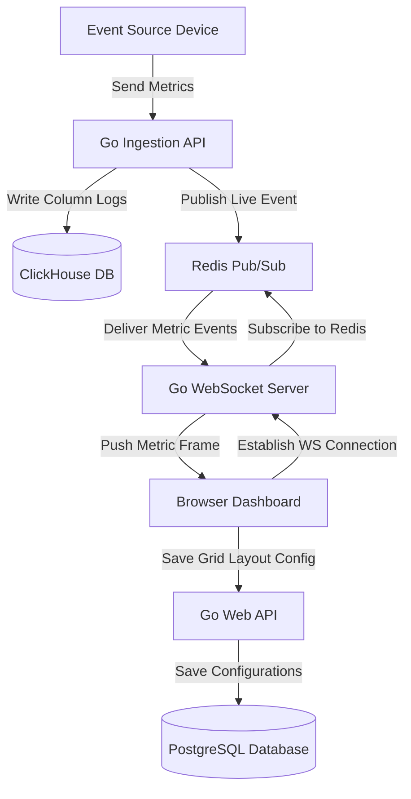

# Enterprise Dashboard Architecture Specification

This document provides the architectural blueprint, design parameters, and engineering decisions for building a real-time **Enterprise Metrics Dashboard** featuring WebSocket data streams, dynamic grid widget configurations, and analytical database aggregations.

---

## 1. Overview & Strategy

### Business Problem
Enterprises manage high-volume data streams (system telemetry, sales transactions, server statuses) and require real-time dashboard visualizations to identify issues and monitor business performance. Querying large databases directly for real-time dashboards can crash transactional servers, while static dashboards fail to show critical events in real-time.

### Goals
* **Real-time Telemetry Updates**: Stream metric updates to client screens in under 100ms from database arrival.
* **Highly Dynamic Grids**: Allow users to customize widget layouts, sizes, and metrics sources with drag-and-drop UI.
* **Low-Latency Aggregations**: Query analytics datasets covering millions of rows without degrading performance.
* **Efficient Connections Management**: Manage thousands of concurrent WebSocket connections on backend gateways.

### Target Users
* **Operations Managers (SREs / DevOps)**: Monitoring system performance, server health, and alerts.
* **Business Executives**: Reviewing sales trends, transaction metrics, and revenue targets.

---

## 2. Requirements

### Functional Requirements
* **Dynamic Widget Grid**: Drag-and-drop dashboard canvas that dynamically adjusts sizes, locations, and data sources.
* **Real-Time Data Streaming**: WebSocket connection channel pushing live updates (CPU, sales counters) to visual charts.
* **Time-Series Query Engine**: Filter historical data by time buckets (e.g. 5m, 1h, 24h) and calculate average/sum aggregation metrics.
* **Threshold Alert Engine**: Configure alert thresholds, sending alerts to browser screens when values are exceeded.

### Non-functional Requirements
* **UI Render Smoothness**: Render chart animations at 60 FPS without layout shifts or memory leaks.
* **Data Load Time**: Return dashboard configurations and initial historical metrics in under 200ms.
* **Connection Scale**: Support up to 10,000 concurrent active WebSocket connections per dashboard node.
* **Aggregation Latency**: Execute average aggregation queries across 10 million rows in under 100ms.

---

## 3. Technology Stack Selection

| Layer | Technology | Rationale & Trade-offs |
|---|---|---|
| **Frontend** | React / Next.js / Tailwind CSS | Next.js with React Client SPA. Dynamic layouts built using libraries like `react-grid-layout` and charts using `Recharts` or `Chart.js`. |
| **Backend** | Go (Golang) | High concurrency throughput, minimal memory overhead, and native support for WebSocket connection loops. |
| **Transactional DB**| PostgreSQL | Stores user profiles, organization configurations, and custom widget layout parameters. |
| **Analytical DB** | ClickHouse | Column-oriented database engine optimized for processing time-series and aggregate analytics queries. |
| **Message Broker** | Redis Pub/Sub | Manages event broadcasting across clustered WebSocket server nodes. |

---

## 4. Architecture & Engineering Plans

### Repository Skills Used
* **[software-architect](file:///d:/projects/Nexulyt-AI-OS/skills/software-architect/SKILL.md)**: C4 Container boundaries, database sharding paradigms.
* **[performance-engineer](file:///d:/projects/Nexulyt-AI-OS/skills/performance-engineer/SKILL.md)**: ClickHouse column index tuning, WebSocket buffer optimization.
* **[ui-ux-designer](file:///d:/projects/Nexulyt-AI-OS/skills/ui-ux-designer/SKILL.md)**: Information hierarchy, layout spacing, dashboard color palettes.

### Architecture Overview
The architecture separates transactional data (PostgreSQL) from analytical time-series logs (ClickHouse). Live events land on a Go ingestion API, are written to ClickHouse, and publish to Redis Pub/Sub. The WebSocket servers subscribe to Redis and push alerts to client screens:

### Database Strategy
This system employs a **hybrid transactional and analytical database (HTAP) architecture**:
* **PostgreSQL (Transactional Store)**:
  * Tables: `dashboards`, `widgets`, `users`, `alert_rules`.
  * Column configurations: Widget position details are stored as JSONB metadata structures: `{ "x": 0, "y": 0, "w": 4, "h": 2, "chart_type": "line", "metric_id": "cpu_utilization" }`.
* **ClickHouse (Analytical Store)**:
  * Table: `metric_logs` using the `MergeTree` engine.
  * Schema: `(timestamp DateTime, metric_id LowCardinality(String), value Float64, device_id String)`.
  * ClickHouse stores data in columns rather than rows, allowing queries to scan only target metrics columns and aggregate millions of rows in milliseconds.

### API Strategy
* **REST APIs**: Configured on `/api/v1/dashboards` to handle grid edits and fetch historical metrics.
* **WebSocket Connection API**: Handled on `/api/v1/metrics/stream` using the Gorilla WebSocket library in Go.
* **Security Headers**: Standard JWT tokens pass via query parameters during connection initialization checks.

### Frontend Strategy
* **Drag-and-Drop Canvas**: Layout grids managed using React hooks mapping layout positions to JSON coordinates.
* **Optimized Chart Rendering**: Limit chart data sets to a maximum of 100 points, decimation algorithms run in the background to downsample historical data before rendering.
* **Canvas Repaint Prevention**: Wrap chart panels in memoization boundaries (`React.memo`) to prevent parent grids from triggering chart repaints during drag actions.

### Backend Strategy
* **Gorilla WebSocket Router**:
  * Manage WebSocket connections in Go hubs using channel systems (register, unregister, broadcast).
  * Enforce read/write deadlines, keep-alive ping/pong frames (every 30 seconds), and client message size limits to prevent server resource exhaustion.
* **Materialized Views**: Configure ClickHouse Materialized Views to pre-aggregate data in 1-minute intervals, reducing query times for long-term historical charts.

---

## 5. Security & Performance

### Security Considerations
* **WebSocket Hijack Prevention**: Verify Origin headers on all incoming WebSocket handshake requests.
* **Widget Parameter Sanitation**: Sanitize widget parameters to prevent SQL injection in ClickHouse.
* **Tenant Data Boundary**: Filter all analytical ClickHouse queries using the user's `organization_id` to prevent cross-tenant data leaks.

### Performance Considerations
* **Metric Downsampling**: Downsample high-frequency data (e.g. 1-second ticks) to larger intervals (e.g. 1-minute summaries) for long-term charts.
* **ClickHouse Column Indexing**: Order primary keys: `PRIMARY KEY (metric_id, timestamp)` to optimize lookup paths.
* **Write Buffering**: Buffer incoming metrics in Go memory arrays and execute batch insertions to ClickHouse every 2 seconds to optimize write performance.

### Deployment Strategy
* **Load Balancing**: Use NGINX load balancers configured with IP hash sticky routing to distribute WebSocket connections evenly across backend instances.
* **Clustered ClickHouse**: Deploy ClickHouse in clustered configurations (Shard replication with ZooKeeper coordinating writes).
* **Autoscaling**: Scale WebSocket pods horizontally based on active TCP connection counts.

---

## 6. Risks, Best Practices, and Future Scope

### Risks
* **Browser Thread Blockage**: Rendering multiple high-frequency real-time charts simultaneously can consume high client-side CPU, causing browser tab crashes.
* **WebSocket Connection Storms**: Sudden client reconnect events after network drops can overwhelm backend connection gateways.

### Best Practices
* Buffer and batch updates to the UI, applying them in batches (e.g. every 500ms) rather than rendering every individual WebSocket frame.
* Configure back-off retry timings on client-side WebSocket reconnect logic.
* Decouple analytical ClickHouse writes from transactional PostgreSQL operations.

### Common Mistakes
* Querying raw time-series data tables for long-term charts without downsampling, causing high database and network overhead.
* Executing database queries directly inside the WebSocket read/write loops.

### Future Improvements
* **AI Anomaly Detector**: Train local regression models to monitor time-series logs and flag metrics that deviate from normal baseline patterns.
* **Dynamic PDF Reports**: Automate weekly PDF dashboard snapshot renders, emailing them to administrators using headless browser scripts.
