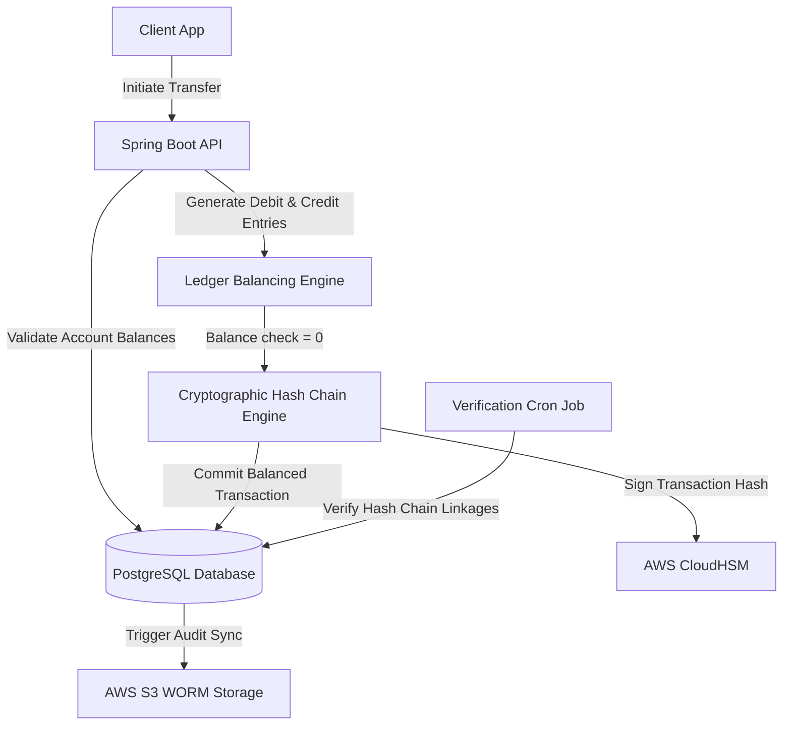

# Fintech Platform Ledger Architecture Specification

This document provides the architectural blueprint, design parameters, and engineering decisions for building a highly secure, transaction-compliant **Fintech Ledger System** featuring double-entry accounting constraints, cryptographic transaction hashing, and audit trails.

---

## 1. Overview & Strategy

### Business Problem
Financial platforms require absolute transaction integrity, mathematical balancing guarantees, and robust audit compliance patterns. Simple balance databases (e.g. updating a single user balance cell) are vulnerable to race conditions, currency math drift, and tamper hacks. To pass financial audits, all money movements must be recorded as immutable, double-entry ledger entries.

### Goals
* **Strict Double-Entry Accounting**: Enforce that every transaction balances mathematically to zero (Debits = Credits).
* **Cryptographic Immutability**: Generate hash chains of ledger blocks to detect tamper attempts immediately.
* **ACID Database Integrity**: Enforce Serializable database isolation levels to prevent phantom overdraft reads.
* **Granular Audit Trails**: Record full session metadata, user contexts, IP addresses, and encryption hashes for all modifications.

### Target Users
* **Customers**: Checking balances, executing transfers, and reading histories.
* **Finance Auditors / Operations**: Reviewing general ledgers, verifying reconciliations, and checking transaction balances.

---

## 2. Requirements

### Functional Requirements
* **Double-Entry Ledger Engine**: Tables recording ledger entries, transactions, and account definitions.
* **Balance Calculator**: Asynchronous and synchronous account balance calculators verifying ledger rows.
* **Cryptographic Hash Chain**: Automatically link transaction records using cryptographically hashed block chains.
* **Reconciliation Checker**: Automatic background service comparing transaction records with external banking statements.

### Non-functional Requirements
* **Transaction Latency Limit**: Complete ledger validations and database writes in under 50ms.
* **Database Isolation Conformance**: Use Serializable transaction isolation boundaries for ledger inserts.
* **Audit Logs Persistence**: Write system audit traces to immutable storage.
* **Math Precision**: Store all currency calculations using exact numeric scaling (e.g. PostgreSQL `numeric(18,4)`), never using floats.

---

## 3. Technology Stack Selection

| Layer | Technology | Rationale & Trade-offs |
|---|---|---|
| **Frontend** | React / Next.js / Tailwind CSS | Next.js SPA with strict input schema checks. High-density data tables display ledger lines. |
| **Backend** | Java (Spring Boot) / Go | Java provides robust decimal math engines and enterprise database connection pools. |
| **Database** | PostgreSQL | Supports Serializable isolation level, advanced transaction scopes, and precise numeric types. |
| **Hash Storage** | HSM / AWS CloudHSM | Hardware security modules (HSM) secure cryptographic keys used to sign block hashes. |
| **Audit Logs** | AWS S3 Object Lock | Immutable WORM storage for ledger backup archives. |

---

## 4. Architecture & Engineering Plans

### Repository Skills Used
* **[software-architect](file:///d:/projects/Nexulyt-AI-OS/skills/software-architect/SKILL.md)**: Ledger schemas design patterns, C4 component maps.
* **[security-engineer](file:///d:/projects/Nexulyt-AI-OS/skills/security-engineer/SKILL.md)**: Cryptographic signing models, HSM integrations, compliance audits.
* **[database-architect](file:///d:/projects/Nexulyt-AI-OS/skills/database-architect/SKILL.md)**: SQL numeric configurations, repeatable read/serializable transactions checks.

### Architecture Overview
The ledger system processes all transfers within a strict Transaction boundary. Payments are split into Debit and Credit entries, signed cryptographically by CloudHSM, and committed to PostgreSQL. An independent ledger verification engine checks hash chain continuity:



### Database Strategy
* **Double-Entry Schema Layout**:
  * Tables: `accounts` (e.g., asset, liability, equity, revenue, expense), `transactions` (contains parent date, description, hash chain link), `entries` (debits and credits).
  * Column Precision: All value fields utilize `numeric(18, 4)` to store values safely down to 4 decimal places.
  * Entry Balance Constraint:
    ```sql
    ALTER TABLE entries ADD CONSTRAINT check_entry_amount_positive CHECK (amount > 0);
    ```
    Transactions must contain at least two entries: a debit (direction: `debit`) and a credit (direction: `credit`), balancing to exactly zero:
    `SUM(case when direction = 'debit' then amount else -amount end) = 0`.

### API Strategy
* **REST APIs**: Endpoints structured under `/api/v1/ledger/accounts`, `/api/v1/ledger/transactions`.
* **Idempotency Header**: Enforce `Idempotency-Key` headers on all POST transfers to prevent duplicate processing.
* **Cryptographic JSON payload**: Transaction receipts return payload hashes signed with HSM keys.

### Frontend Strategy
* **Account Balance Timeline**: Visual layout plotting balance curves, pulling entries dynamically.
* **Decimal Input Checks**: Input components restrict text input, stripping invalid decimals and enforcing maximum currency bounds prior to API routing.
* **Audit Trail Exposer**: Display visual verification badges confirming that transaction hashes match the public ledger chain.

### Backend Strategy
* **Ledger Validation Pipeline**:
  1. Set transaction boundary: `BEGIN TRANSACTION ISOLATION LEVEL SERIALIZABLE;`
  2. Query source account balance: `SELECT SUM(...) FROM entries WHERE account_id = ?;`
  3. Validate overdraft limits. If insufficient: Rollback.
  4. Query last transaction block: `SELECT id, transaction_hash FROM transactions ORDER BY id DESC LIMIT 1 FOR UPDATE;`
  5. Generate debit and credit entries.
  6. Calculate new transaction hash: `SHA256(current_payload + last_transaction_hash)`.
  7. Commit parent transaction and entries.
  8. Commit transaction block: `COMMIT;`

---

## 5. Security & Performance

### Security Considerations
* **Tamper Detection**: If database columns are modified directly bypassing the API, the cryptographic hash chain breaks, triggering platform alarms.
* **Separation of Duties**: Isolate developer write permissions. Database administration accounts must not have read permissions on plaintext encryption keys.
* **Audit Trail Durability**: Replicate ledger changes to S3 WORM storage with multi-region replication.

### Performance Considerations
* **Read-Side Account Balances Cache**: Cache calculated account balances in Redis to avoid executing `SUM(amount)` queries across millions of rows on every user login.
* **Ledger Index Tuning**: Index database fields: `entries (account_id, created_at)`.
* **Batch Reconciliations**: Run heavy statement matching routines asynchronously in low-traffic windows.

### Deployment Strategy
* **Clustered Nodes**: Deploy backend API nodes in isolated subnets with strict firewall parameters.
* **HSM Integrations**: Use secure VPC endpoints to route token signing calls to CloudHSM nodes.
* **Database Scaling**: Enable master database configuration for writes, and read-replicas for generating account statements.

---

## 6. Risks, Best Practices, and Future Scope

### Risks
* **Serializable Deadlocks**: High concurrent transfers on the same corporate account can cause serialization errors, requiring automated request retries.
* **Key Compromise**: Exposure of master signing keys would allow actors to forge signed transactions.

### Best Practices
* Always implement a retry wrapper on the backend to retry transactions if serializable conflict errors occur.
* Store money inputs as integers (representing cents) or numeric decimals, never using float configurations.
* Perform monthly manual reconciliation runs comparing database summaries with bank network logs.

### Common Mistakes
* Modifying user account balances using a simple `UPDATE users SET balance = balance + ?` statement, leaving no trace logs.
* Allowing negative debit or credit values in entry tables, which breaks double-entry mathematics.

### Future Improvements
* **Smart Fraud Classifier**: Train classification algorithms to flag transaction nodes displaying anomalies (e.g. transfers patterns indicative of money laundering).
* **Decentralized Audit Proofs**: Export signed transaction trees to private blockchain nodes to build verifiable public receipts.
