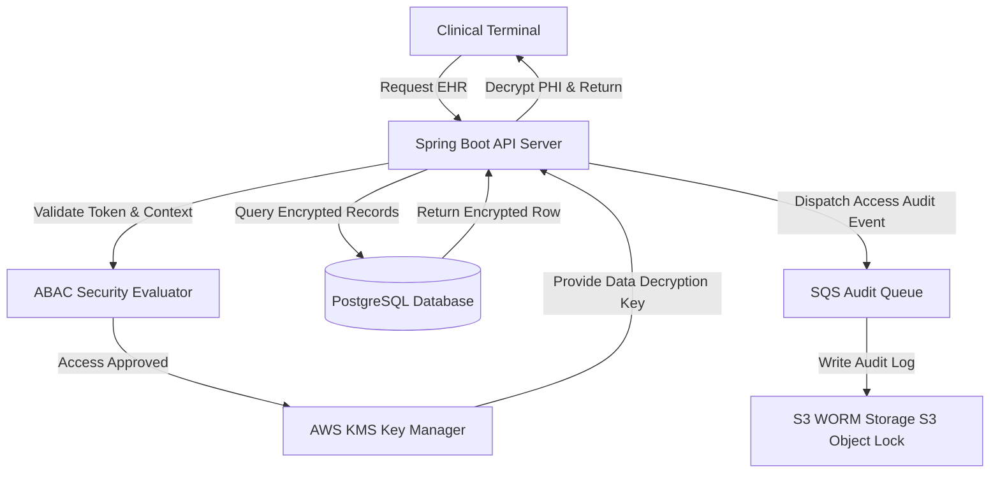

# Hospital Management Architecture Specification

This document provides the architectural blueprint, design parameters, and engineering decisions for building a highly secure, compliance-heavy **Hospital Management System** featuring patient records encryption, HIPAA/GDPR data security models, and high-availability operations.

---

## 1. Overview & Strategy

### Business Problem
Healthcare institutions must manage Electronic Health Records (EHR) while meeting strict legal compliance requirements (such as HIPAA in the US and GDPR in Europe). Systems require absolute privacy controls, field-level encryption, multi-factor authorization, and high availability to ensure patient data remains secure yet accessible to medical staff.

### Goals
* **HIPAA/GDPR Compliance**: Enforce field-level encryption for Protected Health Information (PHI) and keep full audit trails for every access event.
* **High Availability Operations**: Design a fault-tolerant system layout ensuring zero access disruptions to clinical applications.
* **Granular Attribute-Based Access Control (ABAC)**: Dynamically restrict access to medical records based on staff roles, department context, and active patient-doctor relationships.
* **System Integration Compatibility**: Integrate with standard medical messaging systems (HL7/FHIR) securely.

### Target Users
* **Doctors / Nurses**: Reviewing clinical data, prescribing treatments, and logging vitals.
* **Hospital Operators**: Coordinating scheduling, billing transactions, and department workflows.
* **Compliance Officers**: Reviewing audit access logs and security configurations.

---

## 2. Requirements

### Functional Requirements
* **Electronic Health Records (EHR)**: CRUD operations on patient records, treatment plans, prescriptions, and lab results.
* **Attribute-Based Access Control (ABAC)**: Evaluate dynamic rules (e.g., "Doctor can read patient file ONLY if doctor has an active appointment with that patient").
* **HL7 / FHIR Integration**: Import/export health records payloads securely.
* **Immutable Security Logging**: Audit every read and write access on PHI records.

### Non-functional Requirements
* **PHI Field Decryption Speed**: Decrypt and serve client-requested EHR fields in under 80ms.
* **System Availability Target**: 99.999% uptime to prevent clinical routing blockages during emergencies.
* **Audit Trail Security**: Audit logs must be stored in write-once-read-many (WORM) storage.
* **Data Residency Rules**: Conformance with regional GDPR boundaries (e.g. EU data hosted inside EU physical servers).

---

## 3. Technology Stack Selection

| Layer | Technology | Rationale & Trade-offs |
|---|---|---|
| **Frontend** | React / Next.js / Tailwind CSS | Next.js SPA. Strict client-side timeout guards and cookie session pruners are implemented to secure active terminal screens. |
| **Backend** | Java (Spring Boot) | Enterprise-grade security frameworks, native support for FHIR messaging tools, and mature cryptography utilities. |
| **Database** | PostgreSQL / AWS Aurora | PostgreSQL handles records schemas, and supports pgcrypto extensions for field-level database encryption. |
| **Integration API** | FHIR Engine | Standard framework to process medical payloads. |
| **KMS** | AWS Key Management Service (KMS) | Centralized, secure storage for managing envelope encryption master keys. |

---

## 4. Architecture & Engineering Plans

### Repository Skills Used
* **[software-architect](file:///d:/projects/Nexulyt-AI-OS/skills/software-architect/SKILL.md)**: ABAC authorization models, C4 boundary mapping, medical network layouts.
* **[security-engineer](file:///d:/projects/Nexulyt-AI-OS/skills/security-engineer/SKILL.md)**: Field-level encryption setups, envelope encryption models, WORM logs storage.
* **[backend-engineer](file:///d:/projects/Nexulyt-AI-OS/skills/backend-engineer/SKILL.md)**: Spring Security configurations, FHIR payload parsers, transactional event listeners.

### Architecture Overview
The system splits patient data access behind an ABAC evaluator. PHI fields are decrypted on the fly using keys retrieved from AWS KMS. An independent logging worker writes all access events directly to AWS S3 Object Lock (WORM storage):

### Database Strategy
* **Protected Health Information (PHI) Isolation**:
  * Tables: `patients`, `medical_records`, `prescriptions`, `appointments`, `audit_access_logs`.
  * PHI fields (e.g. social security, birth dates, diagnoses notes) are stored as encrypted byte arrays inside the database columns.
* **Envelope Encryption Model**:
  * For each patient record, a unique Data Encryption Key (DEK) is generated. The DEK is encrypted using a Master Key managed inside AWS KMS and stored alongside the patient record.
  * The actual patient data is encrypted using the plaintext DEK via AES-256-GCM. Plaintext DEKs are never saved to disk and are only held in memory during the request execution cycle.

### API Strategy
* **FHIR-Compliant Endpoints**: Exposes endpoints following HL7/FHIR version 4 specification (e.g. `/fhir/Patient/{id}`, `/fhir/Observation/{id}`).
* **Contextual Access Headers**: Requests carry headers denoting user context, department coordinates, and emergency state flags (e.g. "Break the Glass" override).
* **ABAC Validation Payload**: API inputs are checked by interception logic that validates the user credentials and active hospital shift patterns.

### Frontend Strategy
* **Secure Session Pruning**: Web application checks for keyboard/mouse idle status. If inactive for > 120 seconds, it automatically clears tokens from memory and logs out the user.
* **Clipboard Restrictions**: Disable text copying and screenshot hotkey integrations on pages displaying PHI.
* **Emergency Override UI**: Visible "Break the Glass" button triggering audit alerts, giving doctors rapid access to files in critical situations.

### Backend Strategy
* **ABAC Policy Evaluator**:
  * Validates request rules: `User.Role == 'Doctor' AND User.Department == Patient.Department AND (HasActiveAppointment(User, Patient) OR IsAssignedTreatment(User, Patient) OR IsEmergencyState == TRUE)`.
* **Access Audit Engine**: Every read request triggers a non-blocking interceptor that compiles user ID, client IP, patient record ID, and accessed fields. This payload is dispatched to AWS S3 Object Lock (WORM storage) where logs cannot be deleted or overwritten.

---

## 5. Security & Performance

### Security Considerations
* **Break-the-Glass Policy**: In life-threatening emergencies, doctors can bypass standard ABAC rules. Triggering this flag decrypts records instantly but fires high-priority alerts to security teams.
* **Network Isolation**: Host databases and API backends inside private subnets, blocking direct public internet access. Use secure VPNs for hospital terminals.
* **SQL Injection Audits**: Prevent all dynamic query evaluation in Java; use Spring Data JPA or Hibernate parameterized criteria.

### Performance Considerations
* **DEK Decryption Caching**: Cache decrypted DEKs in a secure, memory-isolated cache (e.g. Caffeine Cache with short TTL) to prevent AWS KMS call bottlenecks during active clinical sessions.
* **Database Connection Pools**: Configure connection limits to prioritize clinical API servers over scheduling or billing modules.
* **Index Partitioning**: Maintain index schemas on non-encrypted lookup fields (e.g. Patient ID, Department ID) to keep query evaluations fast.

### Deployment Strategy
* **High Availability Setup**: Run application servers in multiple availability zones with automated traffic load balancers.
* **Database Replication**: Deploy AWS Aurora Multi-AZ database cluster featuring automated failover limits under 30 seconds.
* **Disaster Recovery**: Maintain daily database backups encrypted using regional KMS keys and replicate them to a separate physical cloud zone.

---

## 6. Risks, Best Practices, and Future Scope

### Risks
* **KMS Outages**: If the cloud KMS provider experiences downtime, the system will be unable to decrypt PHI fields, blocking clinical access.
* **Social Engineering Security Leaks**: Medical staff sharing system credentials or leaving active clinical terminals unattended.

### Best Practices
* Never log decrypted PHI or clinical diagnostics in system logs.
* Require Multi-Factor Authentication (MFA) for all user roles, including internal clinical networks.
* Conduct regular penetration testing on hospital terminal subnets.

### Common Mistakes
* Storing DEK keys in plaintext inside database config files.
* Bypassing security checks or access audits on staging or sandbox testing environments.

### Future Improvements
* **AI Diagnostic Integration**: Integrate secure, offline machine learning models (e.g., local radiology image classification) to help detect anomalies in test results.
* **FHIR Event Subscriptions**: Expose secure WebSub notifications to sync records with regional healthcare directories.
