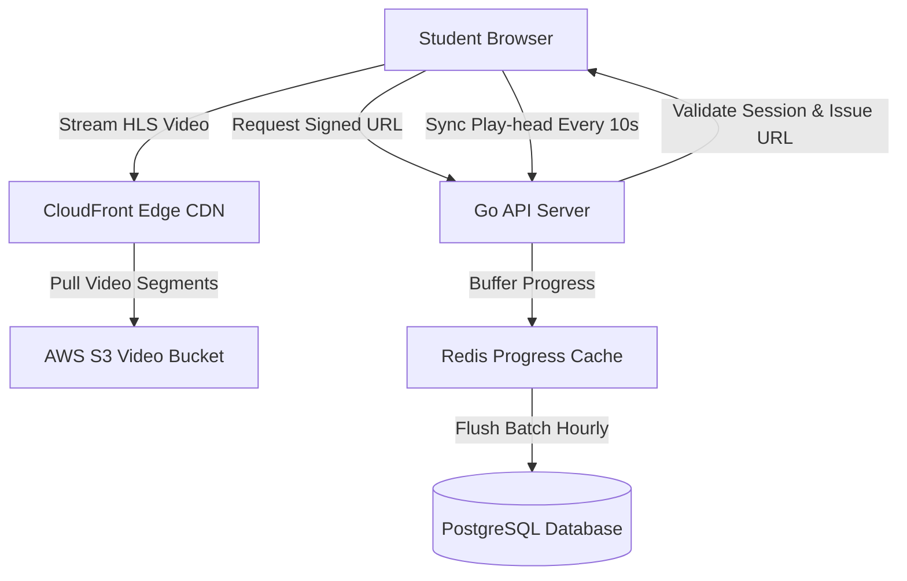

# Learning Management System (LMS) Architecture Specification

This document provides the architectural blueprint, design parameters, and engineering decisions for building a scalable, media-focused **Learning Management System (LMS)** featuring video CDN asset distribution, course progress state tracking, and secure quiz validation models.

---

## 1. Overview & Strategy

### Business Problem
Educational platforms must stream rich video lectures, manage dynamic course structures, and track progress metrics for thousands of active students. Slow video buffering times, inaccurate progress saves, and vulnerable quiz grading systems degrade student engagement and damage certification authority.

### Goals
* **Optimized Video Delivery**: Stream video content globally with low latency using multi-region Edge CDN networks.
* **Persistent Progress States**: Automatically track video progress and course checkpoints with write latency under 20ms.
* **Secure Quiz Verification**: Validate quiz responses server-side using secure transaction scoring to prevent cheating.
* **Scale Concurrent Streaming**: Support high concurrent video streams during campus exam/lecture peak hours.

### Target Users
* **Students**: Streaming lecture videos, submitting quizzes, and tracking certifications.
* **Instructors**: Uploading course outlines, video files, and managing quiz configurations.
* **Administrators**: Reviewing platform analytics, billing, and course approvals.

---

## 2. Requirements

### Functional Requirements
* **Video Streaming Engine**: Adaptive bitrate streaming (HLS/DASH) with signed URL access controls.
* **Course Progress Engine**: Real-time checkpoint tracking storing video play-head percentages and course chapter completion status.
* **Quiz Grading Engine**: Server-side quiz validator that compares candidate answers against encrypted key fields and calculates scores.
* **Certification Pipeline**: Auto-generation of secure PDF certificates when course completion checks pass.

### Non-functional Requirements
* **Video Time-to-First-Frame**: Buffer and begin playing videos in under 1.5 seconds globally.
* **Progress Sync Interval**: Sync video play-head positions to backend endpoints every 10 seconds.
* **Quiz Validation Security**: Quiz score evaluations must run isolated from database read buffers.
* **Concurrent Users Target**: Support up to 25,000 active concurrent streams.

---

## 3. Technology Stack Selection

| Layer | Technology | Rationale & Trade-offs |
|---|---|---|
| **Frontend** | React / Next.js / Tailwind CSS | Next.js with video.js hooks. Custom video overlays use client states to check focus and engagement parameters. |
| **Backend** | Go (Golang) / Node.js | Go handles heavy progress tracking API routes. Node.js handles PDF certificate generation and video metadata ingestion. |
| **Database** | PostgreSQL | Manages relational entities (Users, Courses, Chapters) and locks quiz records transactions. |
| **Progress Cache** | Redis | Caches active video play-head parameters before flushing summaries to PostgreSQL. |
| **Asset Storage** | AWS S3 + CloudFront CDN | Video files stored in S3, transcoded using AWS Elemental MediaConvert, and distributed via CloudFront edge. |

---

## 4. Architecture & Engineering Plans

### Repository Skills Used
* **[software-architect](file:///d:/projects/Nexulyt-AI-OS/skills/software-architect/SKILL.md)**: C4 Container layouts, media distribution mapping.
* **[frontend-engineer](file:///d:/projects/Nexulyt-AI-OS/skills/frontend-engineer/SKILL.md)**: Custom HLS video players, progress save hooks, responsive UI layouts.
* **[performance-engineer](file:///d:/projects/Nexulyt-AI-OS/skills/performance-engineer/SKILL.md)**: CloudFront cache configurations, Redis write-buffering.

### Architecture Overview
The system isolates heavy video streaming from state tracking. Clients stream video chunks directly from CloudFront Edge nodes using signed URLs. Video progress data is buffered in Redis to shield the primary PostgreSQL database from write bottlenecks:

### Database Strategy
This system separates structural relational data from rapid progress records:
* **Relational Schema (PostgreSQL)**:
  * Tables: `users`, `courses`, `chapters`, `quizzes`, `quiz_questions`, `quiz_submissions`, `certificates`.
  * Indexing: Composite key indices on `(user_id, course_id)` to speed up progress reporting views.
* **Write-Buffer State (Redis)**:
  * Video play-heads are saved in Redis hashes: `progress:user_id:chapter_id` mapping fields `{ "playhead": 120, "completed": false, "timestamp": 17182939 }`.
  * An automated cron worker runs every hour, collecting dirty hashes from Redis and executing a batch upsert to the database `user_progress` table.

### API Strategy
* **REST Routes**: Handlers for `/api/v1/courses`, `/api/v1/quizzes/submit`, `/api/v1/progress/sync`.
* **Signed Cookie Access**: Media player requests to CloudFront use CloudFront Signed Cookies to prevent direct file link sharing.
* **Payload Serialization**: Progress sync endpoints use compressed payloads: `{ "c_id": string, "p_sec": integer }` to save bandwidth.

### Frontend Strategy
* **Custom HLS Player**: Video.js layout parsing HLS manifest files (`.m3u8`), auto-adjusting stream resolution (1080p -> 360p) based on client bandwidth changes.
* **Progress Sync Hook**: Custom React hooks listening to player tick events. If page changes state (e.g. user tab switches, browser minimizes), the hook pauses the video and dispatches an immediate sync request.
* **Quiz UI Grid**: Prevents back-navigation once a quiz session initiates, using client-side confirm blocks.

### Backend Strategy
* **Secure Quiz Validation Engine**:
  1. Receive submission payload: `{ "submission_id": string, "answers": [{ "q_id": string, "value": string }] }`.
  2. Query database for correct answer keys: `SELECT id, correct_option FROM quiz_questions WHERE quiz_id = ?;`.
  3. Perform server-side validation: Score calculation done in isolation in a Go goroutine.
  4. Write score and set status to `completed` in `quiz_submissions` table in a single transaction.
* **Transcoding Worker**: Video upload events trigger S3 notifications dispatching encoding tasks to MediaConvert to compile video assets to HLS streams.

---

## 5. Security & Performance

### Security Considerations
* **HLS Signed URL Expiration**: Set Signed URL lifespans to 2 hours to prevent links from being shared on external sites.
* **Quiz Plagiarism Shield**: Randomize question presentation order and choice lists on the fly.
* **PDF Certificate Signatures**: Generate cryptographic hashes of certificates using private keys and print verification QR codes.

### Performance Considerations
* **Redis Progress Buffering**: Bypassing direct SQL updates on progress ticks reduces database writes by 90% under peak user loads.
* **CloudFront Origin Shield**: Configure Origin Shield to minimize cache-miss requests from CloudFront Edge nodes back to S3 buckets.
* **API Payload Gzip**: Compress JSON payloads using gzip to reduce roundtrip latency times.

### Deployment Strategy
* **Containerization**: Deploy Go API nodes in multi-stage Docker containers.
* **Orchestration**: Deploy to Kubernetes with horizontal autoscalers monitoring network adapter throughput.
* **Storage Multi-Region**: Enable S3 Cross-Region Replication to copy video assets to regional buckets closest to target demographics.

---

## 6. Risks, Best Practices, and Future Scope

### Risks
* **Media Sync Latency**: Delays in AWS MediaConvert processing could prevent newly uploaded lectures from appearing instantly.
* **Progress Buffering Data Loss**: A sudden crash of the Redis instance before batch flushing could lose recent progress summaries.

### Best Practices
* Always run Redis with Persistence configurations (AOF enabled) to prevent progress data loss on crashes.
* Never store correct quiz options in client-side javascript code blocks or hidden HTML elements.
* Set alert alarms monitoring CloudFront CDN bandwidth spikes.

### Common Mistakes
* Querying progress database tables on every video timeline tick event, crashing database connection pools.
* Uploading raw MP4 videos directly to S3 without transcoding them into HLS/DASH streams, leading to massive buffering latencies for mobile users.

### Future Improvements
* **AI Subtitle Generator**: Automatically generate multi-language closed-captions and transcripts using Whisper models during video transcoding phases.
* **Smart Review Loops**: Train classification logic to analyze quiz mistakes and recommend specific video review bookmarks.
