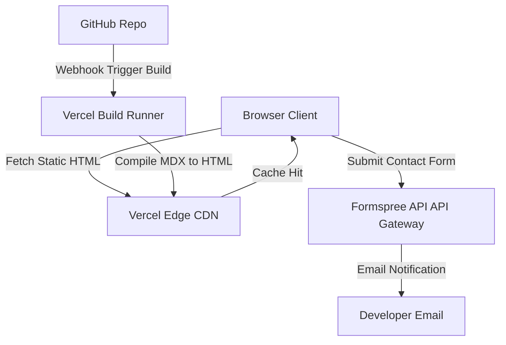

# Portfolio Website Architecture Specification

This document provides the architectural blueprint, design parameters, and engineering decisions for building a high-performance, search-engine-optimized, responsive **Developer Portfolio Website**.

---

## 1. Overview & Strategy

### Business Problem
Independent developers and engineering consultants require a highly performant, visually premium, and search-optimized web presence to showcase their achievements, write articles, and acquire clients. Traditional site builders create slow, bloated packages that hurt search engine rankings and lower conversion rates.

### Goals
* **Maximize Load Speeds**: Deliver a sub-second page load time to retain visitors.
* **Optimize Search Visibility**: Achieve a perfect score on search optimization audits.
* **Support Rich Media**: Display high-definition screenshots, project demos, and interactive widgets.
* **Zero Maintenance Infrastructure**: Deploy on serverless edge networks that scale down to zero cost.

### Target Users
* **Technical Recruiters**: Seeking fast access to project highlights, resumes, and contact links.
* **Engineering Managers**: Reviewing technical blog posts and open-source contributions.
* **Clients & Leads**: Submitting contact queries for project proposals.

---

## 2. Requirements

### Functional Requirements
* **Projects Showcase**: Filterable gallery of completed projects featuring description metadata, images, and live links.
* **Technical Blog**: Markdown-driven blogging system with code syntax highlighting, categorizations, and RSS feed generation.
* **Interactive Resume**: Responsive timeline layout highlighting professional experience, skills, and certifications.
* **Contact Handler**: Secure message submission form dispatching queries to email gateways.

### Non-functional Requirements
* **Lighthouse Performance Targets**: Score > 95 on Core Web Vitals audits (LCP < 1.5s, CLS < 0.05, INP < 100ms).
* **SEO Compliance**: Structured JSON-LD metadata schema for Author and Article entities on all pages.
* **Accessibility**: Conformance with WCAG 2.1 AA parameters (keyboard tab indices, screen-reader descriptions, and contrast checks).
* **Responsive Scaling**: Fluid viewport layouts matching Mobile (360px) to Ultra-wide (1920px) screens.

---

## 3. Technology Stack Selection

| Layer | Technology | Rationale & Trade-offs |
|---|---|---|
| **Framework** | Next.js / Static Site Gen (SSG) | Combines React component patterns with pre-compiled HTML to ensure zero server-side rendering latency. |
| **Styling** | Tailwind CSS | Utility-first classes minimize final CSS bundles and enable responsive styling. |
| **Content Engine** | MDX (Markdown with React Components) | Allows writing content in markdown files while nesting interactive React graphs or components within pages. |
| **Forms** | Formspree / Serverless Functions | Eliminates the need for a persistent database/backend server by utilizing a stateless API gateway. |
| **Deployment** | Vercel Edge CDN | Serves static assets directly from edge CDNs globally, reducing latency to physical user locations. |

---

## 4. Architecture & Engineering Plans

### Repository Skills Used
* **[ui-ux-designer](file:///d:/projects/Nexulyt-AI-OS/skills/ui-ux-designer/SKILL.md)**: Layout wireframes, typography scales, accessibility check grids, and interactive states.
* **[frontend-engineer](file:///d:/projects/Nexulyt-AI-OS/skills/frontend-engineer/SKILL.md)**: MDX integration, Tailwind grids, image optimizations, and Core Web Vitals.
* **[performance-engineer](file:///d:/projects/Nexulyt-AI-OS/skills/performance-engineer/SKILL.md)**: Dynamic code splitting, prefetching, and critical CSS inline methods.

### Architecture Overview
The portfolio is designed as a **Jamstack Architecture**. During the CI/CD compilation step, all routes are fully pre-compiled into static HTML, CSS, and JS bundles. Client browsers fetch pre-rendered markup directly from the CDN edge cache:

### Database Strategy
This architecture uses a **stateless data strategy**:
* **No Database**: Content (projects, articles, details) is stored locally in version-controlled MDX markdown files.
* **Build Ingestion**: During compilation, Next.js crawls local directories to generate pages, index lists, and RSS feeds.
* **Contact Submissions**: Handled by external stateless endpoints, eliminating persistent SQL/NoSQL storage.

### API Strategy
* **Static Assets**: API routes are not used during runtime reads.
* **Contact Gateway**: Simple POST payload submitted asynchronously (`fetch`) to the Formspree endpoint:
  * Headers: `Content-Type: application/json`
  * Payload: `{ "email": string, "name": string, "message": string }`
  * Error checks: Catch network dropouts and display success/failure notification states in the UI.

### Frontend Strategy
* **Modular Page Grids**: CSS Grid layouts reflowing from single column (mobile) to two/three column sidebars (desktop).
* **Asset Optimization**: Next.js `<Image>` component automatically converts upload files to WebP formats, generates responsive `srcset` boundaries, and inserts placeholder blur states to prevent layout shifts.
* **MDX Components**: Code blocks parsed with syntax highlighter libraries (e.g., Rehype Prism) to enable dark-theme line numbers and copy buttons.
* **WAI-ARIA compliance**: Explicit `aria-label` tags on icons and semantic HTML5 structuring.

### Backend Strategy
* **Edge Routing**: Redirections, headers, and security rules configured in a root configuration file (e.g. `vercel.json`).
* **Stateless API Routes**: Standard API handler configurations are omitted to keep the deploy footprint minimal.

---

## 5. Security & Performance

### Security Considerations
* **No Database Vector**: Eliminates SQL/NoSQL injection risks.
* **Form Spam Shield**: Captcha keys embedded within the contact form submission API.
* **Content Security Policy (CSP)**: HTTP headers locking script executions to self and verified CDN boundaries.

### Performance Considerations
* **Critical CSS**: Tailwind inline styles compiled directly into HTML headers, bypassing render-blocking stylesheets.
* **Font Subsetting**: System fonts or local Google Fonts subsetted (WOFF2) to include only Latin characters, inlining them to prevent Font-Face-Shift layout issues.
* **Prefetching**: Next.js `<Link>` component pre-fetches linked page assets when they appear in the user's viewport.

### Deployment Strategy
* **Continuous Integration**: Code push to `main` branch triggers Vercel pipeline (Lint check -> Type check -> Compile build -> Deploy preview).
* **Domain DNS Routing**: DNS mapped with SSL automation.
* **Cache Invalidation**: Deployment updates invalidate Vercel CDN cache instantly, serving fresh pages without browser reload checks.

---

## 6. Risks, Best Practices, and Future Scope

### Risks
* **Third-Party API Outages**: Contact form submission depends on external Formspree service availability.
* **Build Time Blowout**: As MDX articles scale to thousands, compile build times will slow down.

### Best Practices
* Keep all code blocks typed using TypeScript.
* Compress images using CLI tools prior to checking them into git repositories.
* Keep site styling clean, avoiding heavy javascript animations that delay Interaction to Next Paint (INP).

### Common Mistakes
* Checking API keys or secrets directly into the public GitHub code repository.
* Omitting Alt tags on project screenshots, failing WCAG accessibility audits.

### Future Improvements
* **ISR Migration**: Transition local file parsing to Incremental Static Regeneration (ISR) once articles exceed 1,000 files to speed up build times.
* **Search Engine Integration**: Expose search boxes index powered by local mini lunr.js algorithms to search blog posts offline.
