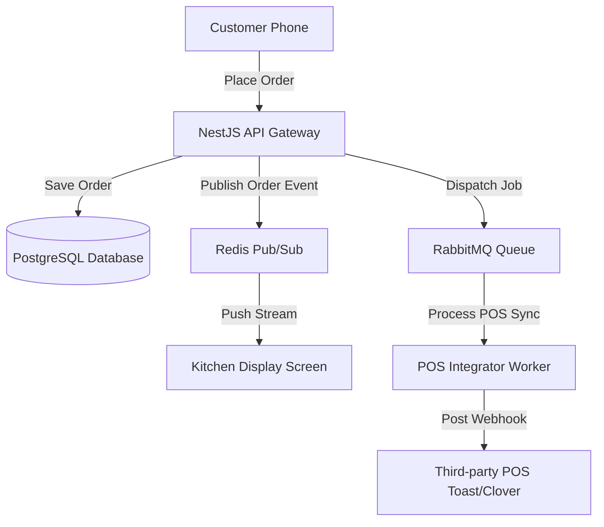

# Restaurant SaaS Multi-Tenant Architecture Specification

This document provides the architectural blueprint, design parameters, and engineering decisions for building a cloud-based, multi-tenant **Restaurant SaaS System** featuring point-of-sale (POS) connectivity, digital menus, and order streams.

---

## 1. Overview & Strategy

### Business Problem
Restaurants face high coordinator overhead, fragmented ticketing systems, and high transaction costs. Store owners require a unified, multi-tenant digital management software to handle real-time digital orders, menu updates, POS hardware connections, and multi-location analytics without running independent database instances for every franchise.

### Goals
* **Logical Multi-Tenancy**: Ensure robust, leak-free isolation of tenant data (menus, staff, orders, payments).
* **Real-time Order Streaming**: Deliver client orders instantly to kitchen display screens (KDS) and POS systems.
* **Resilience to Offline Status**: Ensure POS and ordering streams can survive intermittent internet disconnections at physical locations.
* **Unified Menu Syncing**: Synchronize menu items, pricing modifiers, and inventory availability across online ordering web pages and local physical POS displays.

### Target Users
* **Restaurant Owners / Managers**: Overseeing pricing, staff permissions, and store sales metrics.
* **Kitchen Staff**: Viewing order tickets on kitchen displays.
* **End Customers**: Ordering via mobile dining screens or online checkouts.

---

## 2. Requirements

### Functional Requirements
* **Logical Tenant Isolation**: Ensure all database queries route using a tenant discriminator context.
* **Point-of-Sale (POS) API Integration**: Sync menu changes and push order tickets to local hardware POS (e.g. Toast, Clover) via webhooks.
* **Kitchen Display System (KDS)**: Real-time ticket management grid highlighting prep times, ticket priorities, and item modifications.
* **Payment Gateways**: Stripe Connect integration allowing each tenant to receive direct client payouts.

### Non-functional Requirements
* **Order Delivery Latency**: Push orders to the kitchen display screen in under 200ms from customer checkout.
* **System Uptime**: 99.95% availability target to prevent digital ordering downtime during restaurant peak hours.
* **Database Isolation Conformance**: Strict logical row-level security (RLS) filters preventing tenant-to-tenant data visibility leakage.
* **Concurrence Throughput**: Support up to 500 concurrent order writes per restaurant tenant during rush hours.

---

## 3. Technology Stack Selection

| Layer | Technology | Rationale & Trade-offs |
|---|---|---|
| **Frontend** | React / Next.js / Tailwind CSS | Next.js Server Components for customer menus (highly cached) and React Client SPA for real-time kitchen displays and dashboard panels. |
| **Backend** | Node.js (NestJS framework) | Enterprise-grade TypeScript server offering modularity and native support for WebSockets and SSE. |
| **Database** | PostgreSQL | Relational constraints guarantee transaction integrity (essential for accounting/billing) while Row Level Security (RLS) enforces tenant safety. |
| **Real-time Stream** | Redis Pub/Sub / SSE (Server-Sent Events) | Lightweight, persistent connections to stream orders to kitchen displays without the battery/resource footprint of full WebSockets. |
| **Queue Engine** | RabbitMQ | Decouples payment confirmations and POS synchronization updates to prevent API bottlenecks. |

---

## 4. Architecture & Engineering Plans

### Repository Skills Used
* **[software-architect](file:///d:/projects/Nexulyt-AI-OS/skills/software-architect/SKILL.md)**: Multi-tenant database design patterns, C4 component boundary planning.
* **[backend-engineer](file:///d:/projects/Nexulyt-AI-OS/skills/backend-engineer/SKILL.md)**: SSE streams, Stripe Connect integrations, RabbitMQ event consumers.
* **[database-architect](file:///d:/projects/Nexulyt-AI-OS/skills/database-architect/SKILL.md)**: PostgreSQL Row Level Security (RLS) policies, composite indexing tables.

### Architecture Overview
The system is built around a centralized backend service serving customer frontends via Edge CDNs and kitchen displays via persistent Server-Sent Events (SSE) connections. Heavy tasks like external POS syncs and Stripe processing are deferred to RabbitMQ workers:



### Database Strategy
This architecture uses a **Shared Database / Shared Schema** multi-tenant model:
* **Tenant Isolation**: Every table contains a `tenant_id` foreign key.
* **Row-Level Security (RLS)**: PostgreSQL RLS policies enforce that all SELECT, UPDATE, and DELETE operations automatically filter queries on active tenant context:
  ```sql
  ALTER TABLE orders ENABLE ROW LEVEL SECURITY;
  CREATE POLICY tenant_order_isolation ON orders
    USING (tenant_id = current_setting('app.current_tenant_id'));
  ```
* **Partitioning**: Large tables (like `orders` or `ticket_logs`) are partitioned horizontally by calendar months or `tenant_id` blocks to keep indexes compact.

### API Strategy
* **REST & Server-Sent Events (SSE)**: Customer interactions are RESTful; order ticket streams to the kitchen rely on SSE (`/api/v1/tenants/{id}/kds/stream`).
* **Tenant Discriminator**: Enforced in API headers via `X-Tenant-ID`. Authentication tokens (JWT) embed the user's `tenant_id` payload to prevent header spoofing.
* **POS Webhooks**: POS integrations use incoming webhook endpoints `/api/v1/webhooks/pos/{provider}` secured with HMAC signatures.

### Frontend Strategy
* **Customer Menu Layout**: Server-side rendered (SSR) pages cacheable at Edge CDN. Next.js fetches menu items using cache tags matching the `tenant_id`.
* **KDS Grid**: Client-side React dashboard that listens to SSE streams. Tickets display as visual cards containing timers, item lists, and modifiers, ordering cards by entry time.
* **State Sync**: Local React state acts as a replica of KDS tickets, automatically executing acoustic alerts for overdue tickets.

### Backend Strategy
* **API Middleware**: Validates incoming JWT tokens, extracts the `tenant_id` payload, and configures the PostgreSQL connection parameter (`app.current_tenant_id`) within the execution transaction block.
* **Idempotency**: All billing and order submissions require client-generated idempotency keys to prevent duplicate ordering.

---

## 5. Security & Performance

### Security Considerations
* **RLS Leaks Prevention**: Include static checks and database integration testing suites that verify no query can bypass the tenant parameter filter.
* **Stripe Connect Audits**: Maintain strict separation of financial keys. Ensure each tenant can only view billing details matching their connected Stripe ID.
* **Device Authorization**: Physical tablets in kitchens must authorize using OAuth 2.0 device flow, mapping hardware MAC addresses to authorized tenant device tables.

### Performance Considerations
* **Composite Indexes**: Index tables using composite columns: `(tenant_id, status, created_at)` on orders to keep filtering fast.
* **SSE Connection Pruning**: Configure idle-connection timeout monitors to purge abandoned SSE clients, preventing connection leaks.
* **Stripe Webhook Concurrency**: Process incoming payments asynchronously using RabbitMQ workers to avoid blocking the main server threads.

### Deployment Strategy
* **Containerization**: NestJS API and background workers packaged in multi-stage Docker containers.
* **Orchestration**: Deploy to Kubernetes with horizontal pod autoscalers (HPA) configured to scale pods based on memory and CPU consumption spikes.
* **Database Scaling**: Primary database for writes with regional read-replicas handling customer-facing menu loads.

---

## 6. Risks, Best Practices, and Future Scope

### Risks
* **Data Leakage**: A programming bug bypassing RLS configuration could expose database records of one tenant to another.
* **POS Sync Drift**: Offline states at physical restaurants can lead to menu desynchronization between cloud dashboards and POS systems.

### Best Practices
* Always run write queries within SQL transaction blocks.
* Keep custom kitchen alerts lightweight to prevent tab crash lockouts on low-spec restaurant tablets.
* Configure strict rate-limits on public customer menu routing to prevent scraper bots from exhausting system resources.

### Common Mistakes
* Omitting the `tenant_id` field on junction tables (e.g. order item modifiers table).
* Allowing developers to execute raw SQL queries that bypass the RLS filter layers.

### Future Improvements
* **Offline Local Sync**: Implement a local gateway container (Edge Node) inside physical restaurants to cache tickets and sync back to cloud when connections resume.
* **Inventory Predictive Analytics**: Introduce regression modeling to suggest menu inventory restock thresholds based on past sales trends.
