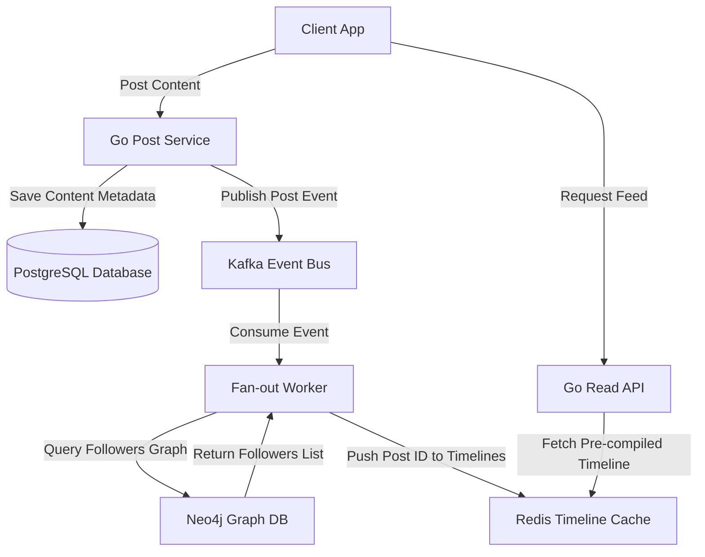

# Social Media Platform Architecture Specification

This document provides the architectural blueprint, design parameters, and engineering decisions for building a high-throughput, graph-driven **Social Media Platform** featuring feed timeline distribution, graph relationships models, and high-volume media delivery.

---

## 1. Overview & Strategy

### Business Problem
Social platforms must process massive, write-heavy event streams (likes, comments, posts) and dynamically build personalized user timelines (feeds). Relational database engines struggle with the deep recursive joins needed to query followers, while slow feed construction latencies directly degrade user engagement.

### Goals
* **High-Throughput Write Handling**: Accept thousands of post and interaction submissions per second.
* **Low-Latency Feed Generation**: Deliver personalized user feeds in under 100ms from request receipt.
* **Optimized Graph Queries**: Model user connections (followers, friends, blocks) to optimize query paths.
* **Edge Media Delivery**: Distribute image and video uploads globally with low latency.

### Target Users
* **Active Content Creators**: Uploading images/videos, writing posts, and viewing metrics.
* **End Consumers**: Browsing timelines, liking/commenting on posts, and following other users.

---

## 2. Requirements

### Functional Requirements
* **Dynamic Feed Timeline**: Build chronological user timelines compiled from posts written by followed creators.
* **Follower Graph Database**: Map user nodes and bidirectional follow/block relationships.
* **Media Upload Pipeline**: Support image/video uploads with automated compression and CDN distributions.
* **Interactions Broker**: Process posts likes, comments, and share metrics asynchronously.

### Non-functional Requirements
* **Timeline Fetch Latency**: Compile and return user feed lists in under 80ms.
* **Media Upload Buffer**: Complete image post-processing and metadata writes in under 3 seconds.
* **Graph Query Isolation**: Isolate social graph queries from the main transaction database.
* **Concurrent Throughput**: Support up to 50,000 active concurrent connections and 5,000 writes per second.

---

## 3. Technology Stack Selection

| Layer | Technology | Rationale & Trade-offs |
|---|---|---|
| **Frontend** | React / Next.js / Tailwind CSS | Next.js Client SPA with infinite scroll. Lazy-loading components optimize image grids. |
| **Backend** | Go (Golang) | High concurrency throughput, lightweight memory footprint, and native support for WebSocket loops. |
| **Relational DB** | PostgreSQL | Handles static user metadata, account billing, and configuration parameters. |
| **Graph DB** | Neo4j | Optimizes complex follow/follower and recommendations graph queries, bypassing relational JOIN bottlenecks. |
| **Cache Layer** | Redis | Caches pre-compiled user feed lists (timelines) for instant retrieval. |
| **Media Host** | Cloudflare Images & CDN | Auto-resizes and optimizes uploaded image files at the edge. |

---

## 4. Architecture & Engineering Plans

### Repository Skills Used
* **[software-architect](file:///d:/projects/Nexulyt-AI-OS/skills/software-architect/SKILL.md)**: C4 Container topology designs, hybrid data sync planning.
* **[performance-engineer](file:///d:/projects/Nexulyt-AI-OS/skills/performance-engineer/SKILL.md)**: Fan-out models caching, Redis memory management, CDN configs.
* **[backend-engineer](file:///d:/projects/Nexulyt-AI-OS/skills/backend-engineer/SKILL.md)**: Go connection pools, Neo4j driver configurations, WebSockets streams.

### Architecture Overview
The platform decouples writing posts from reading timelines. Creating a post triggers a "fan-out" service that updates the pre-compiled feeds in Redis for all active followers. Reading the feed query simply fetches the list from Redis, avoiding expensive database queries:

### Database Strategy
This system splits data across relational, graph, and in-memory caches:
* **Neo4j Graph Database**:
  * Nodes: `User`.
  * Relationships: `FOLLOWS`, `BLOCKED`, `MUTED`.
  * Allows rapid Cypher queries to verify connections (e.g. "Find followed users who aren't blocked").
* **PostgreSQL (Transactional Store)**:
  * Tables: `posts`, `comments`, `likes`, `media_attachments`.
  * Indexing: Composite index on `posts (user_id, created_at DESC)`.
* **Redis Timeline Cache (Fan-out model)**:
  * Every user has a Redis sorted set (`zset`) representing their feed: `feed:user_id` where values are `post_id` keys and scores are `created_at` timestamps.
  * Maximum feed size locked to 500 items per user to preserve Redis memory configurations.

### API Strategy
* **REST APIs**: Used for user registration, media upload tokens, and settings.
* **GraphQL**: Flexible API layout for rich comment trees.
* **WebSockets Engine**: Persistent connections (`/api/v1/feed/realtime`) to push new post alerts to active users in real-time.

### Frontend Strategy
* **Infinite Scroll Grid**: Custom list controllers with dynamic viewport intersections. Off-screen post nodes are unmounted from the DOM to maintain browser memory safety.
* **Optimistic Actions**: Instantly increment "likes" counts locally while processing API requests in the background.
* **Edge Image Rendering**: Utilize Cloudflare Image components to automatically request the optimal WebP resolution matching the device screen.

### Backend Strategy
* **Feed Distribution Engine (Fan-out)**:
  * **Fan-out-on-Write (Push)**: When a post is written, query followed users from Neo4j. For each follower, insert the `post_id` into their Redis `feed:follower_id` sorted set. Recommended for accounts with < 10,000 followers.
  * **Fan-out-on-Read (Pull)**: For "celebrity" accounts (> 10,000 followers), do not push posts to all followers. Instead, when a user requests their feed, fetch the pre-compiled timeline from Redis and merge it on the fly with the latest posts from celebrity accounts they follow.

---

## 5. Security & Performance

### Security Considerations
* **Blocked User Exclusions**: Ensure feed compilation logic dynamically checks blocked graphs in Neo4j to prevent posts from blocked users from appearing.
* **Image Upload Sanitization**: Strip EXIF metadata from uploaded images to protect user location privacy.
* **CORS Limits configurations**: Enforce strict Origin rules on media upload endpoints.

### Performance Considerations
* **Redis Memory Management**: Configure Redis eviction policies to `noeviction` (returning errors if memory limits are exceeded) and regularly archive inactive user sets to cold database tables.
* **Neo4j Index Tuning**: Create unique constraints on `User(id)` fields inside Neo4j.
* **CDN Edge Caching**: Cache public media assets (images, static profile banners) permanently at the CDN edge.

### Deployment Strategy
* **Go Node Deployments**: Multi-region Kubernetes clusters with auto-scalers triggered by concurrent HTTP traffic.
* **Clustered Neo4j**: Deploy Neo4j in Causal Clustering configurations (Primary nodes for writes, Read Replicas for graph lookups).
* **Kafka Event Bus**: Multi-partition Kafka setups to allow multiple concurrent Fan-out workers to process post queues in parallel.

---

## 6. Risks, Best Practices, and Future Scope

### Risks
* **Fan-out Bottlenecks**: A sudden post from an account with millions of followers can queue up millions of Redis write tasks, delaying timeline updates for other users.
* **Redis Memory Exhaustion**: Storing feeds for millions of users in memory can incur high infrastructure costs.

### Best Practices
* Set strict limits (e.g. 500 records) on timeline sorted sets in Redis.
* Move inactive users (no logins for 30 days) out of active Redis caches, rebuild feeds on-demand when they log back in.
* Run media processing tasks (transcoding, compression) in background workers, returning immediate success responses to the frontend.

### Common Mistakes
* Querying SQL database joins recursively to build timelines on every page load.
* Storing large raw binary image files directly inside PostgreSQL database columns.

### Future Improvements
* **AI Content Feed Recommender**: Train recommendation models to inject interesting, non-followed posts into user timelines based on engagement patterns.
* **Edge Video Stitching**: Implement dynamic HLS manifest updates at the CDN edge to stitch personalized ads into video streams.
