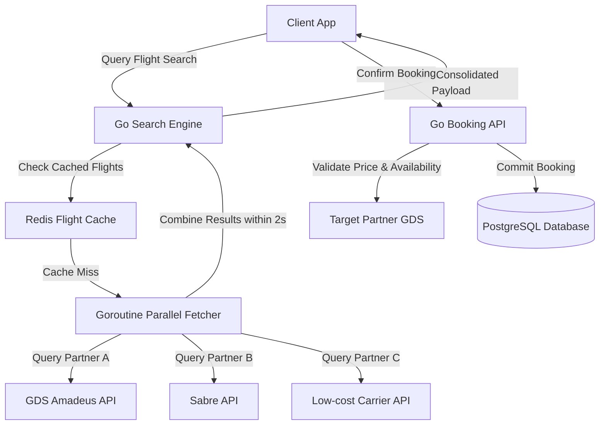

# Travel Platform Architecture Specification

This document provides the architectural blueprint, design parameters, and engineering decisions for building a high-scale, aggregated **Travel Search & Booking Platform** featuring multi-partner API connections, concurrent search routines, and latency budget management.

---

## 1. Overview & Strategy

### Business Problem
Travel platforms aggregate flight, hotel, and car rental availability data from multiple third-party suppliers (Global Distribution Systems, GDS, and local partner APIs). Suppler APIs are notoriously slow, inconsistent, and rate-limited. Running synchronous search loops can result in massive page loading latencies for customers, leading to abandoned booking attempts.

### Goals
* **Concurrent Partner Ingestion**: Query multiple third-party partner APIs concurrently using execution threads to optimize search speeds.
* **Strict Latency Budgets**: Impose hard response deadlines on third-party APIs, returning the fastest cached or partial results if thresholds are exceeded.
* **Cached Inventory Syncing**: Maintain a high-performance Redis cache of common routes and listings to bypass slow partner APIs.
* **Resilient Booking Verification**: Double-check price and seat availability with suppliers in a single transactional step prior to payment processing.

### Target Users
* **Leisure & Business Travelers**: Searching for flights/hotels, comparing prices, and booking itineraries.
* **Travel Operations**: Reviewing partner API success metrics, transaction rates, and handling booking exceptions.

---

## 2. Requirements

### Functional Requirements
* **Aggregated Search Engine**: Search routing engine that queries third-party GDS (e.g. Amadeus, Sabre) and hotel catalogs concurrently.
* **Itinerary Builder**: Component enabling users to bundle flight, hotel, and rental selections into a single transaction.
* **Booking Verification Pipe**: Pre-checkout validation checking that selected partner items are still available and pricing has not changed.
* **Notification Dispatcher**: PDF ticket compilation and email confirmation dispatcher.

### Non-functional Requirements
* **Total Search Page Latency**: Return aggregated search results in under 2.5 seconds, even if slow partner APIs fail to return data.
* **Search Cache Hit Rate**: Target a minimum of 75% search queries answered using Redis cache.
* **Availability Verification Speed**: Verify inventory and pricing with partner APIs in under 800ms during checkout.
* **Concurrent Search Throughput**: Support up to 5,000 search queries per second.

---

## 3. Technology Stack Selection

| Layer | Technology | Rationale & Trade-offs |
|---|---|---|
| **Frontend** | React / Next.js / Tailwind CSS | Next.js with React Client components. Visual progress indicators and partial results rendering improve perceived performance. |
| **Backend** | Go (Golang) / Rust | Go is perfect for managing hundreds of concurrent partner API fetch requests using goroutines and channels. |
| **Transactional DB**| PostgreSQL | Stores user profiles, past booking histories, and account details. |
| **Caching Engine** | Redis | Caches search results, partner API pricing details, and inventory records. |
| **Task Queue** | BullMQ / RabbitMQ | Decouples notification tasks and asynchronous post-booking webhook dispatches. |

---

## 4. Architecture & Engineering Plans

### Repository Skills Used
* **[software-architect](file:///d:/projects/Nexulyt-AI-OS/skills/software-architect/SKILL.md)**: C4 Container boundaries, distributed caching patterns.
* **[backend-engineer](file:///d:/projects/Nexulyt-AI-OS/skills/backend-engineer/SKILL.md)**: Go goroutines concurrency, third-party API integration, webhook gateways.
* **[performance-engineer](file:///d:/projects/Nexulyt-AI-OS/skills/performance-engineer/SKILL.md)**: Caching TTL policies, response decimation, CDN configurations.

### Architecture Overview
The platform decouples search reads from booking writes. Searches trigger Go goroutines that query Redis caches first, then dispatch parallel HTTP calls to partner APIs. The system returns partial results if partners exceed a 2.0-second timeout budget:



### Database Strategy
* **Relational Schema (PostgreSQL)**:
  * Tables: `users`, `bookings`, `itinerary_items`, `partner_networks`, `booking_receipts`.
  * Indexing: Composite key index on `bookings (user_id, status)` and `itinerary_items (booking_id)`.
* **Redis Search Cache (Cache-Aside Pattern)**:
  * Cache key structure: `search:route:date:cabin` (e.g. `search:JFK:LAX:2026-07-15:economy`).
  * Cache value: Compressed JSON arrays containing flight details, pricing, and supplier tags.
  * Cache TTL: Configured dynamically based on proximity to flight date (e.g., 24 hours for flights > 30 days away, 30 minutes for flights < 7 days away).

### API Strategy
* **REST APIs**: Public search endpoints `/api/v1/search`, and booking endpoints `/api/v1/booking/reserve`.
* **Supplier API Adaptors**: Implement the Adaptor Pattern to map various partner XML/JSON payloads into a standardized internal data format.
* **Webhook Receivers**: Webhook endpoints handle asynchronous booking success responses from suppliers.

### Frontend Strategy
* **Partial Results Streaming**: Render search result cards progressively as partner responses stream back from the API gateway.
* **Flight Filter Panel**: Client-side filtering logic allowing users to sort results by stops, price, airlines, and durations in real-time.
* **Booking Progress Steps**: Visual steps showing booking confirmation, payment capture, and ticket issuing.

### Backend Strategy
* **Goroutine Parallel Fetcher (Go)**:
  ```go
  // Conceptual logic execution:
  ctx, cancel := context.WithTimeout(context.Background(), 2000 * time.Millisecond)
  defer cancel()
  
  // Dispatch goroutines querying partner APIs parallelly.
  // Collect results using channels.
  // If context timeout expires, return compiled results gathered up to that point.
  ```
* **Price and Availability Check**: Before executing payment processing, the API queries the target partner GDS to confirm availability. If pricing has changed, the checkout transaction is halted and the user is prompted to review changes.

---

## 5. Security & Performance

### Security Considerations
* **PCI-DSS Compliance**: Do not process or store credit card details locally. Utilize tokens provided by Stripe/Adyen gateways.
* **API Key Encryption**: Encrypt supplier API keys using AES-256-GCM, storing keys securely in configurations.
* **Booking Ownership Check**: Ensure that booking edit APIs validate user permissions to prevent unauthorized ticket alterations.

### Performance Considerations
* **Goroutine Pools**: Manage outgoing supplier requests using HTTP connection pooling to bypass DNS lookup overhead.
* **Search Result Pagination**: Decimate large result sets (e.g. limit to top 100 cheapest/fastest options) to reduce network payload sizes.
* **Redis Memory Tuning**: Enable Redis LRU (Least Recently Used) cache eviction parameters to manage memory limits.

### Deployment Strategy
* **Multi-Region Deployments**: Deploy API nodes close to supplier GDS datacenters (typically AWS us-east-1 or eu-west-1) to minimize network latency.
* **Containerization**: Pack Go API server and BullMQ workers in lightweight Docker containers.
* **Autoscaling**: Scale search API instances based on CPU utilization and incoming network packet rates.

---

## 6. Risks, Best Practices, and Future Scope

### Risks
* **Supplier Rate Limiting**: Sending too many parallel search requests could trigger IP blocks or rate limits from GDS networks.
* **Cache Staleness**: Customers might select cached flight listings that are no longer available at that price, causing checkout failures.

### Best Practices
* Set dynamic, low TTL limits on search caches to minimize booking failure rates due to stale data.
* Use circuit breakers to disable queries to a specific supplier API if its failure rate exceeds 15%.
* Implement fallback mock responses to ensure test suites can run without calling live partner APIs.

### Common Mistakes
* Querying supplier APIs synchronously in a serial block, causing search pages to load in 10+ seconds.
* Not filtering cached search results for expired flight dates, leading to invalid search displays.

### Future Improvements
* **AI Price Predictor**: Train regression models to analyze historical pricing changes and warn users if ticket prices are likely to rise or fall in the next 7 days.
* **Automatic Route Builders**: Build algorithms that combine flights from non-partner airlines to generate cheaper multi-stop itineraries.
