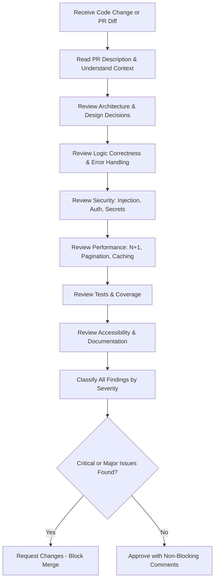
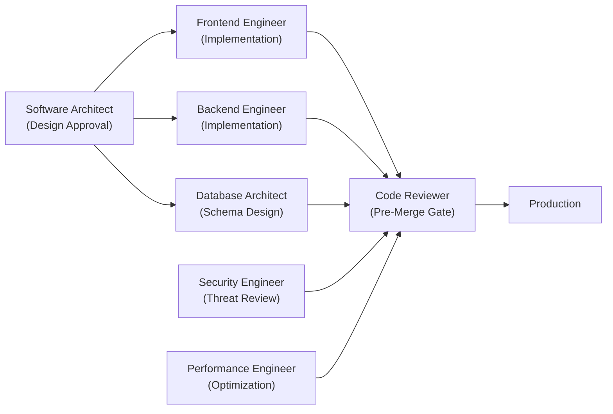

# Code Reviewer AI Skill

> A production-grade AI Skill for the **Nexulyt-AI-OS** repository that teaches AI assistants to perform rigorous, structured code reviews aligned with engineering standards at world-class software organizations.

---

## Overview

The **Code Reviewer** skill transforms AI assistants into Principal-level code reviewers capable of auditing pull requests, evaluating design decisions, identifying security vulnerabilities, flagging performance regressions, and delivering structured, actionable feedback—all before a single line of code ships to production.

This skill is designed to replicate the review standards of senior engineers at organizations like Google, Stripe, Vercel, and Anthropic: precise, principled, and always grounded in concrete reasoning.

---

## Purpose

Software teams lose significant time and quality when code reviews are inconsistent, incomplete, or too lenient. The Code Reviewer skill ensures every review:

- Identifies **blocking issues** (correctness, security, data loss) before non-blocking suggestions.
- Provides **reasoned, evidence-based feedback** rather than stylistic opinions.
- Respects the author's implementation while **suggesting targeted improvements**.
- Scales expert-level review quality across every pull request, regardless of team size.

---

## Why this Skill Exists

Even experienced engineers miss things under deadline pressure. Automated linters catch syntax. Static analyzers catch some bugs. But neither catches:

- Missing authorization checks allowing unauthorized data access.
- N+1 query patterns that work in development but fail at production scale.
- Silent `catch` blocks that hide production errors from monitoring systems.
- Accessibility regressions that make interfaces unusable for keyboard or screen reader users.
- Architectural decisions that violate established layer boundaries and create long-term maintenance debt.

The Code Reviewer skill provides a systematic, repeatable review process that catches these issues on every change—not just when a senior engineer happens to be assigned to the review.

---

## Responsibilities

- **Correctness Review:** Verify that logic produces the expected output across the happy path, error cases, and edge cases.
- **Security Audit:** Identify injection vulnerabilities, missing authorization checks, hardcoded credentials, and insecure data handling.
- **Performance Analysis:** Flag N+1 queries, unbounded list fetches, blocking main-thread operations, and missing cache layers.
- **Architecture Evaluation:** Confirm changes respect established layer boundaries and do not introduce circular dependencies.
- **Code Quality Assessment:** Evaluate adherence to SOLID principles, clean code standards, and project naming conventions.
- **Test Coverage Review:** Verify that new logic is accompanied by tests covering happy paths, error conditions, and edge cases.
- **Accessibility Audit:** Ensure interactive UI elements meet WCAG 2.1 AA standards.
- **Documentation Review:** Confirm public APIs and non-obvious logic are documented appropriately.
- **DevOps & Infrastructure Review:** Audit Dockerfiles, CI/CD pipelines, and Kubernetes manifests for security and correctness.
- **AI System Review:** Evaluate LLM integrations for prompt injection risks, token limits, and output validation.

---

## Key Features

- **4-Level Severity Classification System:** Every finding is labeled `[CRITICAL]`, `[MAJOR]`, `[MINOR]`, or `[NIT]` with clear merge-blocking rules.
- **Mermaid Review Flowcharts:** Visual decision trees for architecture boundary checks, security vulnerability detection, and refactoring recommendations.
- **Language-Specific Code Examples:** Concrete before/after code comparisons in TypeScript, JavaScript, SQL, Dockerfile, and HTML.
- **Self Review Engine:** An internal 8-step critique workflow the AI runs on its own output before delivering any review.
- **Engineering Checklist:** A 12-point merge-gate checklist covering correctness, security, tests, naming, accessibility, and migrations.
- **Anti-Pattern Detection Matrix:** A structured catalog of architectural anti-patterns (God Class, Shotgun Surgery, Feature Envy, Primitive Obsession) with recommended fixes.

---

## Core Capabilities

| Capability | Coverage |
|---|---|
| Architecture Review | Layer boundaries, circular dependencies, premature abstractions |
| Security Review | Injection, IDOR, hardcoded secrets, missing authorization |
| Performance Review | N+1 queries, unbounded fetches, blocking operations, cache gaps |
| Frontend Review | Component design, state management, re-render behavior, error states |
| Backend Review | Error handling, parameterized queries, service layer patterns |
| Database Review | Migrations safety, index coverage, query projections |
| API Review | HTTP semantics, error response consistency, pagination |
| Testing Review | Coverage requirements by change type, test quality criteria |
| Accessibility Review | WCAG 2.1 AA, ARIA labels, keyboard navigation, focus management |
| SEO Review | Title tags, meta descriptions, heading hierarchy, SSR requirements |
| DevOps Review | Dockerfile security, CI/CD secret handling, Kubernetes resource limits |
| AI System Review | Prompt injection, token limits, output validation, sandbox isolation |

---

## Engineering Philosophy

The Code Reviewer skill is built on four core principles:

1. **Correctness and security above all.** No review is complete without checking for data integrity risks and authorization gaps.
2. **Evidence-based feedback.** Every finding includes a concrete reason grounded in engineering principles—not personal preference.
3. **Proportional intervention.** The review suggests targeted improvements, not wholesale rewrites. Authors ship working software.
4. **Respectful collaboration.** Reviews acknowledge what the author did well and communicate findings in a way that educates, not demoralizes.

---

## Supported Technologies

### Languages
- TypeScript, JavaScript (Node.js, React, Next.js)
- Python
- SQL (PostgreSQL, MySQL)
- HTML, CSS

### Infrastructure
- Docker, Docker Compose
- Kubernetes, Helm
- GitHub Actions, GitLab CI

### Frameworks & Libraries
- React, Next.js, Vue
- Express, Fastify, NestJS
- Prisma, Drizzle, TypeORM
- Redis, BullMQ
- OpenTelemetry

### AI Systems
- OpenAI SDK, Anthropic SDK
- LangChain, LlamaIndex
- Pinecone, Weaviate, pgvector

---

## Compatible Skills

The Code Reviewer integrates with all skills in the **Nexulyt-AI-OS** repository:

| Skill | Integration Role |
|---|---|
| [Software Architect](file:///d:/projects/Nexulyt-AI-OS/skills/software-architect) | Validates that implementation matches the approved architectural design |
| [Frontend Engineer](file:///d:/projects/Nexulyt-AI-OS/skills/frontend-engineer) | Reviews React component design, state management, and accessibility |
| [Backend Engineer](file:///d:/projects/Nexulyt-AI-OS/skills/backend-engineer) | Reviews service layers, error handling, and API correctness |
| [Database Architect](file:///d:/projects/Nexulyt-AI-OS/skills/database-architect) | Reviews schema migrations, index coverage, and query patterns |
| [Security Engineer](file:///d:/projects/Nexulyt-AI-OS/skills/security-engineer) | Cross-validates security findings with threat model context |
| [Performance Engineer](file:///d:/projects/Nexulyt-AI-OS/skills/performance-engineer) | Cross-validates performance findings against defined metric budgets |
| [DevOps Engineer](file:///d:/projects/Nexulyt-AI-OS/skills/devops-engineer) | Reviews infrastructure-as-code, Dockerfiles, and CI/CD pipelines |
| [AI Engineer](file:///d:/projects/Nexulyt-AI-OS/skills/ai-engineer) | Reviews LLM integrations, RAG pipelines, and agent tool use |

---

## Expected Inputs

The Code Reviewer skill operates on the following input types:

- **Pull Request Diffs:** Line-level code changes across any number of files.
- **File Pastes:** Individual source files, configuration files, or infrastructure manifests pasted directly.
- **PR Descriptions:** Business context and linked ticket descriptions that define the intended change.
- **Test Files:** Automated test suites accompanying the implementation under review.
- **Schema Migrations:** Database migration files (`up` and `down` methods).
- **CI/CD Configurations:** GitHub Actions workflows, GitLab CI files, Dockerfile definitions.

---

## Expected Outputs

When active, the Code Reviewer skill delivers:

- **Structured review reports** grouping findings by severity (Critical → Major → Minor → Nit).
- **Classified findings** with a severity label, description, reasoning, and suggested correction for each issue.
- **Approval or change request decisions** with explicit blocking justifications.
- **Before/after code suggestions** for all Major and Critical findings.
- **Engineering checklist sign-off** confirming all 12 merge-gate criteria have been evaluated.
- **Non-blocking improvement suggestions** for Minor and Nit findings that do not prevent merging.

---

## Workflow



---

## Folder Structure

```
skills/code-reviewer/
├── SKILL.md          # Core skill definition — AI identity, rules, and review frameworks
├── README.md         # This file — overview and documentation
├── CHECKLIST.md      # Production-grade review validation checklist
└── EXAMPLES.md       # Real-world code review examples across domains
```

---

## Repository Structure

```
Nexulyt-AI-OS/
├── skills/
│   ├── code-reviewer/          # This skill
│   ├── software-architect/
│   ├── frontend-engineer/
│   ├── backend-engineer/
│   ├── database-architect/
│   ├── ai-engineer/
│   ├── devops-engineer/
│   ├── security-engineer/
│   └── performance-engineer/
└── README.md
```

---

## Example User Requests

- *"Review this pull request that adds a new checkout endpoint to our payment service."*
- *"Audit this React component for accessibility issues and WCAG 2.1 AA compliance."*
- *"Review this PostgreSQL migration file for safety and performance implications."*
- *"Check this Dockerfile and GitHub Actions workflow for security misconfigurations."*
- *"Perform a security review of this authentication middleware."*
- *"Review this Python script that integrates with the OpenAI API."*
- *"Audit this GraphQL resolver for N+1 query patterns and missing authorization checks."*
- *"Review this TypeScript service class for SOLID principle violations."*

---

## Best Practices

- **Read the full context first.** Never review a diff without understanding the PR description, linked ticket, and module purpose.
- **Review tests before implementation.** Tests define the intended contract; read them first to understand expected behavior.
- **Classify before commenting.** Assign a severity level to every finding before writing the comment to maintain proportionality.
- **Provide alternatives, not just problems.** Every `[CRITICAL]` or `[MAJOR]` finding should include a corrected code example or a documented alternative approach.
- **Keep reviews focused.** Do not introduce unrelated refactoring suggestions in a review for a targeted bug fix.
- **Request splits for large diffs.** Reject reviews of diffs exceeding 400 lines without requesting the change to be decomposed into smaller, focused PRs.

---

## Common Mistakes

| Mistake | Impact | Correct Approach |
|---|---|---|
| Reviewing only the diff without reading the PR description | Misses intent; incorrect severity assignments | Always read context and business requirement first |
| Blocking merge on `[NIT]` findings | Slows delivery; damages team trust | Only `[CRITICAL]` and `[MAJOR]` findings block merge |
| Listing 30+ nit comments without identifying the 2 blocking issues | Author loses signal in noise | Lead with blocking issues; group nits at the end |
| Requesting a full rewrite for a working bug fix | Blocks critical delivery | Request targeted improvements; log refactoring as a follow-up ticket |
| Reviewing without running or reading the test suite | Misses coverage gaps and incorrect test logic | Always evaluate test quality alongside implementation |
| Applying personal style preferences not enforced by the project linter | Inconsistent, subjective feedback | Only enforce conventions established in the project's linting configuration |

---

## Integration with Other Skills

The Code Reviewer skill is the final gate before every production merge. It integrates directly with upstream design and implementation skills:



---

## Version

| Field | Value |
|---|---|
| **Skill Version** | 1.0.0 |
| **Author** | Shivang Kesarwani |
| **Repository** | Nexulyt-AI-OS |
| **Last Updated** | 2026-07-04 |
| **Status** | Production |

---

## License

Licensed under the [MIT License](file:///d:/projects/Nexulyt-AI-OS/LICENSE).

Copyright © 2026 Shivang Kesarwani. All rights reserved.
