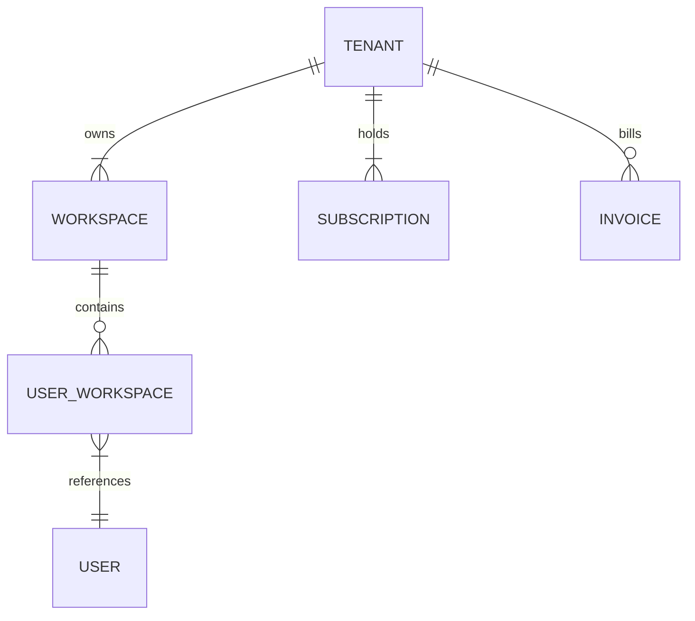
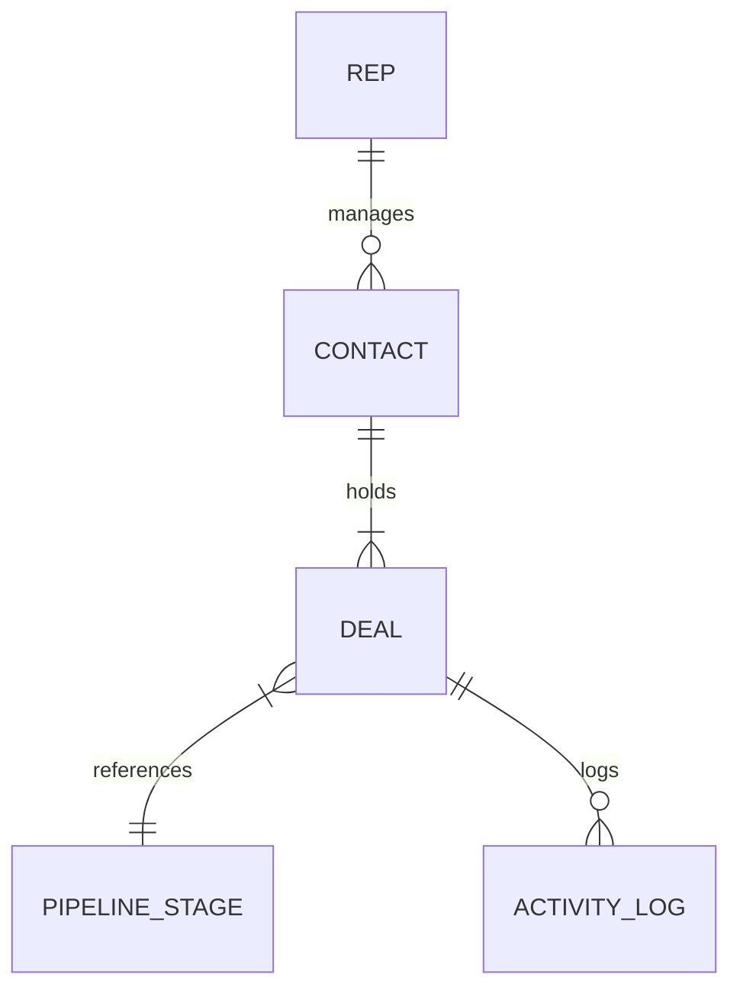
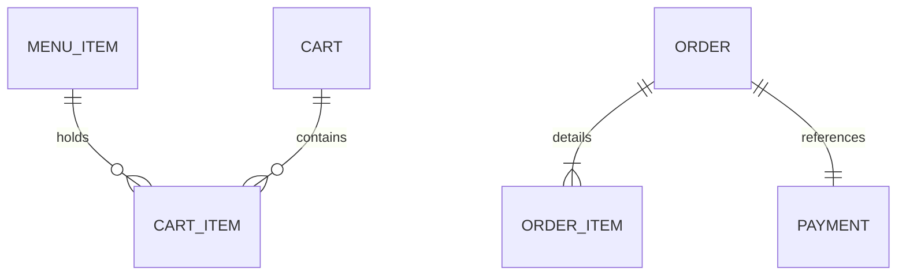
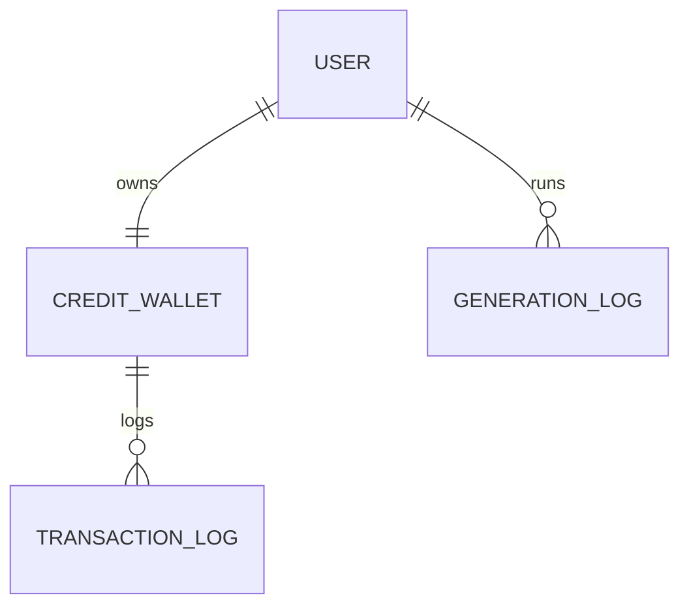
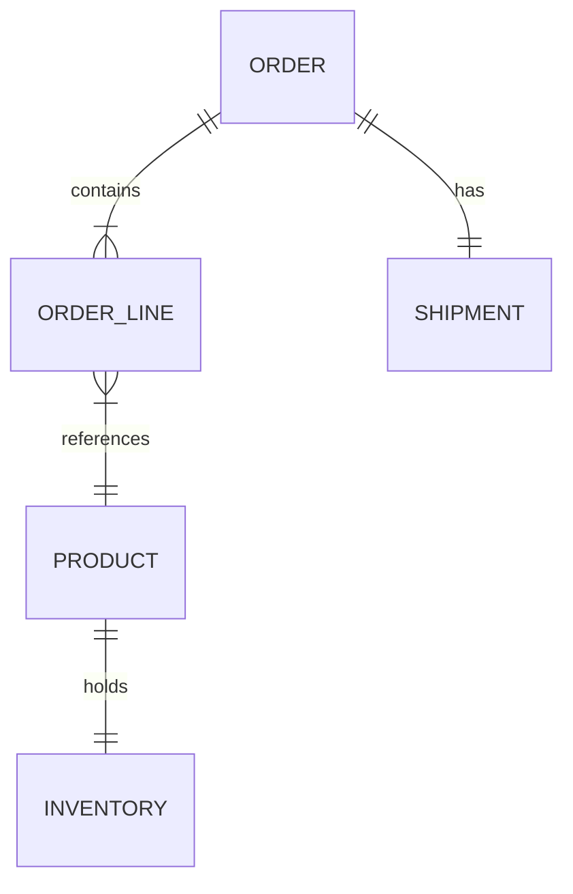
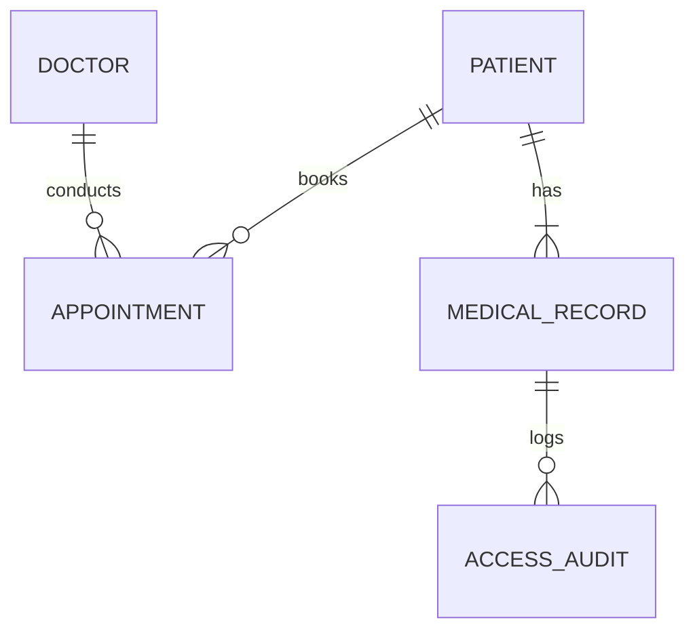
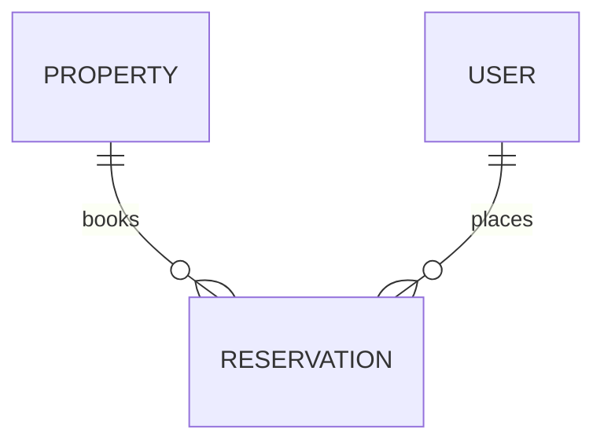
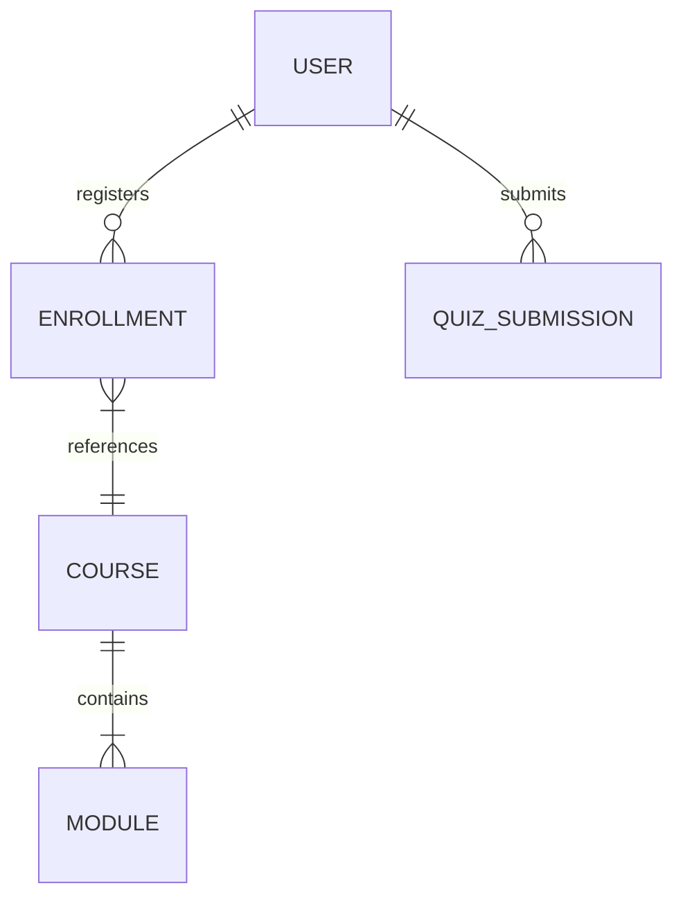

# Database Architect Design Examples

This document details production-grade database modeling strategies, ERD schemas, relationships, indexing pathways, and security systems across multiple real-world scenarios.

---

## 1. SaaS Database

### User Request
Design a multi-tenant subscription database supporting tenant workspaces, active seats, and invoice billing records.

### Requirement Analysis
- **Core Needs:** Rigid data isolation, tenant billing logs, dynamic seats validation constraints, and invoice tracking.
- **Constraints:** Prevent cross-tenant database queries and leakage under concurrent client sessions.

### ER Design

### Tables
- `tenants` (id: UUID, name: VARCHAR, created_at: TIMESTAMP)
- `workspaces` (id: UUID, tenant_id: UUID, name: VARCHAR)
- `subscriptions` (id: UUID, tenant_id: UUID, status: VARCHAR, tier: VARCHAR)
- `users` (id: UUID, email: VARCHAR)
- `user_workspaces` (user_id: UUID, workspace_id: UUID, role: VARCHAR)
- `invoices` (id: UUID, tenant_id: UUID, amount: NUMERIC, status: VARCHAR)

### Relationships
- `workspaces.tenant_id` references `tenants.id` (ON DELETE RESTRICT)
- `subscriptions.tenant_id` references `tenants.id` (ON DELETE CASCADE)
- `user_workspaces.user_id` references `users.id` (ON DELETE CASCADE)
- `user_workspaces.workspace_id` references `workspaces.id` (ON DELETE CASCADE)
- `invoices.tenant_id` references `tenants.id` (ON DELETE RESTRICT)

### Index Strategy
- Compound B-Tree Index: `idx_workspace_tenant (tenant_id, id)`
- Partial Index: `idx_unpaid_invoices ON invoices(tenant_id) WHERE status = 'unpaid'`

### Scaling Strategy
- Implement Row-Level Security (RLS) policies in PostgreSQL utilizing the tenant identifier key (`tenant_id`).
- Set up read replicas to distribute read queries, and cache subscription limits in Redis.

### Security Strategy
- Enforce strict SSL/TLS parameters on all connections.
- Column-level encryption (AES-256) is applied to invoice detail rows.

### Final Recommendation
Standardize tenant operations on PostgreSQL RLS configurations, and verify queries against execution plans to confirm index usage.

---

## 2. CRM Database

### User Request
Create a CRM database to track client contact records, deal stages, and activity logs.

### Requirement Analysis
- **Core Needs:** Dynamic contact profiles, pipelines, historical activity ledgers, and rep assignments.
- **Constraints:** Prevent deadlocks during pipeline stage updates and manage growth in activity tables.

### ER Design

### Tables
- `representatives` (id: UUID, name: VARCHAR)
- `contacts` (id: UUID, rep_id: UUID, name: VARCHAR, email: VARCHAR)
- `pipeline_stages` (id: UUID, name: VARCHAR)
- `deals` (id: UUID, contact_id: UUID, stage_id: UUID, amount: NUMERIC)
- `activity_logs` (id: UUID, deal_id: UUID, rep_id: UUID, action: VARCHAR, created_at: TIMESTAMP)

### Relationships
- `contacts.rep_id` references `representatives.id` (ON DELETE SET NULL)
- `deals.contact_id` references `contacts.id` (ON DELETE RESTRICT)
- `deals.stage_id` references `pipeline_stages.id` (ON DELETE RESTRICT)
- `activity_logs.deal_id` references `deals.id` (ON DELETE CASCADE)

### Index Strategy
- B-Tree Index: `idx_contact_email ON contacts(email)`
- Compound Index: `idx_deal_stage_date ON deals(stage_id, updated_at)`

### Scaling Strategy
- Partition the `activity_logs` table by range (monthly partition boundaries).
- Offload logging queries to read replica databases.

### Security Strategy
- Audit triggers track row modifications on the `deals` table.
- Enforce check constraints on the deal `amount` column to prevent negative values.

### Final Recommendation
Isolate logging table writes inside background workers, and use date-range table partitioning to manage database storage growth.

---

## 3. Restaurant Ordering System

### User Request
Design a database for a food ordering platform handling menu choices, checkout carts, and payment logs.

### Requirement Analysis
- **Core Needs:** Dynamic menu lookups, session cart caching, payment logs, and order status updates.
- **Constraints:** Prevent order state discrepancies under concurrent checkouts during peak dinner hours.

### ER Design

### Tables
- `menu_items` (id: UUID, name: VARCHAR, price: NUMERIC, category: VARCHAR)
- `carts` (id: UUID, session_token: VARCHAR, created_at: TIMESTAMP)
- `cart_items` (cart_id: UUID, item_id: UUID, quantity: INT)
- `orders` (id: UUID, status: VARCHAR, total: NUMERIC)
- `order_items` (order_id: UUID, item_id: UUID, quantity: INT, price: NUMERIC)
- `payments` (id: UUID, order_id: UUID, amount: NUMERIC, status: VARCHAR)

### Relationships
- `cart_items.cart_id` references `carts.id` (ON DELETE CASCADE)
- `cart_items.item_id` references `menu_items.id` (ON DELETE CASCADE)
- `order_items.order_id` references `orders.id` (ON DELETE RESTRICT)
- `order_items.item_id` references `menu_items.id` (ON DELETE RESTRICT)
- `payments.order_id` references `orders.id` (ON DELETE RESTRICT)

### Index Strategy
- Unique Index: `idx_cart_session ON carts(session_token)`
- Compound Index: `idx_order_status ON orders(status, created_at)`

### Scaling Strategy
- Cache active user carts and menu categories in Redis to reduce database read load.
- Partition order tables horizontally by range (monthly) to keep active tables small.

### Security Strategy
- Check constraint on `menu_items.price` (`CHECK price >= 0.00`).
- Validate Stripe webhook signature payloads before updating payment logs tables.

### Final Recommendation
Enforce transactional writes for orders, and run menu read operations against Redis memory caches.

---

## 4. AI SaaS

### User Request
Create a database for an AI generation platform to track credit budgets, generation metrics, and model settings.

### Requirement Analysis
- **Core Needs:** Strict credit balance validation, concurrency locks, API usage parameters, and generation logs.
- **Constraints:** Prevent duplicate credit spending during rapid parallel generation requests.

### ER Design

### Tables
- `users` (id: UUID, email: VARCHAR)
- `credit_wallets` (user_id: UUID, balance: INT)
- `transaction_logs` (id: UUID, wallet_id: UUID, amount: INT, type: VARCHAR)
- `generation_logs` (id: UUID, user_id: UUID, model_name: VARCHAR, prompt_tokens: INT, completion_tokens: INT)

### Relationships
- `credit_wallets.user_id` references `users.id` (ON DELETE CASCADE)
- `transaction_logs.wallet_id` references `credit_wallets.user_id` (ON DELETE RESTRICT)
- `generation_logs.user_id` references `users.id` (ON DELETE RESTRICT)

### Index Strategy
- Unique Index: `idx_wallet_user ON credit_wallets(user_id)`
- Compound Index: `idx_gen_user_model ON generation_logs(user_id, model_name)`

### Scaling Strategy
- Run all credit checks and updates inside database transactions using row-level locking (`SELECT ... FOR UPDATE`) to prevent credit balance bypass.
- Cache user credit balances in Redis, syncing final states back to PostgreSQL databases asynchronously.

### Security Strategy
- Check constraint on `credit_wallets.balance` (`CHECK balance >= 0`).
- Append-only write rules configured for transaction logs.

### Final Recommendation
Implement strict pessimistic row-level locking on wallet balance rows to prevent credit overdrafts during concurrent API calls.

---

## 5. E-commerce Database

### User Request
Design a database to verify product stock, process payments, and track order shipments.

### Requirement Analysis
- **Core Needs:** Real-time stock counts, checkout flow validation, payments, and order tracking.
- **Constraints:** Prevent out-of-stock item purchases under heavy concurrent checkouts.

### ER Design

### Tables
- `products` (id: UUID, sku: VARCHAR, price: NUMERIC)
- `inventories` (product_id: UUID, quantity: INT)
- `orders` (id: UUID, status: VARCHAR)
- `order_lines` (order_id: UUID, product_id: UUID, quantity: INT, price: NUMERIC)
- `shipments` (id: UUID, order_id: UUID, carrier: VARCHAR, status: VARCHAR)

### Relationships
- `inventories.product_id` references `products.id` (ON DELETE RESTRICT)
- `order_lines.order_id` references `orders.id` (ON DELETE RESTRICT)
- `order_lines.product_id` references `products.id` (ON DELETE RESTRICT)
- `shipments.order_id` references `orders.id` (ON DELETE RESTRICT)

### Index Strategy
- Unique Index: `idx_product_sku ON products(sku)`
- B-Tree Index: `idx_inventory_product ON inventories(product_id)`

### Scaling Strategy
- Run stock check queries inside transactions using row-level locking to prevent out-of-stock purchases.
- Set up read replicas to distribute product catalog queries, and cache inventory states in Redis.

### Security Strategy
- Verify Stripe signatures on payment callbacks before updating order tables.
- Encrypt shipping addresses and payment identifiers inside database tables.

### Final Recommendation
Enforce database transaction isolation levels (e.g., Repeatable Read) on order checkouts to guarantee data consistency.

---

## 6. Hospital Management

### User Request
Design a secure, HIPAA-compliant database to track patient records, doctor schedules, and appointment visits.

### Requirement Analysis
- **Core Needs:** Secure patient data management, doctor schedules, appointment records, and audit logs.
- **Constraints:** Restrict medical records access to authorized physicians, and maintain audit logs.

### ER Design

### Tables
- `patients` (id: UUID, ssn_encrypted: VARCHAR, name: VARCHAR)
- `doctors` (id: UUID, name: VARCHAR, specialty: VARCHAR)
- `appointments` (id: UUID, patient_id: UUID, doctor_id: UUID, slot: TIMESTAMP)
- `medical_records` (id: UUID, patient_id: UUID, notes: TEXT, created_at: TIMESTAMP)
- `access_audits` (id: UUID, record_id: UUID, doctor_id: UUID, accessed_at: TIMESTAMP)

### Relationships
- `appointments.patient_id` references `patients.id` (ON DELETE RESTRICT)
- `appointments.doctor_id` references `doctors.id` (ON DELETE RESTRICT)
- `medical_records.patient_id` references `patients.id` (ON DELETE RESTRICT)
- `access_audits.record_id` references `medical_records.id` (ON DELETE CASCADE)

### Index Strategy
- B-Tree Index: `idx_appointment_slot ON appointments(slot, doctor_id)`
- Compound Index: `idx_audit_record ON access_audits(record_id, accessed_at)`

### Scaling Strategy
- Partition the `access_audits` table by range (monthly) to keep active tables small.
- Separate transactional patient scheduling from historical reporting databases.

### Security Strategy
- Column-level encryption (AES-256) is applied to all sensitive medical notes.
- Write append-only database triggers to update the access audit log table automatically whenever records are viewed.

### Final Recommendation
Implement database-level audit logs to track medical record reads and updates, and encrypt sensitive patient details.

---

## 7. Booking Platform

### User Request
Design a cabin rental booking database tracking property availability, check-in dates, and reservations.

### Requirement Analysis
- **Core Needs:** Property listings, reservation schedules, conflict checks, and reservation locks.
- **Constraints:** Prevent double-booking conflicts under concurrent checkout attempts.

### ER Design

### Tables
- `properties` (id: UUID, name: VARCHAR, location: VARCHAR)
- `users` (id: UUID, email: VARCHAR)
- `reservations` (id: UUID, property_id: UUID, user_id: UUID, dates: DATERANGE)

### Relationships
- `reservations.property_id` references `properties.id` (ON DELETE RESTRICT)
- `reservations.user_id` references `users.id` (ON DELETE RESTRICT)

### Index Strategy
- GiST Index: `idx_reservation_dates ON reservations USING gist (property_id, dates)`

### Scaling Strategy
- Check cabin date availability using PostgreSQL range overlap queries (`&&`) to optimize database execution speeds.
- Store temporary date reservation locks inside Redis cache databases with a 5-minute TTL to block conflicts during payment checkout steps.

### Security Strategy
- Enforce check constraints to verify check-in dates occur before check-out dates.
- Validate property ID keys at the controller layer before processing bookings.

### Final Recommendation
Use PostgreSQL range types (`daterange`) and GiST exclusion constraints to prevent double-booking dates.

---

## 8. Learning Management System

### User Request
Build a database for a learning management system to track course modules, student enrollments, and quiz completions.

### Requirement Analysis
- **Core Needs:** Course hierarchies, student registration tracking, quiz grading, and progress metrics.
- **Constraints:** Optimize performance for progress tracking queries across massive enrollment tables.

### ER Design

### Tables
- `courses` (id: UUID, title: VARCHAR)
- `modules` (id: UUID, course_id: UUID, title: VARCHAR)
- `users` (id: UUID, email: VARCHAR)
- `enrollments` (user_id: UUID, course_id: UUID, status: VARCHAR, progress: INT)
- `quizzes` (id: UUID, module_id: UUID, total_points: INT)
- `quiz_submissions` (id: UUID, quiz_id: UUID, user_id: UUID, score: INT)

### Relationships
- `modules.course_id` references `courses.id` (ON DELETE CASCADE)
- `enrollments.user_id` references `users.id` (ON DELETE CASCADE)
- `enrollments.course_id` references `courses.id` (ON DELETE RESTRICT)
- `quiz_submissions.user_id` references `users.id` (ON DELETE CASCADE)

### Index Strategy
- Compound Index: `idx_enrollment_progress ON enrollments(course_id, progress)`
- B-Tree Index: `idx_submission_user ON quiz_submissions(user_id, quiz_id)`

### Scaling Strategy
- Cache course metadata structures in Redis to reduce database read load.
- Offload quiz grading queries to read replica databases.

### Security Strategy
- Check constraint on `enrollments.progress` (`CHECK progress BETWEEN 0 AND 100`).
- Validate user roles (e.g., Student, Teacher) before allowing access to quiz grading endpoints.

### Final Recommendation
Use Redis memory databases to cache static course metadata, and index progress columns to speed up dashboard queries.
