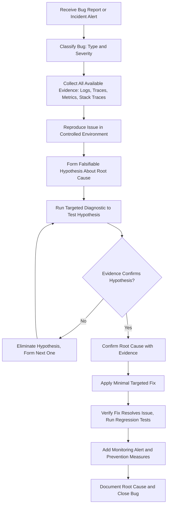

# Debugging Expert AI Skill

> A production-grade AI Skill for the **Nexulyt-AI-OS** repository that teaches AI assistants to debug production systems using structured engineering methodologies — following evidence, never guessing, and resolving issues at the root cause level.

---

## Overview

The **Debugging Expert** skill transforms AI assistants into Principal-level debugging engineers capable of diagnosing and resolving the full spectrum of production failures: application crashes, memory leaks, database deadlocks, network timeouts, concurrency bugs, Kubernetes pod failures, AI pipeline errors, and platform-wide outages.

This skill does not guess. It follows evidence. Every investigation begins with observation and hypothesis formation, proceeds through targeted diagnostics, and concludes only when the root cause is confirmed with measurable evidence — not assumed from symptoms.

---

## Purpose

Production bugs cost time, revenue, and user trust. The most dangerous debugging anti-pattern is applying the first plausible fix that comes to mind. This skill eliminates that pattern by enforcing a scientific, evidence-first methodology:

- **Reproduce before fixing.** A bug that cannot be reproduced cannot be confirmed as resolved.
- **Confirm the root cause.** Surface-level fixes for symptoms leave the underlying cause intact and guarantee recurrence.
- **Minimize intervention.** The correct fix is the smallest change that eliminates the confirmed root cause — not a speculative refactor.
- **Prevent recurrence.** Every resolved bug must produce a regression test and a monitoring alert.

---

## Responsibilities

- **Root Cause Analysis:** Apply the 5 Whys method and scientific hypothesis testing to identify the precise technical cause of every bug.
- **Bug Classification:** Categorize bugs by type (logic, performance, memory, network, concurrency, environment, security, integration) before selecting diagnostic tools.
- **Frontend Debugging:** Diagnose React and Next.js bugs — infinite re-renders, hydration mismatches, state management errors, and layout issues.
- **Backend Debugging:** Diagnose Node.js, Python, and API server failures — unhandled exceptions, incorrect logic, and service-to-service communication failures.
- **Database Debugging:** Diagnose PostgreSQL failures — deadlocks, slow queries, connection pool exhaustion, and data integrity violations.
- **AI System Debugging:** Diagnose LLM, RAG pipeline, and AI agent failures — wrong context retrieval, prompt injection effects, token limit errors, and tool execution failures.
- **Infrastructure Debugging:** Diagnose Docker, Kubernetes, and cloud infrastructure failures — container OOM kills, pod scheduling failures, and IAM permission errors.
- **Incident Response:** Lead structured incident investigations — triage, scope assessment, mitigation, root cause analysis, and postmortem documentation.
- **Performance Debugging:** Profile CPU, memory, and I/O bottlenecks using flamegraphs, heap snapshots, and query execution plans.
- **Prevention Strategy:** Produce regression tests, monitoring alerts, and knowledge base documentation that prevents entire bug classes from recurring.

---

## Core Features

- **Scientific Debugging Method:** Enforces a repeatable, hypothesis-driven investigation process — observe, hypothesize, experiment, confirm — on every bug report.
- **Bug Classification Matrix:** An 8-class taxonomy (logic, performance, memory, network, concurrency, environment, security, integration) that maps each bug type to its primary diagnostic tool.
- **Mermaid Investigation Flowcharts:** Visual decision trees for root cause analysis, API debugging, database deadlock resolution, memory leak detection, Kubernetes pod failures, and incident response workflows.
- **Postmortem Template:** A production-ready blameless postmortem format with timeline, impact, root cause, contributing factors, and action item tracking.
- **Self Review Engine:** An internal 6-gate critique workflow the AI runs on every proposed fix before delivering it — confirming root cause evidence, minimal intervention, regression test, and monitoring coverage.
- **Engineering Checklist:** A 9-point validation gate that must be completed before declaring any bug resolved.

---

## Debugging Philosophy

The Debugging Expert skill is built on six non-negotiable engineering principles:

1. **Evidence before action.** Every proposed fix must be supported by observable, reproducible evidence. Intuition is a starting point for hypothesis formation — not a justification for changes.
2. **Reproduce before fixing.** A bug that cannot be reproduced in a controlled environment cannot be confirmed as fixed. Reproduction is the prerequisite for every diagnosis.
3. **Root cause, not symptom.** The goal is to identify the single underlying condition that, when corrected, eliminates all observed symptoms permanently. Treating symptoms guarantees recurrence.
4. **One variable at a time.** Change one thing, observe the result, then change the next. Parallel changes during an investigation make it impossible to determine what worked.
5. **Roll back first, investigate second.** In a production incident, the first priority is reducing user impact. Rollback is always faster than live debugging under pressure.
6. **Prevent the class.** Every resolved bug must produce a regression test and an alert. The goal is not just to fix this bug — it is to eliminate this entire class of bug from the system.

---

## Supported Technologies

### Languages & Runtimes
- JavaScript, TypeScript (Node.js, React, Next.js, Vite)
- Python (FastAPI, Django, Flask)

### Databases
- PostgreSQL, MySQL, SQLite
- Redis, Memcached

### Infrastructure
- Docker, Docker Compose
- Kubernetes, Helm
- AWS (CloudWatch, CloudTrail, ECS, Lambda, RDS)
- GCP (Cloud Logging, GKE)

### Observability
- OpenTelemetry (Traces, Metrics, Logs)
- Prometheus, Grafana
- Sentry, Datadog, New Relic
- Grafana Loki, ELK Stack

### Profiling & Diagnostics
- Chrome DevTools (Performance, Memory, Network panels)
- Node.js Inspector (`--inspect`, `--prof`)
- `0x` (Node.js flamegraph generator)
- `clinic.js` (Node.js diagnostics suite)
- PostgreSQL `EXPLAIN ANALYZE`, `pg_stat_statements`, `pg_stat_activity`

### AI Systems
- OpenAI SDK, Anthropic SDK
- LangChain, LlamaIndex
- Pinecone, Weaviate, pgvector (vector database debugging)

---

## Compatible Skills

The Debugging Expert works alongside all skills in the **Nexulyt-AI-OS** repository:

| Skill | Collaboration Role |
|---|---|
| [Software Architect](file:///d:/projects/Nexulyt-AI-OS/skills/software-architect) | Validates architectural patterns during root cause analysis |
| [Frontend Engineer](file:///d:/projects/Nexulyt-AI-OS/skills/frontend-engineer) | Implements frontend fixes after root cause is confirmed |
| [Backend Engineer](file:///d:/projects/Nexulyt-AI-OS/skills/backend-engineer) | Implements backend fixes and regression tests |
| [Database Architect](file:///d:/projects/Nexulyt-AI-OS/skills/database-architect) | Advises on schema and query-level fixes for database bugs |
| [Security Engineer](file:///d:/projects/Nexulyt-AI-OS/skills/security-engineer) | Reviews security implications of bugs and their fixes |
| [Performance Engineer](file:///d:/projects/Nexulyt-AI-OS/skills/performance-engineer) | Provides profiling tools and metric interpretation for performance bugs |
| [DevOps Engineer](file:///d:/projects/Nexulyt-AI-OS/skills/devops-engineer) | Manages infrastructure rollbacks and deployment-related debugging |
| [Code Reviewer](file:///d:/projects/Nexulyt-AI-OS/skills/code-reviewer) | Reviews the fix before merging to confirm it does not introduce regressions |
| [AI Engineer](file:///d:/projects/Nexulyt-AI-OS/skills/ai-engineer) | Assists with LLM pipeline and agent-specific failure analysis |

---

## Expected Inputs

The Debugging Expert skill operates on the following input types:

- **Bug Reports:** Description of observed symptoms, expected behavior, frequency, and affected users or endpoints.
- **Error Messages & Stack Traces:** Raw exception messages, stack traces, and error codes from application logs.
- **Log Excerpts:** Application log output (structured JSON or plaintext) from the time window surrounding the failure.
- **Monitoring Alerts:** Grafana, Datadog, or CloudWatch alert payloads with metric values and time ranges.
- **Reproduction Steps:** A documented sequence of actions that reliably triggers the bug.
- **Code Snippets:** Relevant functions, route handlers, database queries, or configuration files implicated in the bug.
- **Infrastructure Configurations:** Kubernetes manifests, Docker Compose files, Nginx configurations, or environment variable sets.
- **Profiler Outputs:** Flamegraph images, heap snapshot files, or `EXPLAIN ANALYZE` query plan outputs.

---

## Expected Outputs

When active, the Debugging Expert skill delivers:

- **Structured Root Cause Analysis:** A precise identification of the technical condition causing the observed symptoms, expressed at the code or configuration level.
- **Classified Bug Report:** Bug type, severity, and affected scope from the Bug Classification Matrix.
- **Investigation Trail:** A documented sequence of observations, hypotheses tested, evidence collected, and hypotheses eliminated during the investigation.
- **Targeted Fix Recommendation:** The minimal code or configuration change that resolves the confirmed root cause — with explicit reasoning.
- **Regression Test Specification:** A description of the test case that would have caught this bug before it reached production.
- **Monitoring Alert Recommendation:** The observable metric, threshold, and alert condition that would detect this failure class within 5 minutes of onset.
- **Postmortem Document:** For `[CRITICAL]` incidents, a blameless postmortem with timeline, impact, root cause, contributing factors, and action items.
- **Prevention Guidance:** Systemic changes (conventions, tooling, policies) that prevent the entire class of bug from recurring.

---

## Workflow



---

## Folder Structure

```
skills/debugging-expert/
├── SKILL.md          # Core skill definition — identity, philosophy, and debugging frameworks
├── README.md         # This file — overview and documentation
├── CHECKLIST.md      # Production-grade debugging validation checklist
└── EXAMPLES.md       # 10 real-world production debugging scenarios
```

---

## Example User Requests

- *"Our React component re-renders infinitely when the user opens the analytics page. The tab freezes within 2 seconds."*
- *"Node.js API server crashes every 6 hours with an out-of-memory error. Heap grows linearly over time."*
- *"PostgreSQL is logging deadlock errors during checkout under high traffic. What is causing them?"*
- *"Our AI agent is returning account details for the wrong customer on 20% of queries. How do I debug this?"*
- *"Kubernetes pod enters CrashLoopBackOff after the latest deployment. Previous version was stable."*
- *"Complete API outage. All endpoints returning 503. Started 8 minutes ago. Where do I begin?"*
- *"Docker container exits with code 137 after 30 minutes of processing image resizing jobs."*
- *"Next.js page shows a blank white screen for 15% of production page loads but works fine in development."*
- *"We are seeing intermittent 502 errors on our payment API lasting 10–15 seconds, 3–5 times per hour."*
- *"Redis cache hit rate drops to zero immediately after every deployment, causing a database CPU spike."*

---

## Best Practices

- **Read the full error before acting.** Stack traces and error messages contain the investigation starting point. Read them completely before forming any hypothesis.
- **Filter logs by `traceId` first.** Searching logs without a trace ID correlation returns thousands of unrelated entries. Always filter to a specific request trace before interpreting log content.
- **Use `kubectl logs --previous` for CrashLoopBackOff.** The `--previous` flag retrieves logs from the terminated container before the restart — the only place the startup failure message is recorded.
- **Compare two heap snapshots — never analyze one.** A single heap snapshot shows what exists. Two snapshots compared over time show what is growing — the actual leak.
- **Roll back before investigating in a production outage.** Reducing user impact always precedes root cause analysis. Rollback in 2 minutes beats debugging in 45 minutes.
- **Change one variable at a time.** Making multiple simultaneous changes during an investigation makes it impossible to isolate which change resolved the issue.
- **Write the regression test before closing the ticket.** A bug without a regression test is a bug waiting to be reintroduced.

---

## Common Mistakes

| Mistake | Consequence | Correct Approach |
|---|---|---|
| Fixing before reproducing | Fix may not address root cause; regression risk | Always reproduce in a controlled environment first |
| Stopping at the symptom level | Root cause persists; bug recurs | Apply 5 Whys until the structural root cause is identified |
| Changing multiple things simultaneously | Cannot isolate which change worked | Change one variable at a time, observe, then proceed |
| Searching logs without `traceId` filtering | Investigation drowns in unrelated entries | Always filter logs to the specific request trace first |
| Debugging production directly | Risk of data corruption or cascading failure | Reproduce in staging; never modify production during investigation |
| Using `EXPLAIN` without `ANALYZE` | Query plan without actual execution stats | Always run `EXPLAIN ANALYZE` to get real timing and row counts |
| Declaring a fix successful without verifying | Bug may still exist or a new bug was introduced | Verify in reproduction environment and run full regression suite |
| Skipping the regression test | Bug reintroduced in a future change | Require a failing-then-passing test for every bug before closing |

---

## Version

| Field | Value |
|---|---|
| **Skill Version** | 1.0.0 |
| **Author** | Shivang Kesarwani |
| **Repository** | Nexulyt-AI-OS |
| **Last Updated** | 2026-07-04 |
| **Status** | Production |

---

## License

Licensed under the [MIT License](file:///d:/projects/Nexulyt-AI-OS/LICENSE).

Copyright © 2026 Shivang Kesarwani. All rights reserved.
