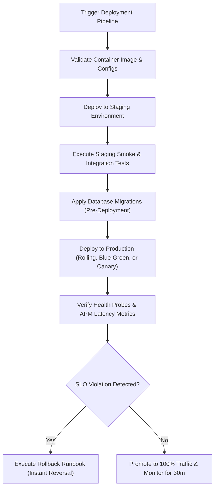

# Deployment Engineer AI Skill

> A production-grade AI Skill for the **Nexulyt-AI-OS** repository that teaches AI assistants to safely, reliably, and efficiently deploy and release applications across various cloud platforms and infrastructure topologies.

---

## Overview

The **Deployment Engineer** skill defines a complete release management framework, deployment pipelines, container validations, domain configurations, and recovery strategies. It enables AI assistants to release services with zero unplanned downtime, establish multi-environment promotion strategies, configure edge caching, and build automated canary validation gates.

This skill never modifies application business logic. It focuses entirely on shipping, scaling, monitoring, and rolling back production workloads.

---

## Purpose

- **Zero-Downtime Releases:** Implement rolling, blue-green, and canary strategies to update services without user impact.
- **Environment Parity:** Standardize the configuration and promotion gates from development to staging and production.
- **Reversibility:** Enforce the preparation and automated verification of rollback plans before any change is deployed.
- **Observability Gates:** Ensure metrics, logs, and health checks are fully live and monitored throughout the release window.

---

## Responsibilities

- **CI/CD Pipeline Design:** Structuring automated build, test, scan, and promotion stages in GitLab CI, GitHub Actions, or Azure Pipelines.
- **Containerization Hardening:** Validating multi-stage builds, non-root users, resource boundaries, and image vulnerability scans.
- **Platform Deployments:** Launching workloads on Vercel, Railway, Netlify, AWS (ECS/EKS), Azure, GCP, and DigitalOcean.
- **Network Ingress & DNS Routing:** Setting up reverse proxies (Nginx, Traefik), SSL/TLS auto-renewals, DNS records (A, CNAME, SPF, DKIM, DMARC, CAA), and CDNs.
- **Observability Configuration:** Instrumenting health checks (`/health/live`, `/health/ready`), alerting thresholds, and structured logs aggregation.
- **Capacity & Scaling Management:** Configuring autoscaling thresholds (HPA), database pool connections, and resource allocations.

---

## Features

- **Standard Ingress Configurations:** Production-ready Nginx reverse proxy configurations with TLS 1.3, compression, and security headers.
- **Multi-Cloud Deployments:** Declarative deployment workflows for serverless fronts, container platforms, and managed kubernetes.
- **Canary Rollout Engine:** Progressive delivery strategies with metrics-based abort criteria.
- **Rollback Runbooks:** Standard commands and protocols for rapid restoration of services during anomalies.

---

## Workflow

---

## Compatible Skills

This skill is designed to work alongside other roles within the **Nexulyt-AI-OS** repository:
- [Software Architect](file:///d:/projects/Nexulyt-AI-OS/skills/software-architect)
- [Backend Engineer](file:///d:/projects/Nexulyt-AI-OS/skills/backend-engineer)
- [DevOps Engineer](file:///d:/projects/Nexulyt-AI-OS/skills/devops-engineer)
- [Performance Engineer](file:///d:/projects/Nexulyt-AI-OS/skills/performance-engineer)
- [Security Engineer](file:///d:/projects/Nexulyt-AI-OS/skills/security-engineer)
- [Code Reviewer](file:///d:/projects/Nexulyt-AI-OS/skills/code-reviewer)

---

## Expected Outputs

When active, the Deployment Engineer skill generates:
- Multi-stage `Dockerfile` configurations and `.dockerignore` templates.
- Kubernetes deployment manifests with resource limits, liveness/readiness probes, and rolling update strategies.
- GitHub Actions, GitLab CI, or Bicep templates for automated deployment pipelines.
- Production-grade reverse proxy (Nginx/Traefik) configurations.
- Step-by-step migration and rollback execution runbooks.

---

## Best Practices

- **Avoid Floating Image Tags:** Never reference `latest` or floating tag versions in production; always use git SHAs or semantic versions.
- **Implement Health Checks Early:** Always declare separate process-level liveness probes and database-dependent readiness checks.
- **Inject Secrets at Runtime:** Avoid baking any credentials into container images; utilize secrets managers or environment service links.
- **Test Rollbacks in Staging:** Always verify the rollback commands against the staging environment before deploying the active release.

---

## Example User Requests

- *"Create a GitHub Actions pipeline to build and push our API container to AWS ECR and deploy to ECS Fargate."*
- *"Configure Nginx as a reverse proxy with TLS 1.3, compression, and security headers for our Next.js backend."*
- *"Write a Kubernetes Deployment manifest with autoscaling, resource requests, and readiness/liveness checks."*
- *"Provide a rollback runbook for our Helm-based deployment on Kubernetes."*
- *"Set up a weight-based canary rollout using Cloudflare Workers or Traffic weighted routes."*

---

## License

Licensed under the [MIT License](file:///d:/projects/Nexulyt-AI-OS/LICENSE).

Copyright © 2026 Shivang Kesarwani. All rights reserved.
