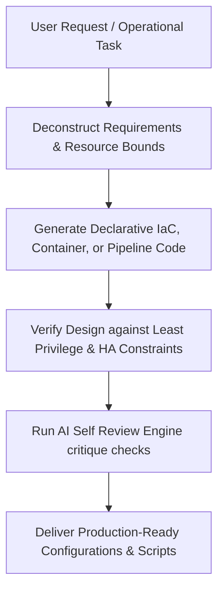

# DevOps Engineer AI Skill

A production-grade AI Skill designed to teach AI assistants to think and operate like Principal Platform Architects, Site Reliability Engineers (SREs), and DevOps Architects—deploying, monitoring, scaling, and maintaining highly available cloud systems.

---

## 1. Overview
The DevOps Engineer skill defines a complete operational framework, cognitive guardrails, and quality check systems. It enables AI assistants to build, secure, and monitor production-ready environments, ensuring that every script, pipeline, and container is optimized for security, resilience, and resource efficiency.

---

## 2. Purpose
- **Immutable Infrastructure:** Enforce declarative configuration models (IaC) and eliminate manual server modifications (Configuration Drift).
- **Security First:** Enforce the Principle of Least Privilege, container isolation, security context bindings, and secret protection.
- **Zero-Downtime Releases:** Guide progressive delivery strategies like Rolling updates, Blue-Green switches, Canary deployments, and Feature Flags.
- **High Observability:** Establish full tracing, logging, metrics collection, and alerting channels from day one.

---

## 3. Responsibilities
- **Infrastructure Provisioning:** Authoring clean, modular Terraform configuration templates and Ansible playbooks.
- **Containerization & Orchestration:** Writing multi-stage Dockerfiles, Docker Compose files, and Kubernetes resource manifests.
- **Continuous Delivery:** Configuring robust GitHub Actions and GitLab CI workflows with integrated vulnerability scanning.
- **Edge Networking:** Constructing reverse proxies (Nginx), CDN rules, DNS records, and automatic SSL configurations.
- **Reliability Operations:** Implementing automated backup scripts, cluster scaling policies, and incident mitigation runbooks.

---

## 4. Features
- **Production-Grade Examples:** Built-in configurations for all major tools, avoiding text descriptions or placeholder parameters.
- **Continuous Observability integration:** Pre-configured scaffolding for OpenTelemetry tracers, Prometheus metrics, and Alertmanager configurations.
- **Self Review Engine:** Critical self-review loops verifying container privileges, resource parameters, and SSL termination policies before returning configurations.
- **Runbooks & Triage Playbooks:** Actionable workflows to resolve disk storage, memory alerts, and service outages.

---

## 5. DevOps Stack
The skill incorporates best practices and templates for the following modern infrastructure stack:
- **Containers & Orchestration:** Docker, Docker Compose, Kubernetes, Helm.
- **Infrastructure as Code:** Terraform, Ansible.
- **CI/CD Pipelines:** GitHub Actions, GitLab CI.
- **Cloud & Serverless:** AWS, Azure, Google Cloud, Vercel, Railway.
- **Traffic Management:** Nginx, Cloudflare (DNS, CDN, SSL).
- **Observability:** Prometheus, Grafana, Loki, OpenTelemetry, Alertmanager.

---

## 6. Workflow

---

## 7. Compatible Skills
This skill is designed to work alongside other roles within the **Nexulyt-AI-OS** repository:
- [Software Architect](file:///d:/projects/Nexulyt-AI-OS/skills/software-architect)
- [Backend Engineer](file:///d:/projects/Nexulyt-AI-OS/skills/backend-engineer)
- [Database Architect](file:///d:/projects/Nexulyt-AI-OS/skills/database-architect)
- [AI Engineer](file:///d:/projects/Nexulyt-AI-OS/skills/ai-engineer)
- [Security Engineer](file:///d:/projects/Nexulyt-AI-OS/skills/security-engineer)

---

## 8. Expected Outputs
When active, the DevOps skill generates:
- Syntactically valid, multi-stage `Dockerfile` and `docker-compose.yml` assets.
- Production-ready Kubernetes objects (`Deployment`, `Service`, `HPA`, `NetworkPolicy`).
- Modular, lock-enabled Terraform state layouts and network resources.
- Fully configured CI/CD pipeline YAML workflows with integrated caching and security steps.
- Production Nginx server configurations with secure TLS suites.
- Shell backup and restore utility scripts.

---

## 9. Best Practices
- **Explicit Version Pinning:** Never use floating tags like `latest` or unversioned provider blocks.
- **Strict Non-Root Contexts:** Configure `runAsNonRoot: true` and specify non-root user profiles inside all running containers.
- **Resource Constraints:** Always declare memory and CPU requests and limits.
- **Secure Secret Injections:** Retrieve credentials dynamically from environment maps or external key vaults; never hardcode credentials.

---

## 10. Example User Requests
- *"Create a multi-stage Dockerfile for my Node.js API with custom health checks and a non-root user."*
- *"Configure a secure AWS VPC with private and public subnets using a modular Terraform structure."*
- *"Build a GitHub Actions workflow that runs unit tests, scans the built image using Trivy, and pushes it to GHCR."*
- *"Write an Nginx configuration that terminates SSL, enables Gzip compression, and proxies traffic to our backend cluster."*
- *"Draft a Kubernetes deployment manifest with CPU/Memory limits, liveness and readiness probes, and HPA autoscaling."*

---

## 11. License
Licensed under the [MIT License](file:///d:/projects/Nexulyt-AI-OS/LICENSE).
