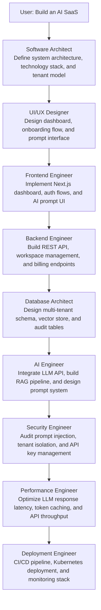
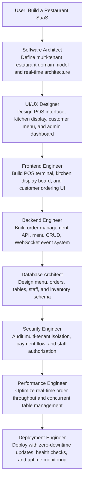
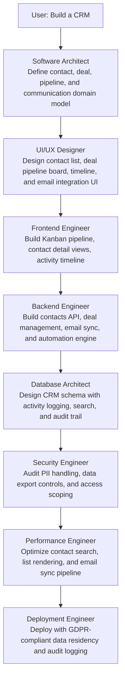
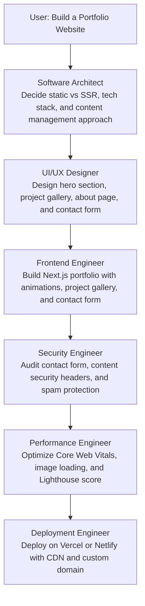
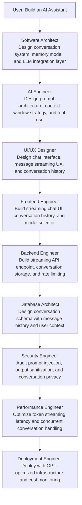
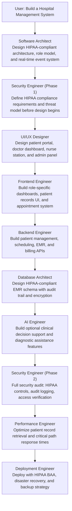
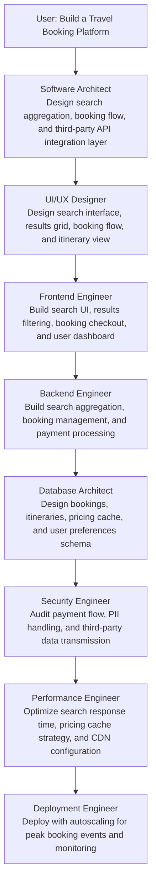
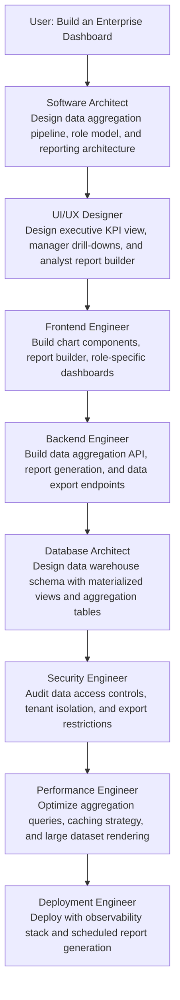
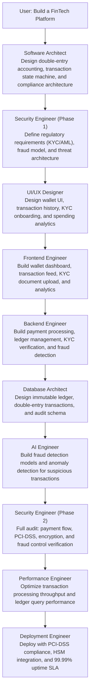
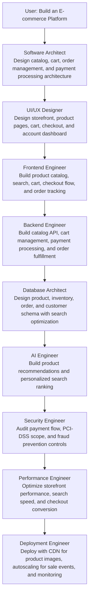

# Full-Stack Orchestrator — Examples

This document demonstrates how the Full-Stack Orchestrator AI decomposes complex product requests into structured, sequenced skill activations. Each example shows the orchestrator's thinking process, skill sequencing decisions, and the handoff chain that transforms a user request into a fully planned, production-ready system.

---

## 1. AI SaaS Platform

### User Request
*"Build an AI SaaS."*

### Orchestrator Thinking
An AI SaaS is a multi-discipline product that requires architectural clarity before any implementation begins. The orchestrator identifies: a cloud-native architecture is needed, an AI pipeline must be integrated safely, multi-tenancy is implied by "SaaS," and security and deployment are non-trivial. The sequencing must ensure the Software Architect defines the system before frontend or backend engineers write a single component.

### Orchestration Chain

### Skill Activation Details

| Skill | Primary Deliverable | Key Decisions |
|---|---|---|
| **Software Architect** | System design document, ADRs | Multi-tenant architecture, LLM provider selection, data residency |
| **UI/UX Designer** | Wireframes, design system, user flows | Dashboard layout, prompt interface, token usage visualization |
| **Frontend Engineer** | Next.js application, component library | SSR for SEO, streaming responses, workspace switcher |
| **Backend Engineer** | Node.js API, billing integration | Stripe subscriptions, rate limiting per plan, usage metering |
| **Database Architect** | PostgreSQL schema, vector DB design | Row-level security for tenancy, pgvector for embeddings |
| **AI Engineer** | RAG pipeline, LLM integration | Context window management, retrieval strategy, output validation |
| **Security Engineer** | Threat model, security controls | Prompt injection prevention, tenant data isolation, secrets rotation |
| **Performance Engineer** | Optimization report, metric baselines | LLM response streaming, cache warm-up, token budget enforcement |
| **Deployment Engineer** | Kubernetes manifests, CI/CD pipeline | Blue-green deployments, auto-scaling on GPU nodes, cost controls |

### Orchestrator Rules Applied
- Software Architect activates before all implementation skills — no code before design.
- AI Engineer activates after Database Architect — RAG pipeline design depends on vector store schema.
- Security Engineer reviews AI integration before Performance Engineer optimizes it — security is never traded for speed.
- Deployment Engineer activates last — ships only what has been reviewed and verified.

---

## 2. Restaurant SaaS

### User Request
*"Build a Restaurant SaaS."*

### Orchestrator Thinking
A Restaurant SaaS serves multiple restaurant businesses (multi-tenant) and requires real-time features: live order management, kitchen display, and table status. The orchestrator identifies: a domain-specific data model (orders, tables, menus, staff) is needed first, real-time WebSocket architecture must be defined early, and the payment flow is critical and requires security review.

### Orchestration Chain

### Skill Activation Details

| Skill | Primary Deliverable | Key Decisions |
|---|---|---|
| **Software Architect** | Domain model, real-time event system design | WebSocket vs SSE for kitchen display, multi-tenant data isolation strategy |
| **UI/UX Designer** | POS wireframes, kitchen display mockups, customer menu flow | Touch-optimized POS layout, order status color coding |
| **Frontend Engineer** | React POS terminal, Next.js customer menu, kitchen display | Offline resilience for POS, WebSocket reconnection logic |
| **Backend Engineer** | Order management API, WebSocket server, billing integration | Order state machine (pending → preparing → ready → served) |
| **Database Architect** | Restaurant schema with tenant isolation | Order history partitioning, inventory tracking, shift management |
| **Security Engineer** | Tenant isolation audit, payment security review | PCI-DSS considerations, staff PIN authentication, RBAC for roles |
| **Performance Engineer** | Real-time throughput optimization | WebSocket connection pooling, order queue optimization |
| **Deployment Engineer** | Production deployment with high availability | Blue-green deployment to avoid POS disruption during service hours |

### Orchestrator Rules Applied
- AI Engineer is not activated — this product does not require LLM integration. The orchestrator skips non-applicable skills.
- Database Architect activates before Security Engineer — tenant isolation must be schema-level before security review.
- Deployment Engineer is briefed on peak hours (restaurant service windows) to avoid deploying during lunch or dinner rush.

---

## 3. CRM (Customer Relationship Management)

### User Request
*"Build a CRM."*

### Orchestrator Thinking
A CRM is a data-intensive application centered on contacts, deals, pipelines, and communication history. The orchestrator identifies: the data model is the core of the system and must be designed first, workflow automation and email integration add complexity, and a CRM always handles PII which requires a rigorous security review.

### Orchestration Chain

### Skill Activation Details

| Skill | Primary Deliverable | Key Decisions |
|---|---|---|
| **Software Architect** | Domain model for contacts, deals, pipelines, activities | Single-tenant vs multi-tenant, integration layer for email providers |
| **UI/UX Designer** | Kanban board, contact detail page, activity feed | Drag-and-drop pipeline, bulk action UX, email thread view |
| **Frontend Engineer** | React Kanban board, contact search, email composition | Optimistic updates for drag-and-drop, virtual scroll for large lists |
| **Backend Engineer** | REST API, email sync with IMAP/SMTP, webhook system | Activity logging on all mutations, deal probability scoring |
| **Database Architect** | CRM schema with full-text search, audit log table | PostgreSQL full-text search for contacts, immutable audit trail |
| **Security Engineer** | PII audit, data export controls, field-level access | GDPR right-to-erasure implementation, role-scoped field visibility |
| **Performance Engineer** | Contact list pagination, search indexing | Elasticsearch or pgvector for fuzzy contact search |
| **Deployment Engineer** | GDPR-compliant deployment with data residency | EU data residency, automated PII data retention enforcement |

---

## 4. Portfolio Website

### User Request
*"Build a Portfolio Website."*

### Orchestrator Thinking
A portfolio website is a frontend-dominant project with no multi-tenancy, no real-time features, and minimal backend needs. The orchestrator scales down the skill chain accordingly — no AI Engineer, no Database Architect (no persistent data), and a simplified security review focusing on form spam prevention and content security headers.

### Orchestration Chain

### Skill Activation Details

| Skill | Primary Deliverable | Key Decisions |
|---|---|---|
| **Software Architect** | Stack decision and content model | Next.js SSG vs Astro, CMS choice (MDX, Sanity, or file-based) |
| **UI/UX Designer** | Portfolio mockup, typography system, color palette | Dark/light mode, project card layout, animation style |
| **Frontend Engineer** | Next.js portfolio site with animations | Framer Motion animations, responsive image grid, contact form |
| **Security Engineer** | Security headers, reCAPTCHA on contact form | CSP headers, honeypot spam protection, no PII in form logs |
| **Performance Engineer** | Lighthouse score ≥ 95, Core Web Vitals pass | WebP images, preloading hero assets, font subsetting |
| **Deployment Engineer** | Vercel deployment with custom domain and SSL | Automatic preview deployments per branch, CDN caching config |

### Orchestrator Rules Applied
- Backend Engineer, Database Architect, and AI Engineer are not activated — a static portfolio site requires none of these.
- The orchestrator explicitly reduces the skill chain to 6 skills from a possible 9, matching scope to complexity.

---

## 5. AI Assistant

### User Request
*"Build an AI Assistant."*

### Orchestrator Thinking
An AI Assistant is a conversational interface backed by an LLM. The orchestrator identifies: the AI Engineer is the most critical skill and must design the conversation architecture before the frontend is built, the backend must handle streaming responses, and prompt injection is the primary security threat that must be reviewed before any other security concern.

### Orchestration Chain

### Skill Activation Details

| Skill | Primary Deliverable | Key Decisions |
|---|---|---|
| **Software Architect** | Conversation system architecture | Stateful vs stateless conversation model, tool-use framework |
| **AI Engineer** | Prompt system, context management, tool definitions | System prompt design, memory compression strategy, fallback behavior |
| **UI/UX Designer** | Chat interface mockup, streaming message UX | Token-by-token streaming indicator, conversation branching UI |
| **Frontend Engineer** | React streaming chat component, history sidebar | Server-Sent Events for streaming, markdown rendering for responses |
| **Backend Engineer** | Streaming API with OpenAI SDK, conversation management | `/api/chat` SSE endpoint, message persistence, token counting |
| **Database Architect** | Conversation and message schema | Message vector embeddings for semantic search, user context table |
| **Security Engineer** | Prompt injection defense, output validation | Input sanitization, output escaping, `max_tokens` enforcement |
| **Performance Engineer** | Streaming latency optimization | First-token latency target, concurrent session limits |
| **Deployment Engineer** | Scalable deployment with LLM cost controls | API key rotation, per-user rate limiting, usage cost alerting |

### Orchestrator Rules Applied
- AI Engineer activates second (immediately after Software Architect) — in an AI product, the AI architecture IS the product architecture.
- UI/UX Designer activates after AI Engineer — the chat interface design depends on knowing what the AI will produce (streaming tokens, tool outputs, citations).

---

## 6. Hospital Management System

### User Request
*"Build a Hospital Management System."*

### Orchestrator Thinking
A Hospital Management System is a mission-critical, compliance-heavy application. The orchestrator immediately flags: HIPAA compliance is mandatory, role-based access is highly granular (doctors, nurses, admins, patients), real-time features are needed (patient status, bed availability), and data integrity is non-negotiable. The Security Engineer must review every component, and the Deployment Engineer must address data residency, backup SLAs, and disaster recovery.

### Orchestration Chain

### Skill Activation Details

| Skill | Primary Deliverable | Key Decisions |
|---|---|---|
| **Software Architect** | HIPAA-compliant system design | Audit trail architecture, PHI data flow mapping, HL7 FHIR integration |
| **Security Engineer (Phase 1)** | Compliance requirements document | HIPAA Security Rule controls checklist, threat model, BAA requirements |
| **UI/UX Designer** | Role-specific interface designs | Cognitive load reduction for clinical staff, emergency access workflows |
| **Frontend Engineer** | React dashboards per role | Real-time bed availability board, patient timeline, e-prescribing UI |
| **Backend Engineer** | EMR API, scheduling engine, billing | PHI encryption at application layer, HL7 FHIR endpoints, e-signature |
| **Database Architect** | PHI schema with column-level encryption | Immutable audit log, patient consent tracking, data access logging |
| **AI Engineer** | Clinical decision support | Drug interaction checking, diagnostic suggestion with confidence scores |
| **Security Engineer (Phase 2)** | Full HIPAA security audit | Access control verification, encryption validation, audit log completeness |
| **Performance Engineer** | Critical path optimization | Patient record retrieval < 500ms, emergency search < 100ms |
| **Deployment Engineer** | HIPAA-compliant production deployment | BAA with cloud provider, PHI backup with 7-year retention, DR < 4 hours |

### Orchestrator Rules Applied
- Security Engineer activates TWICE — before design (to set compliance requirements) and after full implementation (to audit against those requirements).
- Deployment Engineer is provided with HIPAA BAA requirements and must confirm cloud provider compliance before finalizing deployment configuration.

---

## 7. Travel Booking Platform

### User Request
*"Build a Travel Booking Platform."*

### Orchestrator Thinking
A Travel Booking Platform involves third-party API integrations (flights, hotels, rental cars), complex search and filtering, a critical payment flow, and high read traffic during peak booking windows. The orchestrator identifies: the integration layer with travel APIs is the most complex backend concern, search performance is the primary user-facing performance challenge, and payment processing requires the same rigor as any financial system.

### Orchestration Chain

### Skill Activation Details

| Skill | Primary Deliverable | Key Decisions |
|---|---|---|
| **Software Architect** | Integration architecture, booking state machine | Amadeus/Sabre API integration pattern, fare caching strategy |
| **UI/UX Designer** | Search interface, filter UX, booking funnel | Multi-destination search, price calendar widget, seat map |
| **Frontend Engineer** | Search UI with live filtering, checkout flow | Client-side price filtering, optimistic booking state |
| **Backend Engineer** | Travel API aggregation, booking management | Fare hold mechanism, availability locking, cancellation workflows |
| **Database Architect** | Booking schema with pricing history | Price alert subscriptions, booking change history, seat inventory |
| **Security Engineer** | Payment audit, PII transmission review | PCI-DSS for payment, passport data handling, third-party data sharing |
| **Performance Engineer** | Search caching, CDN optimization | Redis fare cache with TTL, search result pagination, edge caching |
| **Deployment Engineer** | Autoscaling for holiday booking peaks | Pre-scale for known peak events (holiday season, Black Friday) |

---

## 8. Enterprise Dashboard

### User Request
*"Build an Enterprise Dashboard."*

### Orchestrator Thinking
An Enterprise Dashboard aggregates data from multiple internal systems and presents it to business decision-makers. The orchestrator identifies: the data pipeline architecture is the core challenge, role-based dashboard access (executives, managers, analysts) must be designed carefully, and performance at scale (large datasets, complex aggregations) is a defining requirement.

### Orchestration Chain

### Skill Activation Details

| Skill | Primary Deliverable | Key Decisions |
|---|---|---|
| **Software Architect** | Data pipeline architecture, reporting domain model | ETL vs ELT, OLAP vs OLTP, pre-aggregation strategy |
| **UI/UX Designer** | Dashboard hierarchy (exec → manager → analyst), chart library | D3.js vs Recharts, drill-down interaction patterns, export UX |
| **Frontend Engineer** | React dashboard with virtualized tables, chart rendering | Large dataset virtual scroll, PDF export, responsive chart layout |
| **Backend Engineer** | Aggregation API, scheduled report generation, CSV/PDF export | Report scheduling with BullMQ, streaming data export |
| **Database Architect** | Materialized views, summary tables, partitioned time-series | Pre-computed daily/weekly/monthly rollups, query partitioning |
| **Security Engineer** | Data access audit, column-level security | Row-level security per department, export data classification |
| **Performance Engineer** | Query optimization, caching with Redis | Stale-while-revalidate caching for slow aggregations, query explain |
| **Deployment Engineer** | Scheduled aggregation jobs, observability stack | Cron-based materialized view refresh, Grafana dashboard deployment |

---

## 9. FinTech Platform

### User Request
*"Build a FinTech Platform."*

### Orchestrator Thinking
A FinTech Platform handles money movement, which is the highest-stakes category of software. The orchestrator immediately flags: double-entry accounting correctness is non-negotiable, regulatory compliance (KYC/AML) must be addressed, audit trails must be immutable, and the Security Engineer must be involved in every phase. Transaction atomicity and idempotency are architectural requirements that must be defined before any engineer writes code.

### Orchestration Chain

### Skill Activation Details

| Skill | Primary Deliverable | Key Decisions |
|---|---|---|
| **Software Architect** | Ledger architecture, transaction state machine, compliance layer | Double-entry accounting model, idempotency keys, event sourcing |
| **Security Engineer (Phase 1)** | Regulatory compliance requirements, threat model | PCI-DSS scope, KYC/AML obligations, fraud prevention strategy |
| **UI/UX Designer** | Wallet dashboard, transaction history, KYC flow | Trust-building design patterns, spending category visualization |
| **Frontend Engineer** | Wallet UI, KYC document upload, spending analytics | Secure document upload, PCI-compliant card input iframe |
| **Backend Engineer** | Payment engine, ledger API, KYC integration, fraud engine | Atomic transfers with distributed saga, idempotency enforcement |
| **Database Architect** | Immutable ledger schema, audit trail | Append-only transaction log, balance reconciliation queries |
| **AI Engineer** | Fraud detection models, anomaly scoring | Real-time transaction scoring, model retraining pipeline |
| **Security Engineer (Phase 2)** | Full PCI-DSS audit, encryption verification | Card data tokenization audit, HSM key management review |
| **Performance Engineer** | Transaction throughput optimization | Ledger read path caching, balance query optimization |
| **Deployment Engineer** | PCI-DSS compliant deployment | HSM integration, network segmentation, penetration test scheduling |

### Orchestrator Rules Applied
- Security Engineer activates at Phase 1 (before design) and Phase 2 (after full implementation) — financial systems require security as a first-class design constraint, not a post-implementation audit.
- Database Architect receives the immutability requirement explicitly — the ledger must be append-only by schema design, not just by application convention.

---

## 10. E-commerce Platform

### User Request
*"Build an E-commerce Platform."*

### Orchestrator Thinking
An E-commerce Platform is a proven, well-understood domain with clear requirements: product catalog, cart, checkout, payment processing, order management, and inventory. The orchestrator identifies: the checkout and payment flow is the most critical path, performance under promotional traffic spikes (flash sales) is a defining challenge, and the search and discovery experience directly drives revenue.

### Orchestration Chain

### Skill Activation Details

| Skill | Primary Deliverable | Key Decisions |
|---|---|---|
| **Software Architect** | E-commerce domain model, checkout flow design | Monolith vs microservices, headless vs coupled frontend, inventory locking strategy |
| **UI/UX Designer** | Storefront design, PDP layout, checkout funnel | Mobile-first PDP, one-page checkout, trust signal placement |
| **Frontend Engineer** | Next.js storefront with ISR, cart UI, checkout flow | Product image optimization, cart persistence across sessions |
| **Backend Engineer** | Catalog API, cart management, Stripe integration, order engine | Inventory reservation during checkout, order state machine |
| **Database Architect** | Product catalog schema, order schema, inventory management | Elasticsearch for product search, PostgreSQL for orders, Redis for cart |
| **AI Engineer** | Recommendation engine, personalized search | Collaborative filtering for recommendations, A/B testing for ranking |
| **Security Engineer** | Payment security audit, fraud prevention | Stripe.js for PCI-scope reduction, bot protection on checkout |
| **Performance Engineer** | Page load optimization, search performance | ISR for product pages, Elasticsearch relevance tuning, image CDN |
| **Deployment Engineer** | CDN configuration, autoscaling for sale events | Pre-warming CDN before flash sales, HPA for checkout service |

### Orchestrator Rules Applied
- AI Engineer activates after the core catalog and order system is designed — recommendations are a value-add feature that must not block the core checkout path.
- Performance Engineer specifically focuses on the checkout conversion funnel — every 100ms of checkout latency directly impacts revenue.
- Deployment Engineer is briefed on flash sale scenarios and must configure pre-emptive autoscaling for known promotional events.
