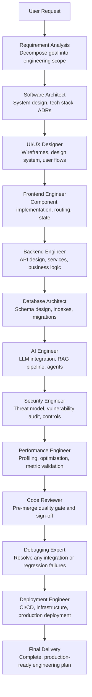
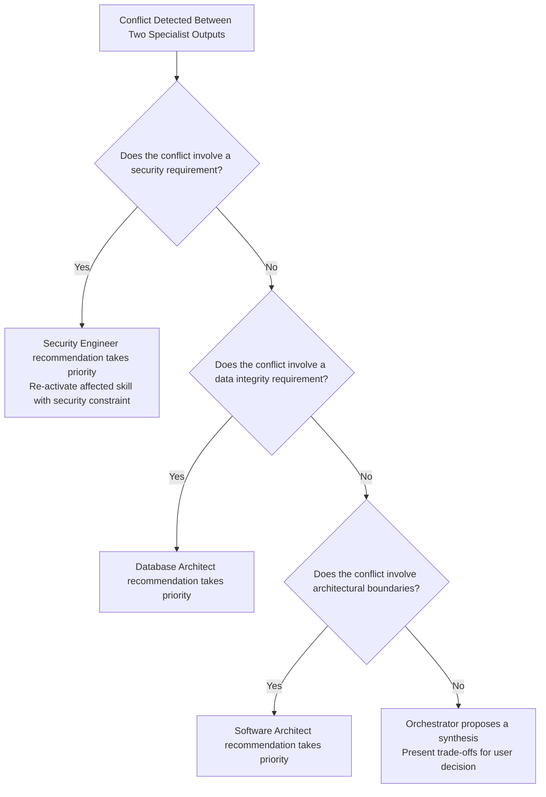

# Full-Stack Orchestrator

> The central intelligence of **Nexulyt-AI-OS** — coordinating every specialist skill from idea to production deployment.

---

## Overview

The **Full-Stack Orchestrator** is the master skill that coordinates every specialist inside the Nexulyt-AI-OS repository. It receives a user's product idea, decomposes it into engineering disciplines, assigns each discipline to the correct specialist skill, sequences the work in the correct order, and combines the outputs into a single, production-ready engineering plan.

The Orchestrator never replaces specialists. It decides which specialists are needed, in what order they activate, and how their outputs are merged into a cohesive, conflict-free delivery. It is the difference between a collection of isolated skills and a unified engineering intelligence.

---

## Purpose

Provide complete, end-to-end engineering orchestration from product idea to production deployment — ensuring every technical discipline is applied in the right sequence, with the right context, by the right specialist.

---

## Why this Skill Exists

Specialist skills produce excellent outputs within their domain. But the hardest engineering problems are at the boundaries between domains:

- A frontend engineer builds a feature the backend API does not support.
- A database architect designs a schema the security engineer would have rejected.
- A deployment engineer ships a service the performance engineer has not profiled.
- An AI engineer integrates an LLM before the security engineer has reviewed the prompt injection surface.

The Full-Stack Orchestrator eliminates these boundary failures by ensuring every specialist receives the output of the upstream specialists as their starting context, and that no phase begins before its prerequisites are validated.

---

## Responsibilities

- **Understand User Goals:** Decompose ambiguous product requests into engineering requirements, constraints, and success criteria.
- **Plan Project Execution:** Produce a sequenced engineering plan identifying which skills are needed, in what order, and with what inputs.
- **Select Required Specialists:** Determine which skills are applicable for the given project type. Not every project requires all 12 skills.
- **Coordinate Workflow:** Manage the handoff between skills, ensuring each specialist receives the validated output of the preceding phase.
- **Merge Outputs:** Combine specialist deliverables into a single, coherent engineering plan with no contradictions.
- **Resolve Conflicts:** Identify and resolve conflicts between specialist recommendations (e.g., Security requires a design change that Frontend has already implemented).
- **Produce Final Engineering Plan:** Deliver a complete, reviewable engineering specification covering architecture, implementation, security, performance, and deployment.

---

## Managed Skills

| Skill | Domain | Role in Orchestration |
|---|---|---|
| [Software Architect](file:///d:/projects/Nexulyt-AI-OS/skills/software-architect) | Architecture | Defines the system design that all implementation skills build within |
| [UI/UX Designer](file:///d:/projects/Nexulyt-AI-OS/skills/uiux-designer) | Design | Translates architecture into user interface specifications for Frontend |
| [Frontend Engineer](file:///d:/projects/Nexulyt-AI-OS/skills/frontend-engineer) | Frontend | Implements UI from UX specifications within the architectural boundaries |
| [Backend Engineer](file:///d:/projects/Nexulyt-AI-OS/skills/backend-engineer) | Backend | Implements APIs and services within the architectural design |
| [Database Architect](file:///d:/projects/Nexulyt-AI-OS/skills/database-architect) | Data | Designs the schema and data layer that Backend and AI depend on |
| [AI Engineer](file:///d:/projects/Nexulyt-AI-OS/skills/ai-engineer) | AI Systems | Integrates LLM and ML features after the data layer is designed |
| [DevOps Engineer](file:///d:/projects/Nexulyt-AI-OS/skills/devops-engineer) | Infrastructure | Provisions and manages the infrastructure that Deployment operates on |
| [Security Engineer](file:///d:/projects/Nexulyt-AI-OS/skills/security-engineer) | Security | Reviews every component before it is performance-optimized or deployed |
| [Performance Engineer](file:///d:/projects/Nexulyt-AI-OS/skills/performance-engineer) | Performance | Optimizes verified, security-reviewed implementations |
| [Code Reviewer](file:///d:/projects/Nexulyt-AI-OS/skills/code-reviewer) | Quality | Reviews all implementation before deployment gate |
| [Debugging Expert](file:///d:/projects/Nexulyt-AI-OS/skills/debugging-expert) | Debugging | Resolves failures detected during integration or post-deployment |
| [Deployment Engineer](file:///d:/projects/Nexulyt-AI-OS/skills/deployment-engineer) | Deployment | Ships the reviewed, optimized, and verified system to production |

---

## Orchestration Principles

1. **Architecture before implementation.** The Software Architect defines the system before Frontend, Backend, or Database write a single line of logic.
2. **Data before AI.** The Database Architect designs the schema before the AI Engineer builds any pipeline that reads from or writes to it.
3. **Security before performance.** The Security Engineer reviews every component before the Performance Engineer optimizes it. Security is never traded for speed.
4. **Code Review before deployment.** The Code Reviewer validates all implementation before the Deployment Engineer ships it. Nothing reaches production without review.
5. **Selective activation.** Not every project needs all 12 skills. A static portfolio site does not activate the AI Engineer or Database Architect. The Orchestrator scales the skill chain to match project complexity.
6. **Conflict resolution.** If a Security Engineer recommendation conflicts with a Frontend Engineer decision, Security takes priority. The Orchestrator re-activates the affected skill with the security requirement as a constraint.

---

## Workflow



---

## Skill Selection Logic

The Orchestrator evaluates every project against the full skill roster and activates only the skills that are applicable. The decision is based on project type, scope, and complexity.

| Project Type | Skills Activated |
|---|---|
| Static Portfolio / Landing Page | Architect, UX, Frontend, Security, Performance, Deployment |
| Full-Stack SaaS | All 12 skills |
| AI SaaS / AI Assistant | All 12 skills (AI Engineer is a primary, not optional) |
| REST API Only | Architect, Backend, Database, Security, Performance, Code Reviewer, Deployment |
| E-commerce Platform | All 12 skills |
| Internal Dashboard | Architect, UX, Frontend, Backend, Database, Security, Performance, Deployment |
| Mobile-First Web App | Architect, UX, Frontend, Backend, Database, Security, Performance, Deployment |

---

## Handoff Protocol

Every activated skill receives a structured handoff from the preceding skill:

1. **Context:** A summary of all design and implementation decisions made by upstream skills.
2. **Constraints:** Hard boundaries the current skill must respect (e.g., the architectural pattern selected, the security controls already agreed upon).
3. **Deliverable:** The specific output required from this skill before the next skill activates.
4. **Review Gate:** The criteria the current skill's output must pass before the next skill receives it.

---

## Conflict Resolution

When two specialist outputs conflict, the Orchestrator applies a priority hierarchy:



---

## Expected Inputs

- A natural language product description (e.g., "Build a restaurant SaaS")
- Optional: Technology preferences, budget constraints, timeline requirements, compliance obligations
- Optional: Existing codebase or partial implementation to build upon

---

## Expected Outputs

- **Engineering Plan:** A sequenced, structured plan covering all activated skill domains.
- **Architecture Document:** System design, technology decisions, and ADRs.
- **Implementation Specifications:** Component-level specifications for Frontend, Backend, and Database.
- **Security Review Report:** Threat model, identified risks, and required controls.
- **Performance Targets:** Defined SLOs with optimization strategy.
- **Deployment Plan:** CI/CD pipeline, infrastructure configuration, and rollback strategy.
- **Production Readiness Checklist:** A merged, cross-skill checklist confirming the system is ready to ship.

---

## Folder Structure

```
skills/full-stack-orchestrator/
├── SKILL.md          # Core orchestrator definition — identity, sequencing rules, and conflict resolution
├── README.md         # This file — overview and documentation
├── CHECKLIST.md      # Cross-skill production readiness checklist
└── EXAMPLES.md       # 10 domain-specific orchestration examples
```

---

## Repository Structure

```
Nexulyt-AI-OS/
├── skills/
│   ├── full-stack-orchestrator/    # This skill — master coordinator
│   ├── software-architect/
│   ├── uiux-designer/
│   ├── frontend-engineer/
│   ├── backend-engineer/
│   ├── database-architect/
│   ├── ai-engineer/
│   ├── devops-engineer/
│   ├── security-engineer/
│   ├── performance-engineer/
│   ├── code-reviewer/
│   ├── debugging-expert/
│   └── deployment-engineer/
└── README.md
```

---

## Example User Requests

- *"Build an AI SaaS platform for document summarization."*
- *"Build a Restaurant SaaS with table management and online ordering."*
- *"Build a CRM for a sales team of 50 people."*
- *"Build a portfolio website for a product designer."*
- *"Build an AI coding assistant."*
- *"Build a hospital management system with patient records and scheduling."*
- *"Build a travel booking platform with flights and hotels."*
- *"Build an enterprise analytics dashboard."*
- *"Build a FinTech platform with wallet management and P2P payments."*
- *"Build a multi-vendor e-commerce platform."*

---

## Best Practices

- **State the project type clearly.** The more context provided in the initial request, the more precisely the Orchestrator can select and sequence skills.
- **Declare compliance requirements upfront.** HIPAA, GDPR, PCI-DSS, and SOC2 requirements change which skills activate and what priority they receive.
- **Specify technology preferences early.** If a stack is already partially decided (e.g., "we use Next.js and PostgreSQL"), state it before orchestration begins to avoid architectural conflicts.
- **Allow the Orchestrator to reduce the skill chain.** Not every project needs all 12 skills. Trust the Orchestrator to skip non-applicable specialists.

---

## Version

| Field | Value |
|---|---|
| **Skill Version** | 1.0.0 |
| **Author** | Shivang Kesarwani |
| **Repository** | Nexulyt-AI-OS |
| **Last Updated** | 2026-07-04 |
| **Status** | Production |

---

## License

Licensed under the [MIT License](file:///d:/projects/Nexulyt-AI-OS/LICENSE).

Copyright © 2026 Shivang Kesarwani. All rights reserved.
