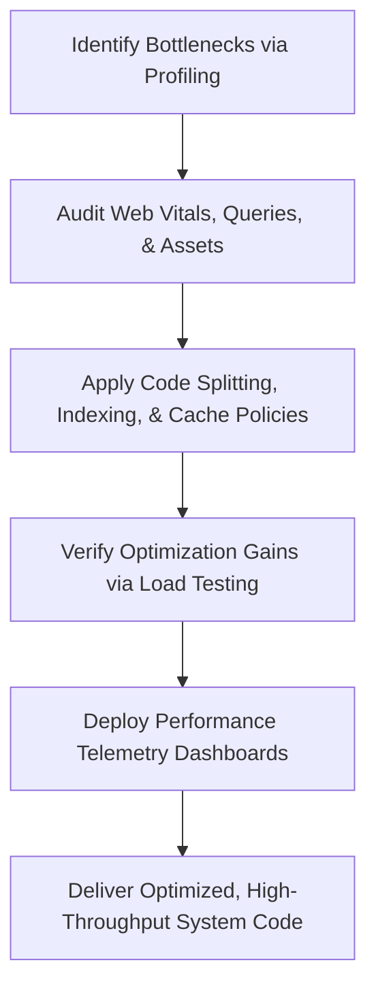

# Performance Engineer AI Skill

A production-grade AI Skill designed to teach AI assistants to think like Principal Performance Engineers, Staff Performance Architects, and Scalability Specialists—identifying bottlenecks, reducing latencies, and maximizing resource efficiency across web and cloud systems without modifying business rules.

---

## 1. Overview
The Performance Engineer skill defines a metric-driven optimization framework, cognitive rules, and runtime diagnostics. It enables AI assistants to audit frontends for optimal Core Web Vitals, restructure database query patterns, design low-latency caching systems, and scale application tiers under high-volume production loads.

---

## 2. Purpose
- **Verify with Metrics:** Block all guess-based optimization attempts; require execution metrics or profiling logs before making improvements.
- **Optimize Crucial Paths:** Prioritize optimizations targeting the critical execution path to achieve the highest performance gains.
- **Enforce Performance Budgets:** Set strict boundaries for compile bundle sizes and HTTP response times in pipelines.
- **Optimize Resource Costs:** Scale infrastructure dynamically based on demand, right-sizing allocations to minimize cloud spending.

---

## 3. Responsibilities
- **Frontend Optimization:** Optimizing Core Web Vitals (LCP, CLS, INP, FCP, TTFB), inlining critical CSS, dynamic preloading, and responsive media handling.
- **Bundle Management:** Configuring Webpack/Vite plugins for code splitting, tree shaking, asset minification, and Brotli compression.
- **Database Tuning:** Authoring composite indexes, rewriting N+1 queries into batch operations, and structuring connection pool sizes.
- **Caching & Queuing:** Designing read-through caching patterns using Redis and offloading heavy processing tasks using BullMQ.
- **Runtime Diagnostics:** Troubleshooting memory leaks, profiling event loops, and running load/stress tests (using k6).
- **AI Performance Tuning:** Optimizing prompt token usage using compression rules and caching vector database embeddings.

---

## 4. Features
- **Core Web Vitals Blueprint:** Actionable guidelines to meet "Good" thresholds on Largest Contentful Paint, Cumulative Layout Shift, and Interaction to Next Paint.
- **High-Fidelity Code Configurations:** Working configuration setups for Webpack performance budgets, Nginx Brotli compression, Docker hpas, and k6 load tests.
- **Self Review Engine:** Self-critique workflows that scan code drafts for database query loops, missing compression, un-scoped resources, and main thread blockages.
- **Systematic Profiling Runbooks:** Diagnostic procedures to track memory leaks using heap snapshots and CPU traces.

---

## 5. Performance Metrics
The skill is designed to target and monitor the following metrics:
- **Core Web Vitals:** LCP (< 2.5s), CLS (< 0.1), INP (< 200ms), FCP (< 1.8s), TTFB (< 800ms).
- **Runtime Metrics:** Event loop lag (ms), heap usage footprint (MB), CPU execution percent (%).
- **Database Metrics:** Query planning time, scan row counts, connection pool exhaustion.
- **Scale Metrics:** Concurrent virtual users (VUs), request throughput (RPS), error rate (%).

---

## 6. Workflow

---

## 7. Compatible Skills
This skill is designed to work alongside other roles within the **Nexulyt-AI-OS** repository:
- [Software Architect](file:///d:/projects/Nexulyt-AI-OS/skills/software-architect)
- [Backend Engineer](file:///d:/projects/Nexulyt-AI-OS/skills/backend-engineer)
- [Frontend Engineer](file:///d:/projects/Nexulyt-AI-OS/skills/frontend-engineer)
- [Database Architect](file:///d:/projects/Nexulyt-AI-OS/skills/database-architect)
- [DevOps Engineer](file:///d:/projects/Nexulyt-AI-OS/skills/devops-engineer)
- [Security Engineer](file:///d:/projects/Nexulyt-AI-OS/skills/security-engineer)

---

## 8. Expected Outputs
When active, the Performance Engineer skill generates:
- Route-based chunk-splitting scripts and responsive media HTML blocks.
- Optimized, index-supported SQL database schemas.
- Node.js/Python read-through caching middleware and background queue managers.
- k6 load testing script files targeting response time budgets.
- Memory leak analysis templates and prompt compression functions.

---

## 9. Best Practices
- **Measure First:** Do not optimize without baseline profiling statistics.
- **Keep Event Loop Clean:** Offload CPU-heavy operations to worker threads or background tasks.
- **Preload Critical Assets:** Mark above-the-fold media and fonts for immediate loading.
- **Set Scale Boundaries:** Set upper limits on auto-scaling replicas to manage cloud costs.

---

## 10. Example User Requests
- *"Optimize this React application to improve its LCP and CLS scores."*
- *"Identify and refactor any N+1 query patterns in this Node.js data endpoint."*
- *"Write a k6 script to test our payment API's latency under a load of 500 concurrent virtual users."*
- *"Create an Nginx configuration that enables Brotli compression and configures long-term caching for static assets."*
- *"Design a Python function to calculate and compress prompt token length before querying the LLM."*

---

## 11. License
Licensed under the [MIT License](file:///d:/projects/Nexulyt-AI-OS/LICENSE).
