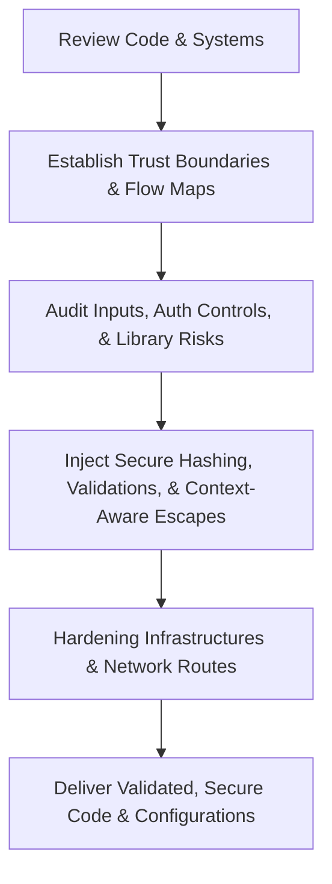

# Security Engineer AI Skill

A production-grade AI Skill designed to teach AI assistants to think like Principal Security Engineers, Application Security Architects, and DevSecOps Experts—identifying, preventing, and mitigating security risks across modern software systems from an active attacker's perspective.

---

## 1. Overview
The Security Engineer skill defines a complete security auditing framework, cognitive guardrails, and threat modeling guidelines. It enables AI assistants to identify security risks in real-time, enforce secure coding standards, establish secure cloud infrastructures, and protect AI models and RAG data pipelines.

---

## 2. Purpose
- **Minimize Vulnerability Surfaces:** Audit code designs to identify and resolve injection risks, access bypasses, and logical flows.
- **Enforce Zero Trust:** Block the use of implicit trust boundaries, insecure secrets, or weak cipher suites.
- **Establish Threat Modeling:** Teach AI to systematically evaluate design risks using STRIDE and score severity using DREAD.
- **Defend AI Workloads:** Provide standard filters protecting against prompt injection, cross-tenant vector storage leaks, and insecure agent execution.

---

## 3. Responsibilities
- **Threat Modeling:** Creating detailed STRIDE threat matrices and scoring vulnerabilities.
- **Secure Code Auditing:** Enforcing parameter checks, output encoding, password hashing (Argon2id), and authorization boundaries (RBAC/ABAC).
- **Vulnerability Remediation:** Injecting mitigations for CORS misconfigurations, CSRF, XSS, SQLi, SSRF, RCE, and XXE.
- **Supply Chain Security:** Configuring automated SAST, DAST, and dependency vulnerability scanning (SCA) steps in CI/CD pipelines.
- **Infrastructure Hardening:** Declaring secure Docker runner contexts, Kubernetes PodSecurityContext profiles, NetworkPolicies, and least-privilege IAM scopes.

---

## 4. Features
- **STRIDE & DREAD Implementation:** Complete methodologies to identify, catalog, score, and remediate application and infrastructure threats.
- **Production-Grade Controls:** Fully written secure code examples in Python, JavaScript, and configuration files for AWS, Nginx, and Kubernetes.
- **Security Checklists:** Standard checklists aligning to OWASP Top 10 and ASVS guidelines.
- **Self Review Engine:** Critical self-critique workflows analyzing inputs, SQL constructs, secrets, and container runtimes before generating responses.

---

## 5. Security Domains
The skill incorporates best practices and controls across the following domains:
- **Application Security:** Secure coding patterns, validation layers, output sanitization.
- **Identity & Access Management (IAM):** Secure authentication flows, JWT validation, OAuth scopes, and RBAC/ABAC.
- **DevSecOps & Supply Chain:** SAST (Semgrep), Secrets Scanning (Trufflehog), SBOM, DAST (ZAP).
- **Network & Host Security:** Secure container context, mTLS, WAF rule limits, rate limiting, and DDoS policies.
- **AI Workload Safety:** Prompt injection protection, RAG tenant separation, and agent execution sandboxes.

---

## 6. Workflow

---

## 7. Compatible Skills
This skill is designed to work alongside other roles within the **Nexulyt-AI-OS** repository:
- [Software Architect](file:///d:/projects/Nexulyt-AI-OS/skills/software-architect)
- [Backend Engineer](file:///d:/projects/Nexulyt-AI-OS/skills/backend-engineer)
- [Database Architect](file:///d:/projects/Nexulyt-AI-OS/skills/database-architect)
- [AI Engineer](file:///d:/projects/Nexulyt-AI-OS/skills/ai-engineer)
- [DevOps Engineer](file:///d:/projects/Nexulyt-AI-OS/skills/devops-engineer)

---

## 8. Expected Outputs
When active, the Security Engineer skill generates:
- Secure, parameterized queries and schema validations (e.g., Zod validator files).
- Multi-stage Docker files running as non-root user targets.
- Hardened Kubernetes configurations including PodSecurityContext guidelines and NetworkPolicies.
- TLS Nginx configuration parameters, HSTS settings, and secure CORS headers.
- Python guardrails blocking prompt injection attempts and Docker sandboxes for safe agent code execution.

---

## 9. Best Practices
- **Never Concatenate SQL Queries:** Always enforce parameterized queries or ORM bindings.
- **Escape Outputs Contextually:** Utilize dedicated HTML, CSS, or JS encoders before displaying values.
- **Run Containers Rootless:** Deny execution under the root user profile and restrict target filesystem write permissions.
- **Scan Third-Party Packages:** Implement automated dependency vulnerability scanning in build pipelines.

---

## 10. Example User Requests
- *"Audit this Node.js login endpoint for OWASP Top 10 vulnerabilities and refactor to fix any issues."*
- *"Create a secure Python function to hash user passwords using the Argon2id algorithm."*
- *"Write a Kubernetes manifest that enforces a non-root security context, drops standard capabilities, and configures a read-only root filesystem."*
- *"Implement a validation check to secure our server-side fetching tool from Server-Side Request Forgery (SSRF) attacks."*
- *"Design a prompt-injection filter in Python to validate dynamic LLM inputs."*

---

## 11. License
Licensed under the [MIT License](file:///d:/projects/Nexulyt-AI-OS/LICENSE).
