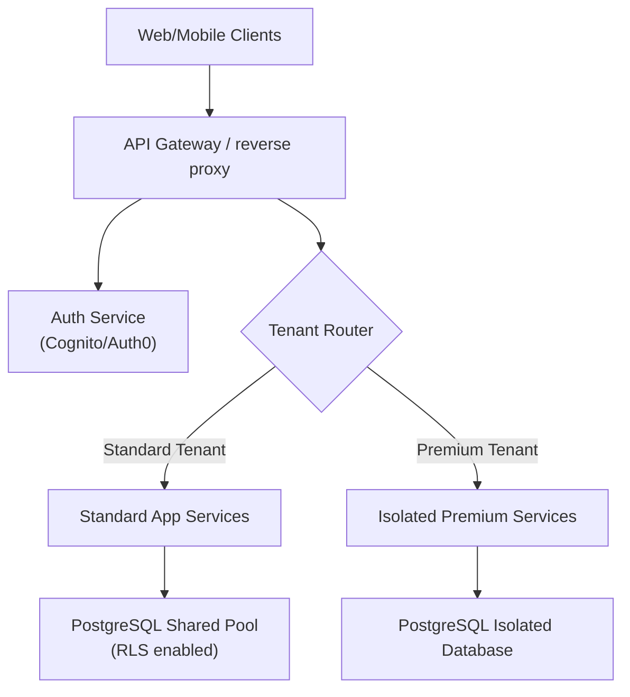
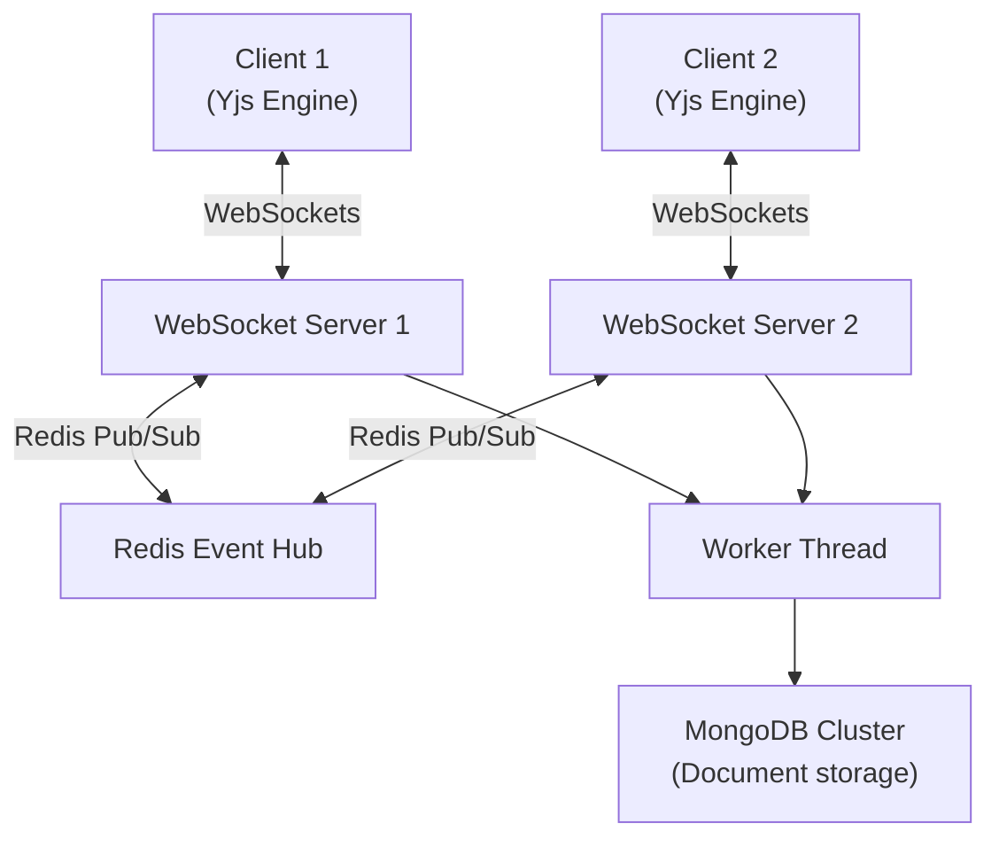
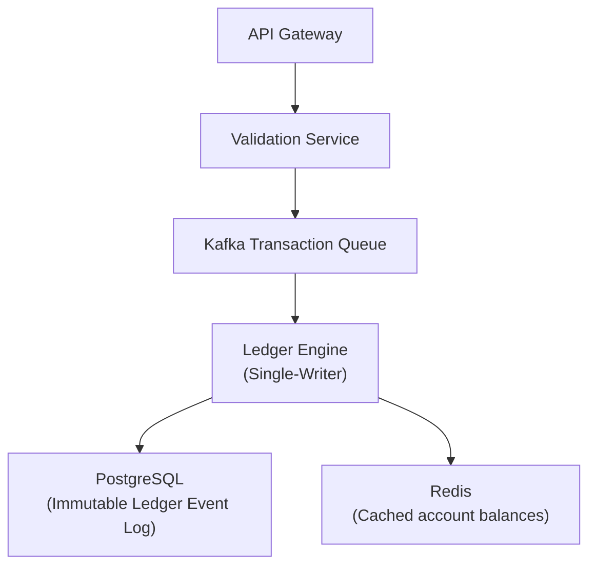

# Software Architect Examples

This document demonstrates how the Software Architect skill translates business goals into robust system architectures, database designs, API specifications, and phased rollout roadmaps.

---

## Example 1: Multi-Tenant B2B SaaS Platform

### 1. Requirements Analysis
*   **Goal**: Build a multi-tenant task management platform for enterprise clients.
*   **Scale**: Support 100,000 daily active users (DAUs), with peaks of 2,000 write requests per second.
*   **Data Residency**: Ability to store customer data in specific regions (US/EU) for regulatory compliance.
*   **Uptime**: 99.9% availability target.

### 2. Architectural Decisions (C4 Level 2 Container)
*   **Boundary Strategy**: Logical tenant separation using Row-Level Security (RLS) in PostgreSQL for cost-efficiency, with the option to deploy dedicated database pools for premium tier customers.
*   **Routing**: API Gateway routes requests based on the tenant subdomain (`https://tenant-name.api.saas.com`) to verify origin and inject tenant scopes.



### 3. Technology Stack Selection
*   **Frontend**: Next.js 14 (App Router) for Server-Side Rendering (SSR) and SEO performance.
*   **Backend**: Node.js + NestJS with TypeScript for modular, type-safe service architecture.
*   **Database**: PostgreSQL 16 for robust relational integrity, transactional compliance, and native RLS support.
*   **Cache**: Redis Cluster for session state storage and tenant settings caching.

### 4. Database Schema Design
*   **Tenants Table**: Holds tenant billing tier, state, and geographic region.
*   **Users Table**: Partitioned logically by `tenant_id`.
*   **Workspaces Table**: Partitioned logically by `tenant_id`.

```sql
-- Schema with Tenant Isolation
CREATE TABLE tenants (
    id UUID PRIMARY KEY DEFAULT gen_random_uuid(),
    name VARCHAR(255) NOT NULL,
    tier VARCHAR(50) DEFAULT 'standard',
    region VARCHAR(50) NOT NULL,
    created_at TIMESTAMP WITH TIME ZONE DEFAULT CURRENT_TIMESTAMP
);

CREATE TABLE workspaces (
    id UUID PRIMARY KEY DEFAULT gen_random_uuid(),
    tenant_id UUID NOT NULL REFERENCES tenants(id) ON DELETE CASCADE,
    title VARCHAR(255) NOT NULL,
    created_at TIMESTAMP WITH TIME ZONE DEFAULT CURRENT_TIMESTAMP
);

-- Enable Row-Level Security on Workspaces
ALTER TABLE workspaces ENABLE ROW LEVEL SECURITY;

-- Policy to restrict access based on current tenant context variable
CREATE POLICY tenant_isolation_policy ON workspaces
    FOR ALL
    USING (tenant_id = NULLIF(current_setting('app.current_tenant_id', true), '')::uuid);
```

### 5. API Design (RFC 7807 Standard)
*   **GET** `/api/v1/workspaces` -> Fetch all workspaces in the tenant context.
*   **POST** `/api/v1/workspaces` -> Create a new workspace.
*   **Error Format**: Return standardized RFC 7807 problem details JSON:

```json
{
  "type": "https://errors.saas.com/tenant-limit-reached",
  "title": "Tenant Workspace Limit Reached",
  "status": 403,
  "detail": "Your current subscription tier restricts workspace creation to 5 maximum. You currently have 5.",
  "instance": "/api/v1/workspaces"
}
```

### 6. Phased Database Migration Roadmap
1.  **Phase 1 (Preparation)**: Create the new `tenants` and `workspaces` tables.
2.  **Phase 2 (Dual Write)**: Update the backend to write newly created records to both old structures and the new multi-tenant structure.
3.  **Phase 3 (Backfill)**: Run a background migration job to backfill legacy data into the tenant tables.
4.  **Phase 4 (Cutover)**: Update reading paths to query the multi-tenant database using RLS context variables.
5.  **Phase 5 (Cleanup)**: Drop the legacy data tables after 7 days of verified error-free operation.

---

## Example 2: Real-Time Collaborative Document Hub

### 1. Requirements Analysis
*   **Goal**: Multi-user real-time document editing platform (similar to Google Docs).
*   **Scale**: Support 10,000 concurrent editing sessions with latency < 50ms for local keystroke sync.
*   **Concurrency**: Conflict resolution for simultaneous text updates.
*   **Uptime**: 99.95% availability target.

### 2. Architectural Decisions
*   **Boundary Strategy**: Client-server collaboration model utilizing CRDTs (Conflict-free Replicated Data Types) or Operational Transformation (OT) to resolve state divergence.
*   **Routing**: State syncing routed through dedicated WebSocket servers with Redis pub/sub backplanes to handle user distribution.



### 3. Technology Stack Selection
*   **Frontend**: React + Yjs client engine for local state replication and peer-to-peer syncing.
*   **Backend**: Node.js + Fastify with socket.io for lightweight, high-throughput WebSocket handlers.
*   **Database**: MongoDB 7.0 for flexible document-state storage (storing JSON-based document updates and historical snapshots).
*   **Queue**: RabbitMQ for queuing document backup writes.

### 4. API Design
*   **WebSocket Event: `doc-update`**: Send incremental document updates encoded in Uint8Array.
*   **WebSocket Event: `presence`**: Send cursor position updates.

---

## Example 3: Event-Driven Transaction Ledger

### 1. Requirements Analysis
*   **Goal**: Transaction processing backend with double-entry validation.
*   **Scale**: 5,000 transactions/second with strict ACID validation.
*   **Compliance**: Immutable audit trails.
*   **Latency**: Transaction booking < 100ms.

### 2. Architectural Decisions
*   **Boundary Strategy**: Event Sourcing model where the state of any account is derived by replaying its immutable transactional ledger events.
*   **Consistency**: Single-writer transaction log to guarantee ordering and avoid concurrent lock contentions.



### 3. Technology Stack Selection
*   **Runtime**: Go (Golang) for fast CPU execution, low memory overhead, and concurrent performance.
*   **Broker**: Apache Kafka for durable, partitioned event streaming.
*   **Database**: PostgreSQL with transactional isolation set to `SERIALIZABLE` to prevent race conditions.
