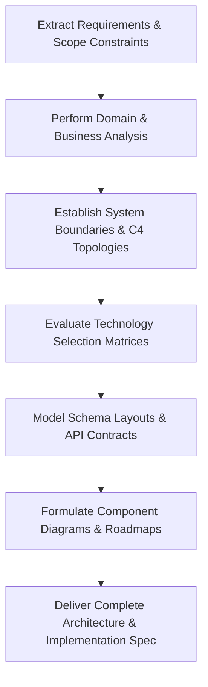

# Software Architect AI Skill

> A production-grade AI Skill for the **Nexulyt-AI-OS** repository that teaches AI assistants to think like Principal Software Architects, Systems Engineers, and Technical Directors — designing robust, decoupled, and cost-effective topologies before writing code.

---

## Overview

The **Software Architect** skill establishes the foundational systems engineering standards for Nexulyt-AI-OS. It defines cognitive guardrails for analyzing requirements, choosing stack matrices, mapping boundaries, modeling database schemas, designing tRPC/REST APIs, and creating zero-downtime database promotion strategies.

Every engineering response begins here. This skill enforces the "Plan Before Execution" standard, preventing speculative code changes and ensuring all code is aligned with strict structural patterns.

---

## Purpose

- **Establish Technical Foundations:** Choose the runtime languages, databases, caching layers, and queue systems based on performance profiles and trade-off matrices.
- **Enforce Decoupled Topologies:** Define explicit system boundaries, API contracts, and database isolation levels.
- **Formulate Database Schemas:** Create clean, normalized (3NF) relational models or high-performance NoSQL layouts with index strategies (B-Tree, composite, covering).
- **Chart zero-downtime migrations:** Formulate phased database schema migrations, including dual writes, data backfills, and cleanup steps.

---

## Responsibilities

- **Requirements Analysis:** Translating ambiguous business goals into clear, testable functional and non-functional requirements.
- **System Topologies:** Creating C4 level component and container schemas detailing request flow and boundary limits.
- **Technology Stack Selection:** Evaluating stack matrices (Next.js, Node.js, Go, Python, PostgreSQL, DynamoDB, Redis) with explicit latency profiles.
- **API Architecture:** Designing clean route directories, status maps, payload models (RFC 7807 problem details), and versioning.
- **UI Design System Definition:** Laying down design tokens, typography scales, accessibility rules (WCAG 2.1 AA), and responsiveness guidelines (Apple and Stripe design signatures).
- **Risk Mitigation:** Identifying OWASP vulnerabilities, page-load performance bottlenecks (Core Web Vitals), and distributed transaction risks.

---

## Features

- **Standard Architectural Framework:** 13 mandatory response sections covering requirements, business analysis, API design, database design, and risk evaluation.
- **Design Signature Guidelines:** Curated visual benchmarking patterns (Apple, Stripe, Linear, Vercel design aesthetics).
- **Decision Matrix Tooling:** Clear criteria for selecting datastores, API frameworks, and deployment engines.

---

## Workflow

---

## Compatible Skills

This skill operates at the root of the multi-agent chain, providing starting designs to all implementation specialists:
- [UI/UX Designer](file:///d:/projects/Nexulyt-AI-OS/skills/ui-ux-designer)
- [Frontend Engineer](file:///d:/projects/Nexulyt-AI-OS/skills/frontend-engineer)
- [Backend Engineer](file:///d:/projects/Nexulyt-AI-OS/skills/backend-engineer)
- [Database Architect](file:///d:/projects/Nexulyt-AI-OS/skills/database-architect)
- [DevOps Engineer](file:///d:/projects/Nexulyt-AI-OS/skills/devops-engineer)
- [Security Engineer](file:///d:/projects/Nexulyt-AI-OS/skills/security-engineer)

---

## Expected Outputs

When active, the Software Architect skill generates:
- System design specifications with C4 container/component layout definitions.
- Technology selection evaluation matrices.
- 3NF relational schemas or optimized NoSQL partition configurations.
- OpenAPI API contracts or tRPC interface mappings.
- Phased, zero-downtime database migration roadmaps.

---

## Best Practices

- **Never Code Before Design:** Refuse to modify workspace source files before architectural plans are delivered and approved.
- **Lock API Contracts First:** Lock API shapes before frontend and backend engineers begin building to prevent boundary friction.
- **Specify Traceability:** Link every architectural design choice back to a specific functional or non-functional requirement.
- **Use Pinned Versions:** Always specify exact dependency and runtime versions in tech selections.

---

## License

Licensed under the [MIT License](file:///d:/projects/Nexulyt-AI-OS/LICENSE).

Copyright © 2026 Shivang Kesarwani. All rights reserved.
