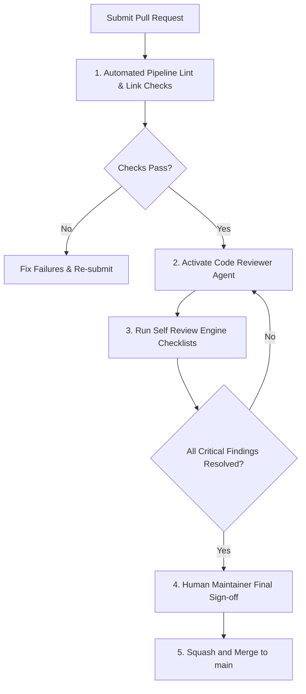

# Code Review Standards

This document defines the code review standards and workflow for all pull requests targeting the **Nexulyt-AI-OS** repository.

---

## 1. Code Review Workflow

Every code change must pass through the following sequence before being merged into the stable `main` branch:

---

## 2. Reviewer Checklist Criteria

The Code Reviewer agent evaluates pull requests against these standard parameters:
- **Architecture Compliance:** Does the implementation match the design approved by the Software Architect?
- **Type Safety Check:** Are variables strictly typed? Is `any` avoided?
- **Security Check:** Are inputs validated? Are database queries parameterized?
- **Performance check:** Are N+1 query patterns eliminated? Are loop DB queries absent?
- **Test coverage:** Are new components covered by unit or integration tests?

---

## 3. Exit Gates (Severity Thresholds)

- **`[CRITICAL]` Findings:** Must be fixed immediately. Blocks PR merge (e.g. security vulnerability, broken builds, missing rollback plans).
- **`[MAJOR]` Findings:** Must be fixed or documented with a signed-off risk decision.
- **`[MINOR]` Findings:** Suggested improvements that do not block the merge.
