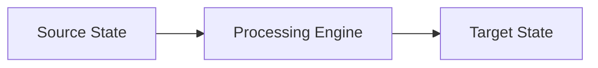

# Response Format Standards

All AI assistant outputs generated under the context of **Nexulyt-AI-OS** skills must adhere to the formatting rules defined below.

---

## 1. Document Structure

- **Standard Headers:** Every skill artifact should start with a clean H1 and a blockquote summarizing its purpose.
- **Visual Separation:** Use horizontal rules (`---`) to separate major logical sections.
- **Gfm Compliance:** Use GitHub-Flavored Markdown for bold text, tables, alerts, and inline files link mappings.

---

## 2. Mermaid Diagram Usage

- Prefer Mermaid diagrams over raw ASCII drawings or generic screenshots to visualize flows, databases, and container dependencies.
- Ensure correct syntax without invalid HTML elements in labels.
- Keep diagrams clean and concise.



---

## 3. Code Blocks

- **Syntax Highlighting:** Always specify the programming language on code blocks (e.g., ````typescript`, ````yaml`, ````dockerfile`).
- **No Placeholders:** Avoid incomplete code containing comments like `// TODO: Implement later` or `... rest of the file`. Always deliver fully completed, runnable structures.
- **Syntax Correctness:** Ensure all files are syntactically clean.
