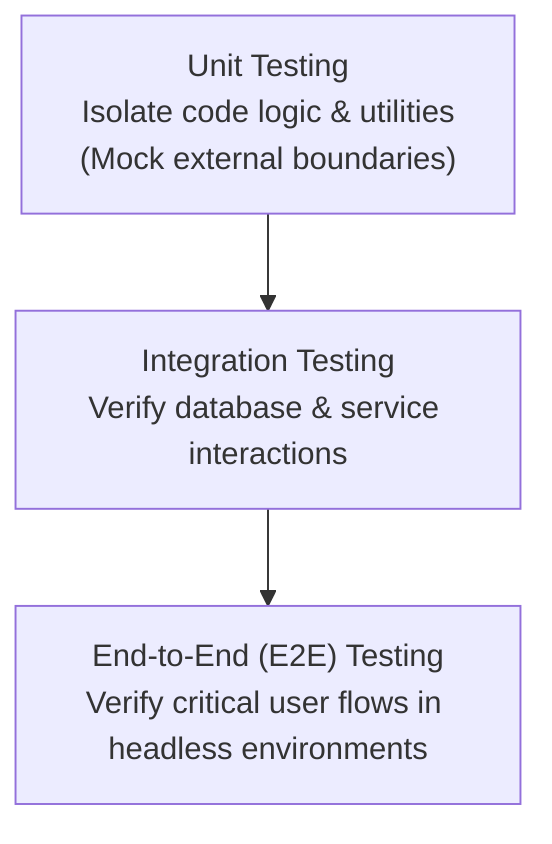

# Testing Standards

This document establishes the testing requirements, strategies, and coverage goals for the **Nexulyt-AI-OS** repository.

---

## 1. Testing Strategy

We follow a multi-tier testing strategy to ensure reliability and correctness:



---

## 2. Testing Levels

### Unit Testing
- Focuses on individual functions, utility services, and validation schemas.
- Must execute quickly. All network calls, file accesses, and database queries must be mocked.

### Integration Testing
- Verifies that multiple components work together (e.g. testing database repository layer against a local test datastore).
- Tests actual API controllers using request wrappers.

### End-to-End (E2E) Testing
- Validates the entire user flow from client action to database persistence and edge delivery.
- Uses headless web testing frameworks (e.g. Playwright, Cypress).

---

## 3. Test Coverage & Naming

- **Coverage Targets:**
  - **Unit Tests:** Minimum 80% coverage for all custom logic.
  - **Critical Paths:** 100% test coverage for payments, auth, and data-routing endpoints.
- **Naming Conventions:**
  - Test files must follow `<filename>.test.ts` or `<filename>.spec.py`.
  - Test case names must describe the input and expected outcome clearly:
    ```typescript
    it("should reject login requests if password length is under 8 characters")
    ```
