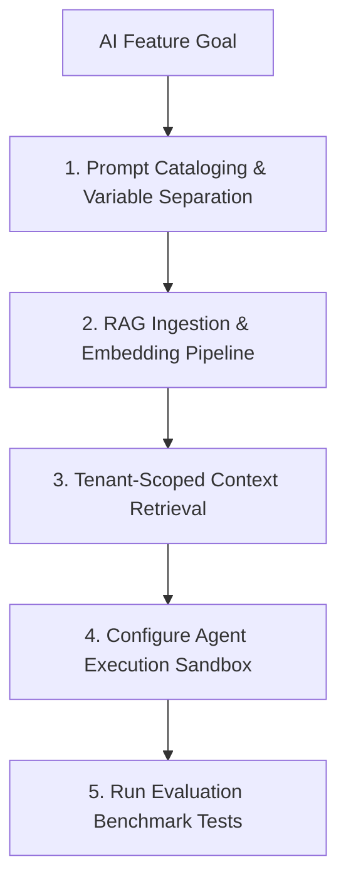

# AI Development Workflow

This document defines the process for prompt cataloging, RAG ingestion setups, model routing, and agent sandboxing within **Nexulyt-AI-OS**.

---

## 1. Overview & Objective

The objective of the AI Development workflow is to design reliable, contextual, and secure LLM-driven features — protecting inputs from prompt injection and preventing cross-tenant context leaks.

---

## 2. Step-by-Step Workflow

### Step 1: Prompt Design
- **Actions:** Define system and user roles. Enforce structured formats on output interfaces.
- **Rules:** Never pass raw, unsanitized user strings directly inside system roles.

### Step 2: RAG Ingestion & Chunking
- **Actions:** Segment documents (e.g. 500-character chunks with overlap) and generate vector embeddings using target models.

### Step 3: Context Retrieval Safety
- **Actions:** Filter search queries using the active tenant context.
- **Rules:** Restrict vector searches to the tenant ID scope to prevent leakage.

### Step 4: Sandbox Configuration
- **Actions:** Configure container sandboxes (e.g. Docker runtimes with limited egress) for agents that execute dynamic scripts.

---

## 3. Best Practices
- Define explicit latency fallbacks when LLM API latency targets are breached.
- Implement token budget monitoring to alert on anomalous usage costs.
- Evaluate responses using evaluation frameworks (e.g. Ragas) during integration tests.
