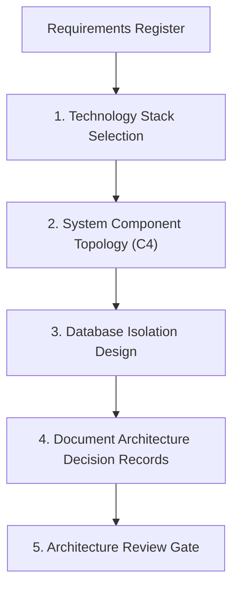

# Architecture Design Workflow

This document defines the planning, component mapping, and decision-making workflows for software architectures.

---

## 1. Overview & Objective

The objective of the Architecture Design workflow is to establish the system topology, technology stacks, and database isolation strategies before implementation begins, preventing boundary bleed and tech stack mismatch.

---

## 2. Step-by-Step Workflow

### Step 1: Technology Selection
- **Actions:** Select the runtime, databases, caches, and queues based on latency budgets and data models.
- **Rules:** Every major choice must be justified in a trade-off matrix.

### Step 2: Component Topology Mapping
- **Actions:** Design system interfaces using the C4 architecture model.
- **Rules:** Define explicit boundaries: frontend must not directly query database tables; APIs must encapsulate models.

### Step 3: Database Isolation Design
- **Actions:** Determine multi-tenant isolation schemas (e.g. logical isolation using Row-Level Security vs. physical database pools).

### Step 4: ADR Documentation
- **Actions:** Save Architecture Decision Records (ADRs) detailing the decision, context, and consequences.

---

## 3. Best Practices
- Design stateless app servers to allow horizontal scaling.
- Minimize dependencies between microservices.
- Ensure the Software Architect signs off on the design before the UI/UX or Database phases begin.
