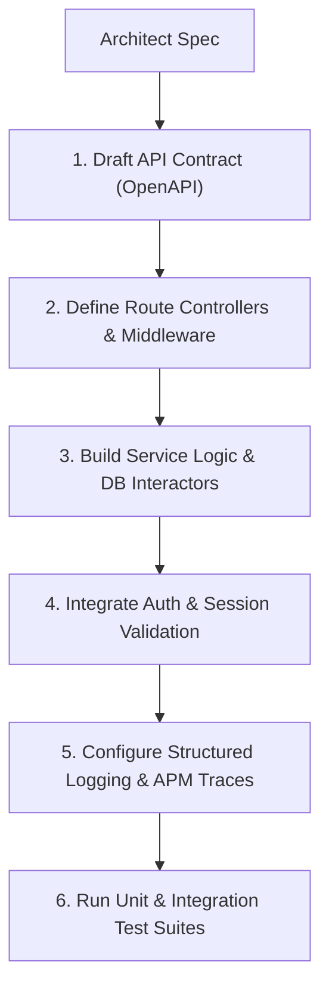

# Backend Development Workflow

This document defines the process for API endpoint design, business services implementation, security integrations, and error logging on the backend.

---

## 1. Overview & Objective

The objective of the Backend Development workflow is to build secure, scalable APIs and services that process business logic, manage data, and authenticate user transactions.

---

## 2. Step-by-Step Workflow

### Step 1: API Contract Drafting
- **Actions:** Define request payload schemas, status mappings, and versioned paths.
- **Rules:** Share contract schemas with the Frontend Engineer before coding.

### Step 2: Route Controllers & Middleware
- **Actions:** Set up endpoints, add validation middleware (Zod schemas), and configure rate-limit policies.

### Step 3: Service Logic
- **Actions:** Implement business actions and database queries.
- **Rules:** Enforce database parameterization on all operations.

### Step 4: Authentication & Security
- **Actions:** Validate token headers (e.g. JWT with RS256), inject tenant scopes, and verify permissions.

### Step 5: Logging & Monitoring
- **Actions:** Implement structured JSON logs, inject trace IDs, and setup health checks.

---

## 3. Best Practices
- Return RFC 7807 problem details JSON objects for API errors.
- Never write SQL queries inside iteration loops.
- Queue compute-intensive tasks on background workers.
