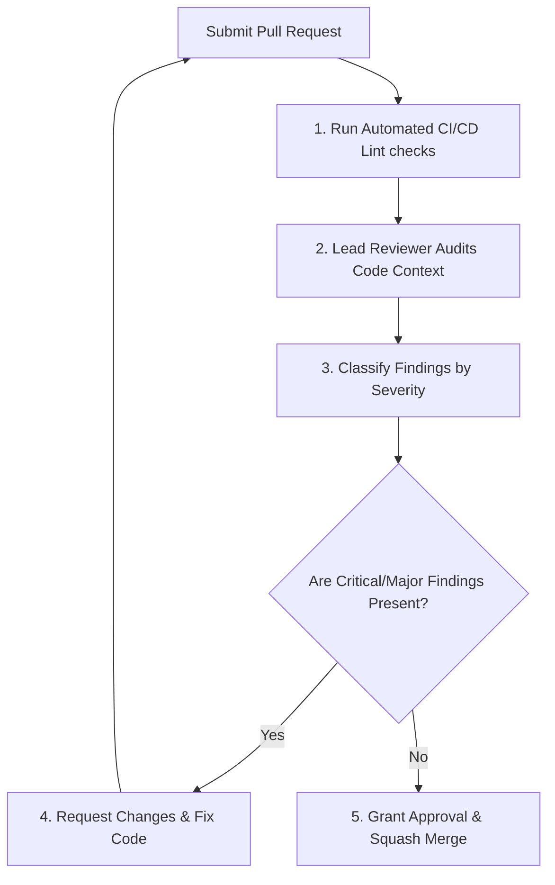

# Code Review Workflow

This document defines the code auditing process, severity classifications, and merge approvals workflow.

---

## 1. Overview & Objective

The objective of the Code Review workflow is to enforce code quality, architectural standards, security rules, and performance budgets before changes are merged into the stable `main` branch.

---

## 2. Step-by-Step Workflow

### Step 1: Severity Classifications
- **`[CRITICAL]`**: Severe security flaws (injection, hardcoded keys), build-breaking bugs, or missing rollback plans. **Blocks merge.**
- **`[MAJOR]`**: Performance regressions (N+1 queries), missing unit tests for critical paths, or deviation from architecture. **Blocks merge.**
- **`[MINOR]`**: Formatting inconsistencies, minor optimizations, or visual enhancements. **Non-blocking.**

### Step 2: Merge Criteria
- 100% pass on all automated pipeline verification scripts.
- Approval from at least one repository maintainer.
- All `[CRITICAL]` and `[MAJOR]` findings must be marked as resolved and verified.
