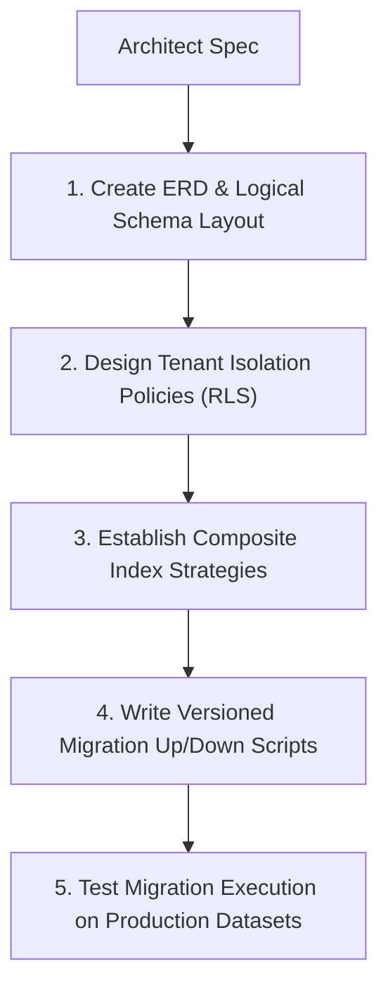

# Database Design Workflow

This document defines the process for schema modeling, index building, transaction controls, migration scripting, and database optimizations.

---

## 1. Overview & Objective

The objective of the Database Design workflow is to ensure datastores are structurally sound, normalized, indexed for performance, and isolated for multi-tenancy.

---

## 2. Step-by-Step Workflow

### Step 1: Logical Modeling
- **Actions:** Define table properties, data types, and reference constraints (1:1, 1:N, N:M).
- **Rules:** Normalize to 3NF unless denormalization is justified for high-read performance.

### Step 2: Tenant Isolation
- **Actions:** Configure Row-Level Security (RLS) policies or partition database schemas per tenant scope.

### Step 3: Indexing Strategy
- **Actions:** Build indexes covering query paths. Avoid redundant index declarations.

### Step 4: Migration Scripting
- **Actions:** Write migration scripts containing both `up` (forward changes) and `down` (reversing changes) methods.
- **Rules:** Ensure schema additions are backward-compatible.

---

## 3. Best Practices
- Never run schema changes in production that block writes (e.g. adding non-nullable columns without defaults).
- Run `EXPLAIN ANALYZE` on queries to detect sequential scans.
- Schedule automatic database backups and verify restoration quarterly.
