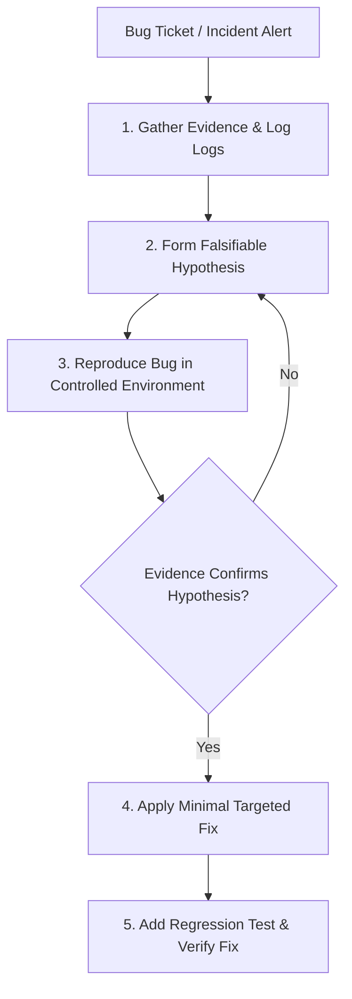

# Debugging Workflow

This document defines the systematic investigation process and root cause analysis steps for resolving application bugs and production anomalies.

---

## 1. Overview & Objective

The objective of the Debugging workflow is to ensure that investigations are driven by evidence rather than speculation, resolving bugs at the root-cause level to prevent recurrence.

---

## 2. Step-by-Step Workflow

### Step 1: Evidence Gathering
- **Actions:** Retrieve trace IDs, error stacks, log context, and version metadata.
- **Rules:** Filter logs by `traceId` first to isolate the failed lifecycle path.

### Step 2: Hypothesis Formulation
- **Actions:** Define a falsifiable statement explaining why the behavior occurred.

### Step 3: Controlled Reproduction
- **Actions:** Write a test case or script replicating the context inputs to trigger the error.
- **Rules:** Never write a fix for a bug that cannot be reproduced.

### Step 4: Remediation
- **Actions:** Write the smallest possible code patch to resolve the verified root cause.
- **Rules:** Avoid speculative refactoring during bug resolution.

### Step 5: Prevention
- **Actions:** Add the reproduction script to the unit test suite and configure alert rules to detect this failure class.

---

## 3. Best Practices
- Read the entire exception stack trace top-to-bottom.
- Avoid modifying code during the investigation phase.
- Document the investigation trail (hypotheses tested and eliminated).
