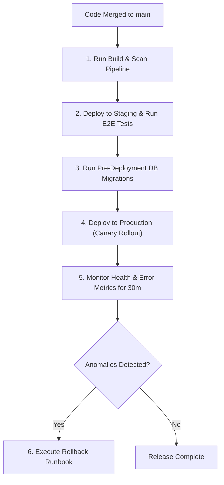

# Deployment Workflow

This document defines the process for pipeline execution, staging validation, rolling production releases, and rollback execution.

---

## 1. Overview & Objective

The objective of the Deployment workflow is to release code updates securely to production with zero unplanned downtime, using automated rollback triggers to protect system availability.

---

## 2. Step-by-Step Workflow

### Step 1: Staging Verification
- **Actions:** Deploy the build artifact to staging and verify health checks return `200 OK`.

### Step 2: Pre-Deployment Database Migrations
- **Actions:** Run SQL migrations.
- **Rules:** Ensure schema modifications are backward-compatible.

### Step 3: Production Canary Rollout
- **Actions:** Gradually route traffic (e.g. 5% → 25% → 100%) to the new instances.
- **Rules:** Deploy versioned, immutable containers (never use `:latest`).

### Step 4: Rollback Triggering
- **Actions:** Automatically execute rollback if errors exceed 1% or latency increases by 20% during the monitoring window.
- **Rules:** Rollback must be executable in under 5 minutes.
