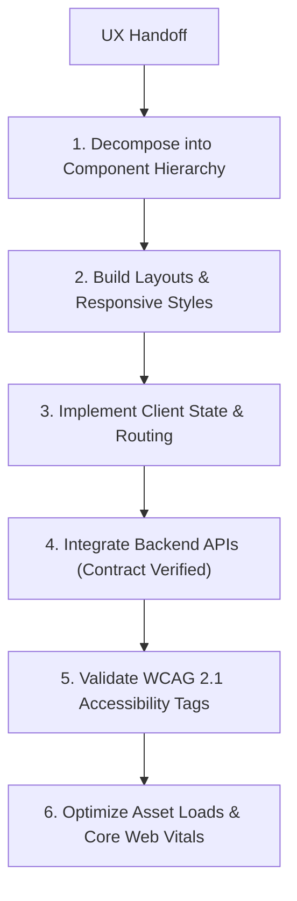

# Frontend Development Workflow

This document defines the process for component styling, client state management, API integration, and accessibility tags verification on the frontend.

---

## 1. Overview & Objective

The objective of the Frontend Development workflow is to build responsive, performant, and accessible user interfaces that match UI/UX mockups and integrate with backend APIs.

---

## 2. Step-by-Step Workflow

### Step 1: Component Decomposition
- **Actions:** Break pages down into reusable components (atomic design approach).

### Step 2: Styling
- **Actions:** Implement layouts using CSS/Tailwind grid networks.
- **Rules:** Responsive CSS breakpoints must match naming tokens.

### Step 3: API Integration
- **Actions:** Connect backend endpoint hooks.
- **Rules:** The API contract must be validated before coding integrations.

### Step 4: Accessibility Integration
- **Actions:** Enforce keyboard navigation, add ARIA attributes, and ensure inputs have descriptive labels.

---

## 3. Best Practices
- Load dynamic components lazily (code splitting) to reduce bundle sizes.
- Optimize images using modern formats (WebP/AVIF).
- Implement error boundary modules to prevent full-page crashes during runtime.
