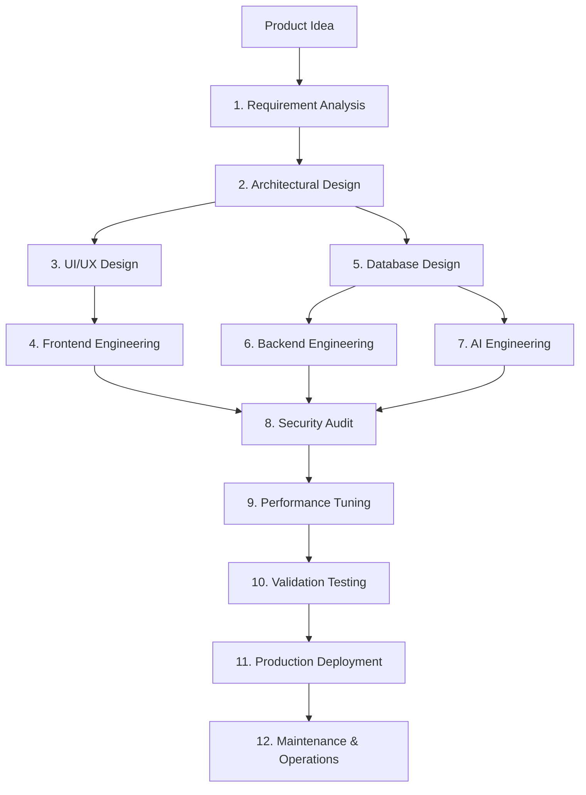

# Full-Stack Development Workflow

This document defines the end-to-end full-stack development workflow within the **Nexulyt-AI-OS** ecosystem.

---

## 1. Overview & Objective

The objective of this workflow is to guide the multi-agent system and developers through the complete lifecycle of building full-stack products — ensuring that no step is bypassed and that deliverables satisfy all structural, security, and performance standards.

---

## 2. Prerequisites & Scope
- **Scope:** Applies to all Tier 3 (Complex), Tier 4 (Advanced), and Tier 5 (Enterprise) projects in the workspace.
- **Prerequisites:** 
  - Cloned repository with registered workspace paths.
  - Pinned IDE context configured.

---

## 3. Workflow Lifecycle

---

## 4. Step-by-Step Execution

### Step 1: Idea & Requirements
- **Inputs:** User natural language brief.
- **Actions:** The `Full-Stack Orchestrator` classifies the project complexity tier, defines functional/non-functional requirements, and establishes quality gates.
- **Outputs:** Project Brief, Requirement Register.

### Step 2: Architecture
- **Inputs:** Project Brief, requirements register.
- **Actions:** The `Software Architect` defines component boundaries (C4 level), selects the stack, and writes ADRs.
- **Outputs:** Architecture Specification, ADR files.

### Step 3: UI/UX Design
- **Inputs:** Architecture specifications, feature list.
- **Actions:** The `UI/UX Designer` creates visual grids, layout wireframes, typography scales, and accessibility rules.
- **Outputs:** Wireframes, UI mockups, CSS variables templates.

### Step 4: Frontend Engineering
- **Inputs:** Mockups, design tokens, API contract draft.
- **Actions:** The `Frontend Engineer` builds the presentational views, sets client state, and maps routes.
- **Outputs:** Frontend views, components test files.

### Step 5: Database Design
- **Inputs:** System requirements, data model constraints.
- **Actions:** The `Database Architect` designs normalized tables, B-Tree indexes, and transaction bounds.
- **Outputs:** SQL migration scripts (`up`/`down` files).

### Step 6: Backend Engineering
- **Inputs:** System design, database schemas.
- **Actions:** The `Backend Engineer` builds APIs, routing endpoints, validations, and logic handlers.
- **Outputs:** REST/tRPC API handlers, integration unit tests.

### Step 7: AI Engineering
- **Inputs:** System scope, vector database tables.
- **Actions:** The `AI Engineer` configures RAG chunking, sets system/user prompts, and designs agent sandboxes.
- **Outputs:** Prompt scripts, RAG ingestion APIs.

### Step 8: Security Audit
- **Inputs:** Codebases, container manifests, and schemas.
- **Actions:** The `Security Engineer` performs STRIDE threat modeling, checks input sanitation, and verifies encryption.
- **Outputs:** Threat logs, validation code files.

### Step 9: Performance Tuning
- **Inputs:** Codebase execution, target SLO limits.
- **Actions:** The `Performance Engineer` profiles latency, optimizes slow SQL queries, and configures CDN caching.
- **Outputs:** Caching scripts, index adjustments.

### Step 10: Validation Testing
- **Inputs:** Merged codebases, test files.
- **Actions:** Run unit, integration, and E2E browser tests.
- **Outputs:** Testing reports, coverage summaries.

### Step 11: Production Deployment
- **Inputs:** Approved build artifacts.
- **Actions:** The `Deployment Engineer` runs CI/CD actions, configures proxy SSL, and sets canary rollouts.
- **Outputs:** Production release, rollback schedules.

### Step 12: Maintenance & Operations
- **Inputs:** Log logs, trace streams.
- **Actions:** Monitor APM error alerts, debug active failures, and resolve anomalies.
- **Outputs:** RCA documents, postmortem reports.

---

## 5. Decision Points
- **Is the API contract locked?** Do not proceed to parallel frontend/backend execution if the API contract has not been validated.
- **Are there Critical security findings?** Stop performance optimization if any `[CRITICAL]` vulnerability is detected.

---

## 6. Exit Criteria
- **Gate Pass:** All quality check boxes are complete.
- **No Empty Files:** Check that no files are 0-byte size.
- **Clean Audit:** Link verification script returns zero failures.
