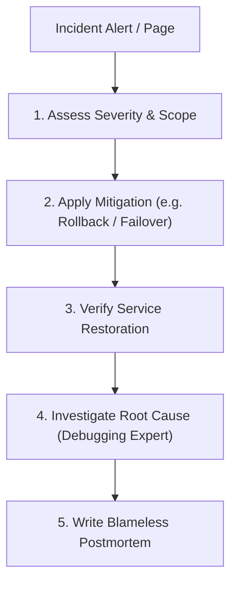

# Incident Response Workflow

This document defines the procedures for outage mitigation, on-call communication, recovery, and postmortem analysis.

---

## 1. Overview & Objective

The objective of the Incident Response workflow is to restore service availability quickly during a production incident, minimize customer impact, and ensure that the root cause is systematically addressed to prevent recurrence.

---

## 2. Step-by-Step Workflow

### Step 1: Triage
- **Actions:** Determine if the issue is a P1 (service down), P2 (major feature degraded), or P3 (minor bug).
- **Rules:** If a P1 is confirmed, identify the incident commander to lead response communications.

### Step 2: Mitigation
- **Actions:** Restore service by applying the fastest safe option.
- **Rules:** Rollback is always preferred over live debugging under pressure. If a rollback is possible, execute it immediately.

### Step 3: Investigation & RCA
- **Actions:** Activate the `Debugging Expert` to perform root cause analysis once the system is stable.
- **Rules:** Focus on trace IDs, query logs, and exception states to find the technical root cause.

### Step 4: Postmortem
- **Actions:** Write a blameless postmortem within 48 hours of resolution.
- **Rules:** Document: timeline, customer impact, root cause, contributing factors, and actionable follow-ups with owners and due dates.
