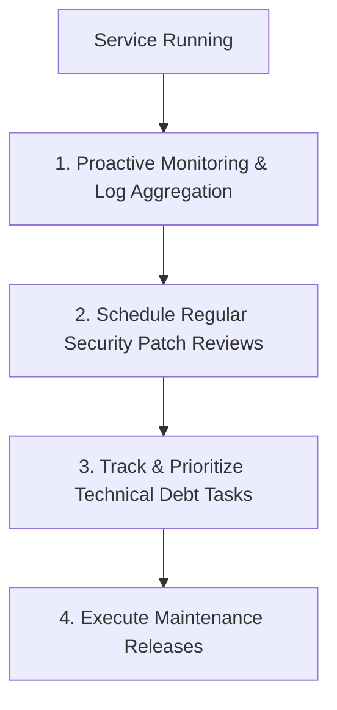

# Maintenance Workflow

This document defines the processes for log monitoring, security patch management, bug fixes, and technical debt resolution.

---

## 1. Overview & Objective

The objective of the Maintenance workflow is to ensure the long-term health, stability, and security of production services through proactive monitoring and debt management.

---

## 2. Step-by-Step Workflow

### Step 1: Proactive Monitoring
- **Actions:** Set up weekly dashboard audits to analyze error trends, response latency metrics, and connection pooling states.

### Step 2: Security Patch Reviews
- **Actions:** Schedule regular scans (Dependabot) to check third-party packages for CVEs.
- **Rules:** Implement critical patches in under 24 hours of disclosure.

### Step 3: Technical Debt Management
- **Actions:** Catalog code cleanups, performance enhancements, and obsolete dependencies in a technical debt backlog.
- **Rules:** Allocate 20% of every development sprint to resolving technical debt tasks.
