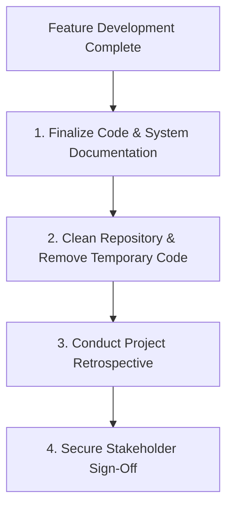

# Project Closeout Workflow

This document defines the process for repository updates, documentation validation, team retrospectives, and project sign-off.

---

## 1. Overview & Objective

The objective of the Project Closeout workflow is to ensure that completed projects are cleanly documented, code quality is locked, knowledge is shared, and lessons learned are recorded in the repository.

---

## 2. Step-by-Step Workflow

### Step 1: Documentation Compilation
- **Actions:** Update OpenAPI schemas, database ERDs, environment templates (`.env.example`), and deployment runbooks.
- **Rules:** Every new feature must be documented before closeout.

### Step 2: Repository Cleanup
- **Actions:** Delete temporary branches, remove diagnostic script files, and clear out test tables from datasets.

### Step 3: Retrospective Review
- **Actions:** Gather the development team to review what went well, what went poorly, and what process adjustments should be made.
- **Rules:** Save lessons learned as markdown updates under the `docs/` directory.

### Step 4: Final Sign-Off
- **Actions:** Archive completed tickets and notify stakeholders of official project completion.
