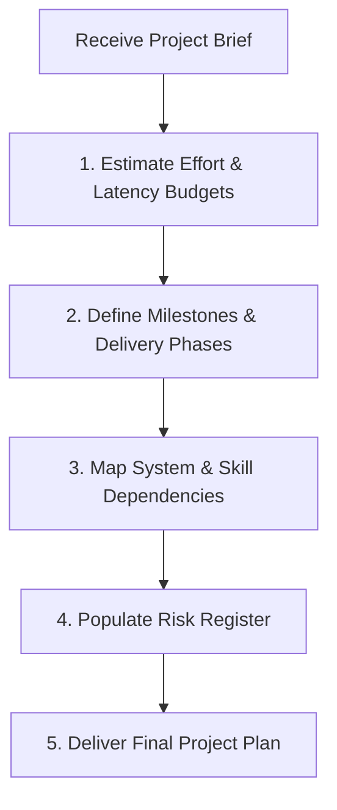

# Project Planning Workflow

This document defines the process for planning software projects, estimating timelines, setting milestones, mapping dependencies, and managing risks.

---

## 1. Overview & Objective

The objective of the Project Planning workflow is to establish a clear development path before writing code. This workflow ensures that deadlines, resource limits, and system dependencies are identified early.

---

## 2. Step-by-Step Workflow

### Step 1: Estimation
- **Actions:** Define the scope of work and estimate the time required for each phase. Set performance latency budgets (e.g. API response time targets) early.
- **Rules:** Use standard estimation buffers (typically adding 20% contingency for complex integrations).

### Step 2: Milestone Definition
- **Actions:** Group features into deliverables and set clear timelines:
  - **Milestone 1:** Architecture design and API contract locked.
  - **Milestone 2:** Database schema and core backend APIs functional.
  - **Milestone 3:** Frontend UI components integrated and tested.
  - **Milestone 4:** Production deployment and monitoring dashboard live.

### Step 3: Dependency Mapping
- **Actions:** Identify system and external API dependencies (e.g. Stripe checkout flows, OAuth callback redirects).
- **Rules:** Design abstraction layers for external services to decouple implementation.

### Step 4: Risk Analysis
- **Actions:** Map technical, security, and operational risks in a risk register.
- **Rules:** Define concrete mitigations for high-probability risks (e.g. database locking during flash sales).

---

## 3. Best Practices
- Define the critical path of the project.
- Involve security and database architects during the planning phase.
- Ensure risk mitigations are tracked as standard checklist items.
