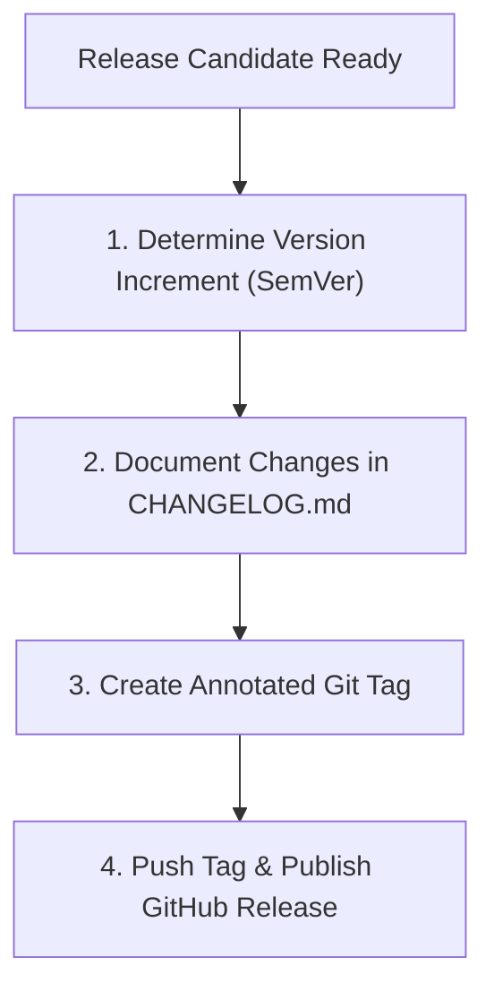

# Release Workflow

This document defines the process for versioning, changelog updates, git tagging, and publishing release notes.

---

## 1. Overview & Objective

The objective of the Release workflow is to ensure all software releases are systematically versioned, verified, and documented before publication.

---

## 2. Step-by-Step Workflow



### Step 1: Versioning Decisions
- **Actions:** Evaluate commits against the semantic versioning spec (`MAJOR.MINOR.PATCH`).
- **Rules:** Breaking changes must increment the major version.

### Step 2: Changelog Updates
- **Actions:** Document features, bugs fixed, and refactoring cleanups.
- **Rules:** Changelog updates must match the version tag message.

### Step 3: Git Tagging
- **Actions:** Create a signed, annotated git tag on the release commit:
  ```bash
  git tag -a v1.0.0 -m "Release version 1.0.0"
  git push origin v1.0.0
  ```

### Step 4: Release Publication
- **Actions:** Generate release notes on GitHub and publish the build package.
