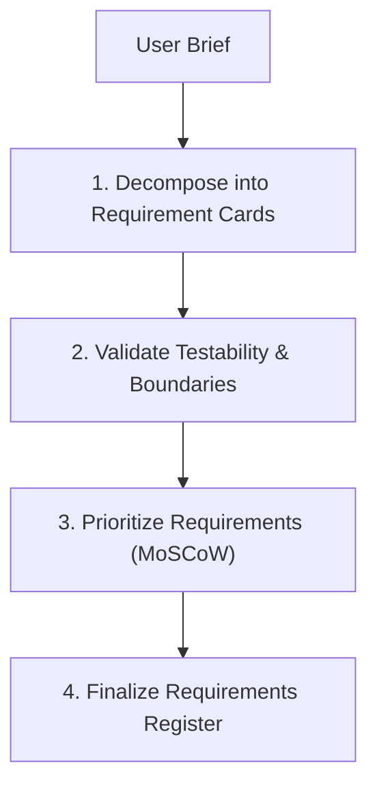

# Requirement Analysis Workflow

This document defines the process for gathering, validating, and prioritizing functional and non-functional requirements.

---

## 1. Overview & Objective

The objective of the Requirement Analysis workflow is to translate the initial user brief into concrete, testable engineering specifications, ensuring alignment on project boundaries and metrics.

---

## 2. Step-by-Step Workflow

### Step 1: Requirement Gathering
- **Actions:** Extract specific functional features and non-functional metrics from the brief.
- **Rules:** Every requirement card must cover: Title, Category, Description, and Measurable Metric.

### Step 2: Validation
- **Actions:** Audit requirements for testability. Vague requirements like "site should be fast" are rejected.
- **Rules:** Non-functional requirements must specify exact bounds: "API response time must be under 200ms at P95."

### Step 3: Prioritization
- **Actions:** Use the **MoSCoW** framework to classify priority:
  - **Must Have:** Core checkout flow, user auth.
  - **Should Have:** Email notification, user activity logs.
  - **Could Have:** Recommendation engine, profile avatar uploads.
  - **Won't Have:** Multi-region active-active database replication.

---

## 3. Best Practices
- Every requirement must have a corresponding verification test.
- Document all assumptions made during analysis.
- Get stakeholder sign-off on the final requirements register before activating the Software Architect.
