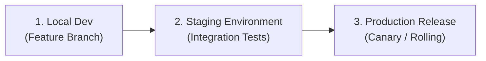

# Software Development Lifecycle (SDLC)

This document describes the software development lifecycle (SDLC) phases, timelines, and promotion gates within **Nexulyt-AI-OS**.

---

## 1. Overview & Objective

The objective of the SDLC workflow is to establish a rigorous promotion path for code changes — ensuring all features pass validation gates before moving to production.

---

## 2. SDLC Phases

### Phase 1: Local Development
- **Goal:** Author code modifications, scripts, or templates on custom feature branches.
- **Rules:** 
  - Enforce `standards/coding-standards.md`.
  - All feature branches must branch off the latest `main` branch.
- **Verification:** Run the target skill's `CHECKLIST.md` locally.

### Phase 2: Staging Promotion
- **Goal:** Integrate code changes into a staging environment that mirrors production configurations.
- **Rules:**
  - Automated CI/CD pipeline triggers on PR creation.
  - Run linting, unit tests, and security scans.
- **Verification:** 100% test pass on integration and staging smoke tests.

### Phase 3: Production Release
- **Goal:** Deploy the verified build artifact to the live production server.
- **Rules:**
  - Requires manual approval from repository maintainers.
  - Deployment must use versioned, immutable artifacts (never `:latest`).
  - Uptime and error rates are observed for 30 minutes post-deployment.
- **Verification:** Health checks return `200 OK`, latency is within SLO bounds.

---

## 3. Decision Framework
- **Did the staging pipeline fail?** If any lint or test check fails in staging, block production promotion.
- **Did post-deployment alerts fire?** If latency or error metrics exceed thresholds within 30 minutes, trigger the rollback runbook.

---

## 4. Best Practices
- Never bypass the staging gate to push directly to production.
- Use feature branches to isolate changes.
- Ensure staging databases contain anonymized, production-equivalent datasets for realistic testing.
